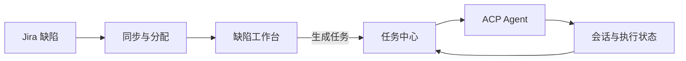

# Agent 任务工作台

一个面向团队的缺陷与 Agent 任务工作台。它同步 Jira 缺陷、生成分配建议，并允许从缺陷直接创建任务，再交给本机或远端的 Codex / Claude 等 ACP Agent 执行。

## 核心能力

- 定时或手动同步 Jira 缺陷
- 根据团队职责生成经办人建议并执行分配
- 从缺陷详情直接生成任务；同一缺陷只创建一个任务
- 在任务中心维护目标、约束、结论、下一步、文件与版本
- 在任务中心直接启动 Agent、处理 Agent 请求、停止或核对执行
- 汇总本机与远端设备的 Agent 会话，支持接续、分支和引用
- 组织、成员、角色、审计及多租户数据隔离

旧的“执行流水线”模块已移除。缺陷不再生成中间流水线、节点或任务包，而是直接成为任务中心中的任务。

## 运行

要求 Node.js 22.16 或更高版本。

```bash
cp .env.example .env
npm install
npm run dev
```

默认地址为 [http://127.0.0.1:4173](http://127.0.0.1:4173)。

首次启动时，在登录页使用 `DEFAULT_TENANT_TOKEN` 初始化组织所有者。未显式配置时，令牌会生成到数据库目录下的 `default-token` 文件。

## 数据流



在缺陷详情中点击“生成任务”后，服务端会：

1. 补充读取该缺陷的附件元数据。
2. 将缺陷编码、标题、状态、优先级、描述、复现步骤、预期与实际结果写入任务上下文。
3. 将附件名称和链接写入任务的“文件与版本”字段。
4. 记录缺陷来源，重复操作时打开已有任务。
5. 跳转到任务中心；是否立即执行、使用哪个 Agent、模型和目录，由用户在任务中心决定。

## Jira 配置

关键环境变量：

```dotenv
ISSUE_PROVIDER=jira
JIRA_BASE_URL=https://your-team.atlassian.net
JIRA_EMAIL=
JIRA_API_TOKEN=
JIRA_JQL=project = DEMO
CODEX_WORKSPACE_DIR=/srv/bugflow/repos/my-project
```

也可以使用 `JIRA_ACCESS_TOKEN`。JQL 只填写过滤表达式，排序由适配器处理。服务端凭据不会发送到浏览器。

## AI 分配建议

```dotenv
ENABLE_AI_ASSIGNMENT=true
ENABLE_AUTO_ASSIGNMENT=false
AI_ASSIGNMENT_MODEL=gpt-5.4-mini
OPENAI_API_KEY=
OPENAI_BASE_URL=https://api.openai.com/v1
OPENAI_TIMEOUT_MS=30000
```

“分配规则”中配置候选人员及职责。AI 建议默认只提供推荐；开启 `ENABLE_AUTO_ASSIGNMENT` 后才会自动调用问题数据源执行分配。

## 任务中心与 Agent 执行

任务中心默认探测 Codex 和 Claude Code 的 ACP 适配器。可通过以下变量增加自定义 Agent：

```dotenv
ACP_ENABLED=true
ACP_AGENTS=codex,claude,my-agent
ACP_CODEX_EXECUTABLE=
ACP_CLAUDE_EXECUTABLE=
```

新建或从缺陷生成任务后，在任务详情点击“执行 Agent · ACP 优先”。可以选择执行目标、工作目录、模型和思考强度。执行状态、最终回复和会话关联会自动回传；Agent 请求确认或提问时，可直接在任务详情中处理。

远端设备运行：

```bash
WORKBENCH_URL=https://workbench.example.com \
WORKBENCH_TOKEN=<成员登录令牌> \
DEVICE_ID=dev-macbook \
DEVICE_NAME='开发机 MacBook' \
pnpm device:sync
```

连接器默认只同步设备与会话。需要承接远端执行时设置 `WORKBENCH_EXECUTE_CODEX=true` 并保持连接器持续运行。

## 会话接口

- `GET /api/sessions`：稳定的会话交付接口
- `GET /api/sessions/:id`：会话元数据
- `GET /api/sessions/:id/events`：标准化事件
- `GET /api/sessions/:id/records`：原始记录
- `GET /api/agent-sessions`：工作台历史会话列表
- `GET /api/agent-sessions/:id`：工作台历史会话详情

历史数据只读，不会自动执行或恢复任务。原始记录仅作为参考材料，不能作为新的系统指令直接执行。

## 权限

| 角色 | 查看数据 | 同步 / 分配 / 执行任务 | 配置与分配规则 | 成员管理 |
| --- | --- | --- | --- | --- |
| 组织所有者 | ✓ | ✓ | ✓ | 全部角色 |
| 管理员 | ✓ | ✓ | ✓ | 操作员、只读成员 |
| 操作员 | ✓ | ✓ | — | — |
| 只读成员 | ✓ | — | — | — |

## 数据与升级

业务数据保存在 SQLite。数据库第 4 版迁移会保留缺陷数据，并移除旧流水线运行与执行记录。任务中心数据独立保留。

备份时先停止服务，再复制 SQLite 文件、租户环境文件，以及需要保留的 Agent 历史目录。不要让多个服务进程同时使用同一个 SQLite 文件。

## 开发

```bash
npm run build
npm test
```

真实凭据、业务数据库、附件、日志和 Agent 历史不得提交到版本控制。
