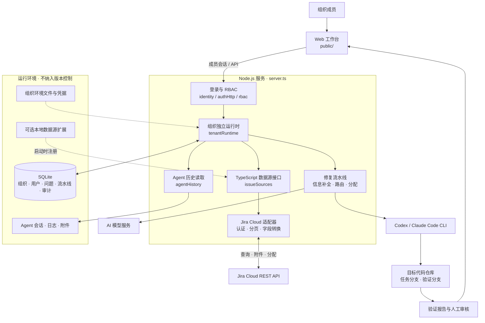
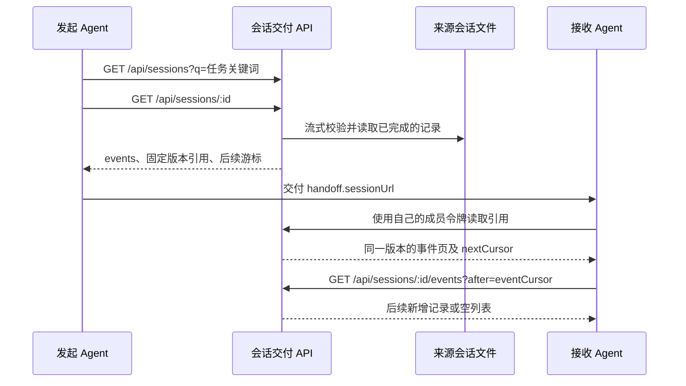

# 自动 Bug 工作流工作台

这是一个支持多组织、多用户、RBAC 角色权限和 SQLite 数据库的轻量 Web 工作台，用于：

- 定时或手动拉取个人缺陷
- 选择缺陷并生成 Loop / IDE 分工明确的修复流水线
- 在独立流水线页面中预览、启动、停止并审核 Codex 任务
- 通过统一数据源接口同步 Jira Cloud 的问题与附件

## 架构



浏览器只访问经过认证与角色授权的业务 API。每个组织拥有独立运行状态和凭据；适配器将外部问题转换为统一 `WorkIssue`，工作流无需理解平台原始格式。数据库表结构由 `migrations/` 管理，实际业务数据和本地扩展均不提交。

公开检出只包含 Jira 适配器，可直接安装依赖并运行。需要机器专用集成时，在被忽略的 `.local/register.ts` 中调用 `registerIssueSource`；启动和组织管理命令会自动预加载此文件，文件不存在时照常启动。扩展可提供配置映射、环境变量前缀和同步时间格式；测试默认不加载本地扩展。

## 运行

需要 **Node.js >= 22.16**。数据库使用 Node.js 内置 `node:sqlite`，无需安装数据库服务。新增数据源模块使用 TypeScript，通过 `tsx` 运行；首次运行前安装依赖。

```bash
pnpm install --frozen-lockfile
cp .env.example .env
# 编辑 .env，配置自己的 Jira 地址、凭据、JQL 和工作目录
npm start
```

默认地址：`http://localhost:4173`

启动时读取项目根目录的 `.env`，初始化 `.workflow-data/workflow.sqlite`，并自动升级数据库结构。默认组织 ID 为 `default`。

**从共享令牌版本升级：**重启服务，在登录页展开“首次使用？初始化组织所有者”，输入原组织令牌，设置所有者的用户名、显示名称和密码。默认组织的原令牌在 `.workflow-data/default-token`，或首次创建时设置的 `DEFAULT_TENANT_TOKEN` 中。初始化不会改变缺陷、流水线、配置或执行记录。

所有者创建成功后，使用“组织 ID + 用户名 + 密码”登录，在“组织成员”页面创建其他用户并分配角色。原组织令牌仅用于首次初始化，不能调用任何业务 API；初始化完成后即使轮换组织令牌，也不能重新初始化或绕过成员权限。

页面“对接配置”、分配人员、缺陷、流水线和执行记录写入数据库。组织内的成员共享业务数据，通过角色控制操作权限。现有 `user_key` 是数据源的业务分组，**不等于登录账号**；修改经办人筛选会影响组织当前工作台，只有管理员和所有者有权修改。每个组织拥有独立的定时任务、运行进程、分配任务和 数据源与 AI 凭据。重启后执行中的流水线标记为中断，定时任务默认暂停，需要手动重新启用。

## 用户与角色权限

每个组织可创建多个独立用户，同一用户名可存在于不同组织，登录时必须提供组织 ID。用户名为 3–80 位字母、数字、点、下划线、短横线或 `@`，不区分大小写。密码为 12–128 个字符，使用随机盐和 scrypt 保存摘要，不存储或返回明文密码。

| 角色 | 查看数据 | 同步、分配、生成/启停流水线 | 完成节点、审核、发布关闭 | 配置与分配规则 | 成员管理与审计 |
| --- | --- | --- | --- | --- | --- |
| 组织所有者 `owner` | ✓ | ✓ | ✓ | ✓ | 管理所有角色 |
| 管理员 `admin` | ✓ | ✓ | ✓ | ✓ | 仅管理操作员、只读成员；可查看审计 |
| 操作员 `operator` | ✓ | ✓ | — | — | — |
| 只读成员 `viewer` | ✓ | — | — | — | — |

这是四个内置角色的 RBAC；当前不包含自定义角色、SSO、邮件邀请或跨组织共享账号。所有权限由服务端逐请求校验，前端同时隐藏无权操作的入口。组织必须至少保留一位启用的所有者；如需转移所有权，先创建或提升另一位所有者，再调整原所有者的角色。

“组织成员”支持创建用户、修改名称和角色、停用/启用账号、重置密码。“我的账号”支持验证当前密码后设置新密码。角色调整从下一次请求立即生效；停用、重置密码、修改自己的密码会撤销该用户全部登录会话，重新启用不会恢复旧会话。退出登录会撤销当前会话。已启动的后台任务继续执行，并保留发起人信息。

登录返回随机会话令牌，数据库只保存其 SHA-256 摘要，有效期为 24 小时。浏览器保存在当前标签页的 `sessionStorage` 中；到期需重新登录。登录和密码相关操作有请求频率及并发限制。成员变更、密码重置、登录退出、业务写入请求和拒绝的业务访问记入组织审计，管理员可查看最近 200 条，审计不包含密码或会话令牌。

## 组织管理与账号恢复

在服务器本地执行：

```bash
npm run tenant -- add team-a 团队A
npm run tenant -- list
npm run tenant -- rotate team-a
npm run tenant -- users team-a
npm run tenant -- reset-password team-a 用户名
```

创建和轮换命令只显示一次**组织初始化令牌**；轮换后旧初始化令牌失效，已建立的成员会话不受影响。`reset-password` 供服务器管理员恢复账号，终端只显示一次随机新密码并撤销目标用户所有会话，操作写入审计。组织尚未初始化时，使用登录页初始化流程创建所有者。

为新增租户创建 `.workflow-data/tenants/team-a.env`：

```env
ISSUE_PROVIDER=jira
JIRA_BASE_URL=https://your-team.atlassian.net
JIRA_EMAIL=owner@example.com
JIRA_API_TOKEN=
JIRA_JQL=project = TEAM_A
OPENAI_API_KEY=团队A的AI密钥
CODEX_WORKSPACE_DIR=/srv/bugflow/repos/team-a
ENABLE_AUTO_ASSIGNMENT=false
```

新增租户不会继承默认团队的配置或凭据。默认团队兼容根目录 `.env`，也可用 `default.env` 覆盖。修改租户环境文件后重启服务。IDE 执行目录应使用独立的仓库副本；服务拒绝不同租户使用相同或相互嵌套的目录。在多租户模式下，该路径由管理员通过环境文件管理。未配置工作目录的租户可以管理缺陷和配置，配置目录后才可生成和执行 IDE 任务。

除 `POST /api/auth/login` 外，API 均要求 Bearer 认证。初始化接口 `GET/POST /api/auth/setup` 仅接受组织初始化令牌；所有业务接口仅接受**成员登录会话令牌**。服务端根据会话确定组织和用户，拒绝伪造的 `X-Tenant-Id`，不接受业务请求体中的 `tenantId` 或 `role` 提权。

主要接口：

- `POST /api/auth/login`：`{ tenantId, username, password }`，返回会话令牌、当前用户及权限。
- `GET /api/auth/session` / `POST /api/auth/logout`：当前会话与退出。
- `PUT /api/auth/password`：`{ currentPassword, password }`，修改自己的密码并撤销全部会话。
- `GET/POST /api/organization/members`：列出或创建成员；创建参数为 `{ username, displayName, password, role }`。
- `PATCH /api/organization/members/:id`：`{ displayName?, role?, enabled? }`。
- `PUT /api/organization/members/:id/password`：`{ password }`，重置成员密码。
- `GET /api/organization/roles` / `GET /api/organization/audit`：角色权限与审计记录。

```bash
curl -H "Authorization: Bearer $SESSION_TOKEN" http://localhost:4173/api/bootstrap
```

当前部署方式是**单 Node.js 服务进程 + SQLite**，适合内部团队工作台；租户隔离覆盖应用数据与运行状态。IDE CLI 仍以服务器系统用户运行，这不是面向互不信任客户的操作系统沙箱。外部访问应由 HTTPS 反向代理承接；跨主机、多实例部署需要另行接入共享数据库与任务队列。

## 数据迁移与备份

首次启动自动将旧 `.workflow-config.json`、`.assignment-people.json` 和 `.workflow-data/users/<用户>/state.json` 导入默认团队，同时兼容旧版本实际生成的 `.workflow-data/users/users/<用户>/state.json`。导入使用数据库事务并记录完成标记，重启不会重复覆盖；原 JSON 文件保留。损坏或重复的用户目录会导致迁移报错，不会静默丢弃数据。

也可以在启动前执行迁移，或导入到已创建的空租户：

```bash
npm run tenant -- migrate
npm run tenant -- migrate team-a
```

数据库位置通过 `DATABASE_PATH` 设置，租户凭据目录通过 `TENANT_ENV_DIR` 设置。SQL 表结构位于 `migrations/001_initial.sql` 和 `migrations/002_rbac.sql`，版本记录在 SQLite `user_version`（当前为 2）。`tenants` 保存租户和令牌摘要，`tenant_settings` 保存配置和人员，`user_states` / `workflow_items` 用组合主键及外键保存租户内的业务数据；一次状态保存整体提交或回滚。`organization_users` 保存组织内账号与角色，`user_sessions` 保存用户会话，`audit_events` 保存组织审计记录。

备份时先停止服务，再复制 SQLite 文件及租户环境文件、默认令牌文件；IDE 任务包和附件仍在各租户工作目录下，需要另外备份。恢复时将备份放回配置的位置再启动。不要让多个服务进程同时使用同一个数据库文件，因为后台执行状态保存在各进程内存中。

运行 `npm test` 可验证业务逻辑、数据库事务与迁移、组织认证、角色越权、跨组织成员访问、所有者保护、会话撤销、并发权限变更、并发同步和重启恢复。

## 密钥

数据源凭据与 AI 密钥仅从服务器环境文件读取，不进入浏览器或版本控制。请按 `.env.example` 创建本地 `.env`，不要将实际 token 填入示例文件。

## 问题数据源（TypeScript）

每个组织当前选择一个数据源。公开版本默认 `ISSUE_PROVIDER=jira`，使用 Jira Cloud。服务端、浏览器端、脚本和测试均使用 TypeScript；浏览器端源码会编译到 `public/build`。开发时运行：

```bash
npm run typecheck
npm test
npm run dev
```

Jira Cloud 最小配置（默认组织放在根 `.env`，其他组织放在 `.workflow-data/tenants/<tenant-id>.env`）：

```env
ISSUE_PROVIDER=jira
JIRA_BASE_URL=https://your-team.atlassian.net
JIRA_EMAIL=your-account@example.com
JIRA_API_TOKEN=
JIRA_JQL=project = DEMO AND issuetype = Bug
ENABLE_AUTO_ASSIGNMENT=false
```

在本地填写自己的 API token 后重启。凭据不进入浏览器、问题记录或版本控制。Jira 配置由服务器管理员管理；查询范围与分页参数均通过组织环境文件设置。Jira 经办人筛选写在 `JIRA_JQL` 中，例如 `project = DEMO AND assignee = currentUser()`。不限制任务类型，移除 `issuetype = Bug` 即可同步其他类型。JQL 只填写过滤表达式，不包含 `ORDER BY`。

支持邮箱 + API token 的 Basic 认证，也可通过 `JIRA_ACCESS_TOKEN` 使用已取得的 OAuth Bearer token（优先于 Basic）；适配器不负责 OAuth 授权或自动刷新。使用 OAuth 网关或有作用域的 token 时，按 Atlassian 要求将 `JIRA_BASE_URL` 设置为 `https://api.atlassian.com/ex/jira/<cloud-id>`，并设置 `JIRA_SITE_URL=https://your-team.atlassian.net` 用于问题链接。当前接入范围为 Jira Cloud REST v3，不包含 Jira Server / Data Center v2。

Jira 功能包括：

- 手动全量查询、定时增量查询、游标分页和问题 ID 去重。`JIRA_PAGE_SIZE` 默认 100，`JIRA_MAX_PAGES` 默认 50；达到分页上限、格式错误或任何一页失败时不覆盖已有数据或推进同步时间。
- 增量查询使用同步开始时间，并向前重叠 5 分钟以覆盖常见索引延迟；重启后首次同步为全量。增量不会删除已不匹配 JQL、已删除或权限撤回的问题，需手动“立即拉取”校准；长时间索引延迟也需全量校准。
- ADF 富文本转换为纯文本；保留问题编号、原始状态和源链接。状态分类 `new / indeterminate / done` 分别映射待处理、处理中、已完成。默认 `Highest / High / Medium / Low / Lowest` 映射 `P0 / P1 / P2 / P3 / P3`；自定义名称使用 `JIRA_PRIORITY_MAP` JSON 映射，未知值显示“未设置”。
- 附件元数据查询与限大小下载，跳转到 CDN 时不传递认证头。人员分配使用 Jira `accountId`，在“分配人员”的人员 ID 字段中配置；自动分配沿用现有开关与角色权限。Jira 状态流转与关闭仍需在原平台人工执行。
- 查询超时与有限 429 重试。`JIRA_TIMEOUT_MS` 默认 30000；遵循 `Retry-After`，长于 30 秒的等待直接提示稍后重试。其他 HTTP 错误不重试写入，也不回显可能包含凭据的响应正文。

Jira 的本地存储按组织、服务地址与 JQL 隔离，问题 ID 带 `jira:` 前缀。更改 Jira 地址或 JQL 会使用新的数据分组，旧分组保留。组织成员共享本组织查询范围，Jira 不使用扩展数据源的经办人字段划分数据。

诊断接口 `GET /api/issues/diagnostics` 要求管理员权限，按当前数据源执行查询检查。

扩展其他平台时，在 `src/issueSources/` 下新增 `.ts` 适配器，实现 `types.ts` 中的 `IssueSource`（`sync`、`attachments`、`assign`、`diagnose`、配置校验、存储范围及可选附件下载），通过 `registerIssueSource` 注册。只输出统一 `WorkIssue`，将平台认证、分页、原始格式转换留在适配器内；通过注册项 `environmentPrefixes` 声明所需环境变量前缀，并添加虚构响应测试。无需修改工作台同步、附件或分配主流程。

API 依据：[Jira 查询与分页](https://developer.atlassian.com/cloud/jira/platform/rest/v3/api-group-issue-search/)、[认证](https://developer.atlassian.com/cloud/jira/platform/basic-auth-for-rest-apis/)、[JQL 时间字段](https://support.atlassian.com/jira-software-cloud/docs/jql-fields/)、[附件](https://developer.atlassian.com/cloud/jira/platform/rest/v3/api-group-issue-attachments/)。

## 交给 IDE Agent（Codex / Claude Code）

IDE 执行路径可以在 `.env` 或页面“对接配置”里设置。默认执行器为 Codex，也可切换为 Claude Code：

```env
IDE_EXECUTOR=codex
CODEX_WORKSPACE_DIR=/srv/bugflow/repos/my-project
CODEX_MODEL=gpt-5.6-sol
CODEX_REASONING_EFFORT=medium
CLAUDE_MODEL=claude-opus-4-8
CODEX_BASE_BRANCH=main
ENABLE_BUG_INFO_COMPLETION=true
ALLOW_SKIP_INFO_COMPLETION=true
ENABLE_AI_ROUTING=true
ENABLE_AI_ASSIGNMENT=true
ENABLE_AUTO_ASSIGNMENT=false
AI_ASSIGNMENT_MODEL=gpt-5.4-mini
OPENAI_API_KEY=你的OpenAI API Key
OPENAI_BASE_URL=https://api.openai.com/v1
AI_ROUTING_MODEL=gpt-5.6-sol
AI_ROUTING_TIMEOUT_MS=30000
ALLOWED_AUTO_FIX_PRIORITIES=P2,P3
REQUIRE_VERIFICATION_REPORT=true
REQUIRE_REGRESSION_TEST=false
REQUIRE_HUMAN_REVIEW=true
```

- `IDE_EXECUTOR` 支持 `codex` 或 `claude`，也可在“执行流水线”页面每次生成流水线时单独选择。
- Codex 使用 `codex exec`；Claude Code 使用 `claude --bare -p` 非交互模式，需本机已安装 `claude` CLI 并配置 `ANTHROPIC_API_KEY`。
- GPT 模型列表支持 `gpt-5.6-sol`、`gpt-5.6-terra`、`gpt-5.6-luna`、`gpt-5.5`、`gpt-5.4` 和 `gpt-5.4-mini`。

`CODEX_REASONING_EFFORT` 支持 `low / medium / high / xhigh`，对应页面里的低 / 中 / 高 / 超高。
`ENABLE_AI_ROUTING=true` 时，服务端会使用 `OPENAI_API_KEY` 调用 `AI_ROUTING_MODEL` 做 Bug 类型和优先级分类；如果模型调用失败，会在路由结果中标记 `local-rule-fallback` 并使用本地规则兜底。
`ENABLE_AI_ASSIGNMENT=true` 时，服务端会使用 `OPENAI_API_KEY` 调用 `AI_ASSIGNMENT_MODEL`（默认 `gpt-5.4-mini`）生成“推荐分配人”，但不会自动修改问题经办人；仅待处理和处理中的缺陷会生成分配建议，需要在页面人工点击“分配给推荐人”后才会调用数据源的分配接口。
`ENABLE_AUTO_ASSIGNMENT=true` 时，AI 分配建议生成完毕后会自动批量调用数据源分配接口；关闭时可在工作台使用“一键分配”批量确认所有待分配建议。

选择一条缺陷后进入“执行流水线”，可以先生成流水线并预览任务包、节点和命令，再到 IDE 自主节点点击“启动 IDE 任务”：

- 生成人工流水线：生成任务包和节点，不立即启动 IDE Agent
- 生成自动流水线：生成自动模式任务包和节点，不立即启动 IDE Agent；确认后由 IDE 自主节点启动对应 CLI

创建流水线后，服务端会：

- 尽量补齐该缺陷的附件信息
- 拉取后根据已配置的人员职责为待处理/处理中的 Bug 生成 AI 分配建议，人工确认后通过数据源适配器分配
- 按标准 Bug 模板规范化缺陷信息，并标出缺失字段
- 调用模型对缺陷做路由分类，判断 Bug 类型、优先级、是否适合 IDE 自主修复
- 生成结构化 Markdown 任务包
- 写入 `${CODEX_WORKSPACE_DIR}/.codex/tasks/<tenant>/*.md`
- 启动任务时从配置的主分支最新代码创建独立 Bug 分支 `codex/<tenant>/bug/<缺陷编码>`
- 由 IDE Agent 完成复现定位、修复方案、编码修复、自动化测试和验证报告
- IDE 完成后自动提交 Bug 分支改动，并合并到个人当天验证分支 `codex/<tenant>/daily/<person>/<yyyyMMdd>`
- 如果合并到当天验证分支出现冲突，服务端会生成冲突处理任务并再次启动 Codex 解决冲突、完成 merge commit
- IDE 完成后停在 Loop 人工 Review 节点，人工通过后才能进入发布与关闭工单
- 在页面展示执行进程、日志、退出码、路由结果、验证报告、人审结果和发布关闭状态

每个流水线节点都可以单独点击查看详情和当前输出。信息补全、路由分类、人工 Review、发布关闭由 Loop 控制；复现定位、修复方案、编码修复、自动化测试和验证报告由 IDE Agent 执行。

新 Bug 分支不存在时，服务端会优先执行 `git fetch origin <CODEX_BASE_BRANCH>`，再从 `origin/<CODEX_BASE_BRANCH>` 创建分支；如果没有 `origin`，则从本地主分支创建。当天验证分支不存在时也按同样主分支创建。目标仓库如果不在目标分支且存在未提交变更，服务端会拒绝启动，避免把已有改动带到错误分支。运行中的任务可以在执行节点里点击“停止任务”，服务端会先发送 `SIGTERM`，5 秒后仍未退出则发送 `SIGKILL`。

## 会话 API 交接

小规模 Agent 协作可以直接交付一个会话引用：接收 Agent 使用自己的成员登录会话令牌调用 API，获取源会话及后续新增记录。服务按需读取来源端 JSONL，不生成上下文包，也不将会话正文复制到数据库。当前支持本机 Codex、Claude Code 记录；这些是本项目提供的 HTTP 接口，不依赖上游提供远程会话 API。



| 接口 | 用途 |
| --- | --- |
| `GET /api/sessions` | 基础检索：`q` 匹配标题、来源会话 ID、目录、模型或分支，`agent=codex/claude`、`workspace`、`from/to` 按更新时间筛选；`offset/limit` 分页 |
| `GET /api/sessions/:id` | 首次读取创建一个固定版本，返回按源文件顺序排列的 `events`、`snapshot`、`version`、`nextCursor` 和 `eventCursor` |
| `GET /api/sessions/:id?cursor=…` | 继续读取指定版本；也可把 `snapshot` 作为 cursor 从头重读 |
| `GET /api/sessions/:id/events?after=…` | 若上次版本未读完，继续该版本；读完后获取追加的完整记录，没有更新时返回空 `events` |
| `GET /api/sessions/:id/records?ref=…` | 读取大记录引用的完整内容；仅接受接口签发的引用，不接受文件路径 |

示例（令牌使用现有 `/api/auth/login` 返回的成员会话令牌）：

```bash
# 查找任务；返回的 href 就是读取入口。
curl --get http://localhost:4173/api/sessions \
  -H "Authorization: Bearer $SESSION_TOKEN" \
  --data-urlencode 'agent=codex' \
  --data-urlencode 'q=任务关键词'

# 读取会话，SESSION_ID 使用检索返回的不透明 ID。
curl "http://localhost:4173/api/sessions/$SESSION_ID?limit=50" \
  -H "Authorization: Bearer $SESSION_TOKEN"

# 继续读同一版本；将响应中的 nextCursor 原样作为 CURSOR。
curl --get "http://localhost:4173/api/sessions/$SESSION_ID" \
  -H "Authorization: Bearer $SESSION_TOKEN" \
  --data-urlencode "cursor=$CURSOR"

# 轮询增量；AFTER 使用最近响应的 eventCursor。
curl --get "http://localhost:4173/api/sessions/$SESSION_ID/events" \
  -H "Authorization: Bearer $SESSION_TOKEN" \
  --data-urlencode "after=$AFTER"
```

交付 `handoff.sessionUrl` 即可让另一个 Agent 从同一版本开始读取；跨机器访问时，为相对路径加上服务的可达地址。接收方需要有权访问同一组织的成员账号，**不要交付发起人的登录令牌**。游标本身不授予读取权限，所有读取仍经过当前成员会话和组织范围校验；退出登录或撤销会话后引用也无法绕过认证。默认沿用 `IDE_HISTORY_SCOPE` 及组织历史目录配置，未配置来源的其他组织不能读取默认组织的记录。

普通事件带 `sourceLine`、`sourceType`、`agent` 及 `record`；原始工具调用参数、调用 ID、工具输出、图片块和用户提供的上下文封装均保留，不做页面预览接口的 24,000 字符截断。记录按来源顺序交付，来源自身生成的事件/消息副本不自动去重，以保持分页和增量游标稳定；`sourceType` 可用于区分事件副本与正式消息。记录属于参考材料，不能当成当前任务的新系统指令直接执行。

这里的“完整”指**来源已保存、且在交付范围内的记录**，并不等于重建模型全部内部状态：

- 识别到的内部推理、system/developer 消息不会交付；已知环境凭据和常见认证字段会脱敏。结构嵌套超过 100 层也会标记排除；`redactions/exclusions` 标记转换次数，不能保证识别来源文本中所有未知敏感内容。
- 不再限制总文件大小为 64 MiB，也不再只返回前 10,000 条。事件页默认 50 条、最多 200 条，并设约 1 MiB 正文预算；较大的事件以 `kind=reference` 返回，通过其 `href` 读取。单条原始记录上限 16 MiB，超过上限或损坏的记录明确返回 `kind=unavailable`，不会静默删除后续记录。
- 文件末尾尚未写入换行的内容视为待完成写入，反映在 `coverage.pendingBytes`，下一次增量读取再检查。`coverage.reachedEnd` 只表示读到当前版本的完整记录边界，不表示 Agent 任务已完成。分页接收方需累积各页的不可用记录及排除标记。
- 内嵌附件随记录交付；只保存为外部 URL 或本地文件路径的附件仍是引用，不自动下载、不提供任意文件读取。上游未保存或已截断的工具输出、清理前的历史无法重建。
- 版本和游标在源文件仍保有相同前缀时有效，允许尾部追加。替换、截短或改写返回 `409`；来源消失或不在可见范围返回 `404`。游标绑定组织运行时，服务重启后需重新获取。它不是持久存档或快照副本。

为避免另建正文存储，读取时会流式扫描和校验来源文件；一次发现会话后，分页复用文件定位索引，目录检索仍按需刷新。校验成本与来源文件长度相关，当前面向小规模协作；基础检索不包含全文或向量搜索。旧 `/api/agent-sessions` 页面预览接口保持原行为。

## Agent 历史会话

侧边栏“Agent 历史会话”支持 Codex 和 Claude Code 的全部本地工作区历史记录，包含 Agent 与工作区筛选、标题/会话 ID/目录/模型/分支搜索、按更新时间排序、分页、会话详情及可折叠的工具调用与结果。列表每页 30 条，详情每次加载 100 条。点击“搜索 / 刷新”重新检查文件变化；不会自动执行或恢复历史任务。

默认组织自动读取服务器用户的 `${CODEX_HOME:-~/.codex}/sessions`、`archived_sessions` 和 `${CLAUDE_CONFIG_DIR:-~/.claude}/projects`。也可在根 `.env` 或组织环境文件中指定：

```env
IDE_HISTORY_CODEX_DIR=/srv/agent-data/codex/sessions
IDE_HISTORY_CLAUDE_DIR=/srv/agent-data/claude/projects
```

显式设置会替换对应 Agent 的默认扫描目录，支持递归读取 `.jsonl`。其他组织必须显式配置历史目录，不会自动扫描服务器用户的历史。修改环境文件后重启服务。

默认读取该组织历史数据源中的**全部工作区**，不再受 `CODEX_WORKSPACE_DIR` 限制。页面提供“全部工作区”及各工作区的精确筛选，选项包含完整路径和会话数量；会话涉及多个目录时可通过任一目录筛选，缺少 `cwd` 的记录归入“未知工作区”。工作区目录从日志元数据读取，不作为新的文件扫描入口；独立 worktree 也会显示。

所有登录成员（含只读成员）共享该组织已配置历史数据源的可见范围。默认组织读取本机默认 Agent 历史目录；其他组织仍必须显式配置自己的历史数据源，不会继承默认组织来源。需要沿用旧版工作目录限制时，在组织环境文件设置 `IDE_HISTORY_SCOPE=workspace`；默认是 `all`。部署方应为不同组织配置各自的历史目录。服务不遍历来源目录内的符号链接，不接受客户端指定文件路径。这里只读取运行服务器上的文件；远程机器和云端会话需要后续适配器接入。

历史页面采用 Codex 风格的灰白布局、紧凑会话列表、右侧对话阅读区和可折叠工作过程。用户消息以灰色气泡显示，助手回复支持安全的 Markdown 子集（段落、标题、列表、加粗、行内代码、代码块和 HTTP/HTTPS 链接），原始 HTML 不执行，Markdown 中的外部图片不加载；日志内嵌图片作为独立附件展示。会话信息默认折叠；“会话跨度”表示首末记录的时间差，不是 Agent 的实际运行耗时。

这是历史记录视图：只有日志明确记录结束、中断或错误时才展示相应状态，否则显示“运行状态未知”，不根据文件更新时间猜测任务是否仍在运行。Codex 同时产生的事件与消息副本会去重；已知插件推荐、环境上下文与 AGENTS 指令包从用户消息中移除，包外真实用户文本保留；过滤发生在标题提取和计数之前。系统角色和推理数据不展示。Codex input_image 与 Claude image 中保存的 PNG/JPEG/GIF/WebP 内嵌图片会在详情显示（单张最多约 12 MiB）；远程链接、未保存的图片和不支持的格式提示无法预览。损坏行、未写完行会跳过并提示；单文件最多读取前 64 MiB，详情最多展示前 10,000 条，每条文本最多显示 24,000 字符。未知记录类型会忽略，CLI 格式变化可能需要更新适配器。扫描结果缓存按文件大小及修改时间失效，详情按需读取，不修改历史文件。

接口（均需成员 Bearer 认证）：

- `GET /api/agent-sessions?agent=codex&workspace=工作区完整路径&q=关键词&offset=0&limit=30`：返回 `providers`（来源状态）、`sessions`、`total`、`offset`、`limit` 、当前筛选 `workspace`、工作区选项 `workspaces: [{ path, count }]` 和数据范围 `scope`（`all` / `workspace`）。`workspace=__unknown__` 筛选未知工作区，留空表示全部。
- `GET /api/agent-sessions/:id?offset=0&limit=100`：返回 `session`、`messages` 和分页信息。`:id` 使用列表返回的不透明 ID，不接受文件路径。

扩展实现位于 `src/agentHistory/`。新增 Agent 时，实现 `{ id, label, roots(environment, tenantId), decode(row) }` 并加入 `defaultHistoryAdapters`；`decode` 返回元数据（如 `cwd`、`id`、`title`、`model`、`branch`、`status`）及标准 `entries: [{ role, text, timestamp, name?, callId? }]`。角色为 `user`、`assistant`、`tool_call` 或 `tool_result`。新适配器应提供绝对 `cwd`；缺失时归入未知工作区，所有路径校验、索引、缓存、搜索、分页、权限和页面复用现有实现。非 JSONL 数据源可在服务层另加读取器，保持 HTTP 返回结构不变。历史适配器独立于 CLI 执行器，增加历史支持不会自动获得执行能力。

## 开源发布与数据边界

仓库仅包含源码、数据库建表迁移、测试代码及文档；SQL 迁移不包含业务记录，测试使用虚构数据。默认人员列表为空，请在组织配置中添加自己的分配人员。示例域名与路径需要替换成实际配置。

真实凭据、人员信息、业务配置、SQLite 数据库、缺陷与执行记录、Agent 历史、日志、截图和附件均不纳入版本控制。本地数据保留在忽略目录中；不要使用 `git add -f` 强行提交。添加新的文件或目录前，先检查内容及 `git diff --cached`。

本项目采用 MIT 许可证，见 [LICENSE](LICENSE)。

## 多设备任务中心

登录后默认进入「任务中心」（`/#tasks`）。原有缺陷工作台、流水线、历史会话和组织管理继续保留。

- **任务**：按等待输入、执行异常、进行中、待接续、已完成分组。任务的目标、约束、结论、下一步和文件版本保存在组织数据库中；上下文修改产生新版本，并检查并发编辑冲突。
- **未归属会话**：汇总工作台所在设备的 Codex / Claude 历史，以及其他设备连接器上传的记录。可以关联已有任务，或用会话创建任务。不会自动猜测并合并任务。
- **转交 / 分支 → 接着做**：保存交接快照，目标接收后仍显示“待执行”；在目标 Agent 实际开始新会话并同步后，选择该会话确认开始。运行中的源任务需先在原 Agent 停止或完成当前步骤，再设为待接续。
- **另开分支**：创建关联分支任务，复制当前上下文，保留原任务和原会话。
- **引用信息**：明确选择目标设备、Agent 和目标会话，传递信息，不改变原任务执行状态。
- **设备与 Agent**：远端每 30 秒同步一次，超过 90 秒没有心跳显示离线。离线交接请求保留至重新连接；可取消或报告失败。

### 在其他设备连接同一工作台

各设备需有此项目和 Node.js >= 22.16，先执行 `pnpm install --frozen-lockfile`。工作台服务需要能从这些设备访问，例如使用已有私有网络地址；本项目仍使用原有 Node 服务与 SQLite，不依赖静态托管。

通过环境变量提供连接参数（密码不要写入 Git）：

```sh
export WORKBENCH_URL=https://your-workbench.example.com
export WORKBENCH_TENANT=default
export WORKBENCH_USERNAME=your-operator-account
# 从终端或已有密码管理工具设置 WORKBENCH_PASSWORD
export WORKBENCH_DEVICE_NAME=Linux
pnpm device:sync
```

也可以用有效的成员登录令牌 `WORKBENCH_TOKEN` 代替用户名和密码。账号需要操作员或以上权限。设备标识绑定首次注册的成员；账号停用或令牌失效时连接器停止，重新登录后启动即可。同一设备更换注册成员时应使用新的 `WORKBENCH_DEVICE_DIR`。

可选参数：

| 参数 | 用途 |
| --- | --- |
| `WORKBENCH_DEVICE_DIR` | 设备标识和交接包存储目录，默认 `.workflow-data/device`；每台设备保持独立，避免复制该目录 |
| `WORKBENCH_SYNC_EXCERPTS=true` | 同步每个会话最近最多 30 条记录中的用户/助手文本，截断至 24,000 字符；默认仅同步索引 |
| `IDE_HISTORY_CODEX_DIR` / `IDE_HISTORY_CLAUDE_DIR` | 限定要汇总的会话目录；默认读取本机 Agent 的标准目录 |
| `IDE_HISTORY_SCOPE=workspace` | 只同步 `CODEX_WORKSPACE_DIR` 及子目录所属会话 |

运行 `pnpm device:sync --once` 可单次同步。连接器不读取项目 `.env`，请通过进程环境设置上述参数。

接收到的交接包保存在 `.workflow-data/device/inbox/<交接ID>.json`，写入成功后才回报“已接收”。把其中的任务上下文和指令交给目标 Agent；本地工作台也支持直接复制或下载 Markdown 交接包。默认同步模式**不会启动 Agent、执行指令或自动复制工作区文件**；开启下方 Codex 执行模式后，可以承接工作台下发的执行任务。文件可访问性、版本、权限以及源 Agent 停止情况须在目标设备核对；跨 Agent 接续创建新会话，不恢复原 Agent 内部状态。

取消请求会阻止后续领取，但不会删除已下载的交接包，也不会停止目标 Agent。远端会话目前保留已同步索引，源设备删除记录不会自动删除工作台中的关联。首页每 3 秒刷新，编辑弹窗打开时暂停刷新，避免覆盖输入。

接口：`GET /api/task-center` 返回当前组织快照，`POST /api/task-center` 接收 `create`、`update`、`link`、`handoff`、`ack` 和 `heartbeat` 操作。沿用成员登录和组织隔离；只读成员不能修改。任务/交接存入 SQLite 第 3 版迁移，已有数据升级保留。


### 在工作台直接执行 Codex 任务

1. 在工作台所在设备安装并登录 Codex 客户端，在客户端添加要执行的项目。项目目录须在组织配置的 `CODEX_WORKSPACE_DIR`（默认当前项目目录）内。
2. 新建或选择任务，填写目标和下一步，点击 **执行 · Codex**，选择项目，再点击 **立即执行**。
3. 工作台通过已安装的 `codex app-server` 创建持久化会话，并调用 `turn/start`。会话使用目标设备原有的 Codex 账号、模型和权限配置；不会创建临时会话，也不会直接修改 Codex 数据库。
4. 目标设备通过 `codex://threads/<id>` 打开客户端对应任务。本机执行记录也提供 **在 Codex 中打开**。自动打开失败时执行记录会提示；客户端必须与执行器使用同一操作系统账号和 `CODEX_HOME`。
5. 执行状态、最终回复、会话关联自动回传。若 Codex 请求操作确认或提问，点击工作台中的 **处理 Codex 请求**。可以停止正在执行的任务；本轮完成后，可以在 Codex 客户端继续该会话。

原来的 **转交 / 分支** 保留用于手动传递上下文，与直接执行分开。若已有未完成的手动接续，请先取消该请求，再直接执行。为避免双重执行，正在运行或结果未知的任务不能再次提交。连接中断或工作台重启后会显示“结果待核对”；已有会话标识时使用 **核对执行结果** 读取原会话，不会自动重新提交任务。

此集成依赖当前已安装 Codex 的 App Server 协议，包括 `project/list`、`thread/start`、`thread/name/set`、`turn/start` 等方法；旧版本缺少接口时需要升级。可用 `CODEX_EXECUTABLE` 指定目标 Codex 可执行文件的绝对路径。详细协议见 [OpenAI 官方 App Server 文档](https://learn.chatgpt.com/docs/app-server)。

#### 在其他设备启用直接执行

在前述设备连接参数之外设置：

```sh
export WORKBENCH_EXECUTE_CODEX=true
export CODEX_WORKSPACE_DIR=/path/to/your/project
pnpm device:sync
```

该设备须已登录 Codex，并在客户端添加项目。连接器会公布允许工作目录内的 Codex 项目；工作台的执行弹窗可以选择该设备和项目。执行模式每 3 秒同步状态，并在**执行设备**打开 Codex 客户端。未连接设备保留待执行请求，恢复后只领取一次；等待中的请求可以取消。关闭执行模式后，设备不再公布可执行项目。

执行连接器需要持续运行，不支持 `--once`。执行日志保存在设备目录的 `executions/`；重启时对未完成的任务报告结果待核对，避免重复执行。远端停止和回复请求由该设备的连接器处理，离线期间需要等待其恢复。

本地运行使用原有 Node.js 服务和 SQLite，依赖本机 Codex、项目目录与客户端，不能作为纯静态网站部署。当前版本没有自动同步源代码文件，也没有让运行中的外部会话变成客户端内建执行器；运行中的交互由工作台接收和处理，客户端用于查看，待本轮完成后可继续会话。
