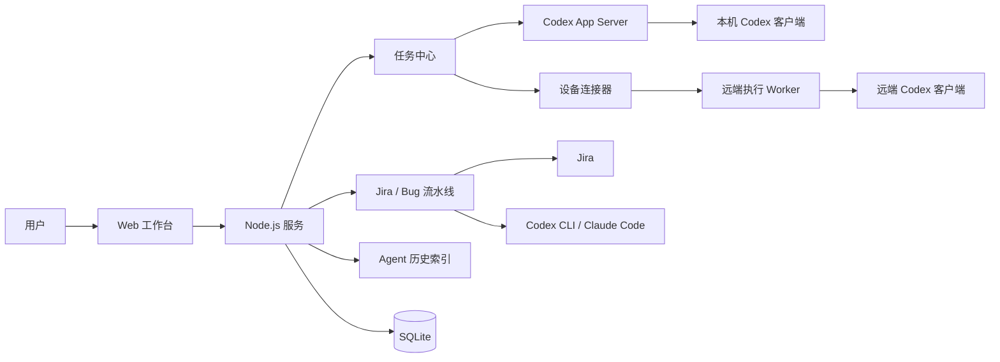

# Agent 任务工作台

一个面向多设备、多 Agent 的本地任务与会话工作台。它把任务、上下文版本、设备、Agent 会话和执行记录统一到同一套界面中，并支持从网页直接启动 Codex 客户端可见的任务。

项目同时保留 Jira 问题接入、AI 分诊、IDE Agent 执行和复核能力，可用于自动化 Bug 修复流水线。

## 当前能力

- **统一任务中心**：创建任务、维护上下文、查看执行状态，并按组织隔离数据。
- **多设备管理**：登记设备在线状态、能力、工作区与可执行项目。
- **多 Agent 会话索引**：汇总 Codex 和 Claude Code 的本地历史会话。
- **跨设备交接**：支持继续、分支和引用三种交接方式，保留上下文版本与来源关系。
- **Codex 客户端直连执行**：通过 Codex App Server 创建持久线程并启动 turn；执行中的任务会出现在 Codex 客户端。
- **远端 Codex 执行**：设备连接器可领取工作台任务，在目标设备上调用本机 Codex，再持续回报状态和输出。
- **Jira Bug 流水线**：抓取问题、AI 分诊、人员分配、自动执行、评审与操作日志。
- **组织与权限**：支持多租户、成员管理、角色权限和恢复流程。

## 架构



服务端入口是 `server.mjs`，静态前端位于 `public/`。主要模块如下：

| 模块 | 作用 |
| --- | --- |
| `src/taskCenter.mjs` | 任务、上下文版本、设备、会话和交接记录 |
| `src/codexExecution.mjs` | 本机 Codex 项目发现、线程启动、审批与执行状态管理 |
| `src/codexAppServer.mjs` | 管理 `codex app-server` 子进程和 JSONL 协议 |
| `src/remoteCodexWorker.mjs` | 远端任务领取、执行日志、控制指令与结果回传 |
| `scripts/device-sync.mjs` | 设备心跳、会话同步、交接接收和远端执行循环 |
| `src/agentHistory/index.mjs` | Codex / Claude Code 历史会话索引 |
| `src/sessionDelivery/index.ts` | 会话增量同步 API |
| `src/tenantRuntime.mjs` | 租户级运行时、配置、执行器与恢复 |
| `src/database.mjs` | SQLite 初始化、迁移、备份与恢复 |

### 两条 Codex 执行路径

**工作台所在设备执行**

1. 前端调用任务执行 API。
2. 服务端通过 `codex app-server` 查询本机项目。
3. 服务端创建持久 Codex thread，并启动 turn。
4. 工作台持续接收状态、输出、审批和用户输入请求。
5. 同一 thread 会出现在 Codex 客户端，可从工作台直接打开。

**其他设备执行**

1. 目标设备运行 `pnpm device:sync` 并开启执行能力。
2. 连接器发布该设备的 Codex 项目和在线状态。
3. 工作台把执行请求写入设备队列。
4. 目标设备领取任务，通过本机 `codex app-server` 执行。
5. 状态、输出和控制结果同步回工作台，线程也会出现在目标设备的 Codex 客户端。

执行记录使用租约和幂等键防止重复领取。服务或连接器异常重启后，未确认结束的本地执行会标记为状态未知，不会自动重跑。

## 快速开始

### 环境要求

- Node.js 22.16 或更高版本
- pnpm
- 本机已安装并登录 Codex CLI；需要 Claude Code 能力时再安装 Claude CLI
- 使用 Jira 流水线时，需要可访问的 Jira 实例和 API Token

### 启动服务

```bash
pnpm install
cp .env.example .env
pnpm start
```

默认访问地址：

- 工作台：`http://127.0.0.1:4173`
- 健康检查：`http://127.0.0.1:4173/api/health`

开发模式：

```bash
pnpm dev
```

如果端口被旧进程占用：

```bash
pnpm kill:port
pnpm start
```

### 从工作台执行 Codex

1. 在“任务”页新建或打开任务。
2. 点击“执行”，选择在线设备和该设备发布的 Codex 项目。
3. 确认任务指令与工作目录后提交。
4. 在任务详情中查看启动、运行、等待输入、完成或失败状态。
5. 本机执行可点击链接打开 Codex 客户端线程；远端执行会在目标设备打开客户端，并在工作台显示线程 ID。

本机执行依赖：

```bash
codex --version
```

服务端默认查找 PATH 中的 `codex`。如需指定可执行文件：

```bash
CODEX_EXECUTABLE=/absolute/path/to/codex
```

可执行项目限制在 `CODEX_WORKSPACE_DIR` 下。默认值是当前仓库目录；需要开放多个项目时，应把它设为这些项目的共同父目录。

## 多设备接入

其他设备通过设备连接器与同一工作台同步。先确保工作台监听局域网地址：

```bash
HOST=0.0.0.0 PORT=4173 pnpm start
```

再在目标设备配置工作台地址和成员凭据。设备 ID 会在首次运行时生成并保存到设备目录。

### 只同步设备与会话

```bash
WORKBENCH_URL=http://192.168.1.20:4173 \
WORKBENCH_TENANT=default \
WORKBENCH_USERNAME=operator \
WORKBENCH_PASSWORD='your-password' \
WORKBENCH_DEVICE_NAME="Office MacBook" \
pnpm device:sync
```

只执行一次同步：

```bash
pnpm device:sync -- --once
```

### 允许工作台在远端直接执行 Codex

```bash
WORKBENCH_URL=http://192.168.1.20:4173 \
WORKBENCH_TENANT=default \
WORKBENCH_USERNAME=operator \
WORKBENCH_PASSWORD='your-password' \
WORKBENCH_DEVICE_NAME="Office MacBook" \
WORKBENCH_EXECUTE_CODEX=true \
CODEX_WORKSPACE_DIR=/Users/me/Work \
pnpm device:sync
```

执行模式需要连接器持续运行，不能与 `--once` 同时使用。建议把它配置为系统登录项或后台服务。

### 设备环境变量

| 变量 | 默认值 | 说明 |
| --- | --- | --- |
| `WORKBENCH_URL` | 无，必须设置 | 工作台服务地址 |
| `WORKBENCH_TENANT` | `default` | 登录组织 ID |
| `WORKBENCH_USERNAME` / `WORKBENCH_PASSWORD` | 无 | 操作员或更高权限的成员凭据 |
| `WORKBENCH_TOKEN` | 无 | 可代替用户名和密码的有效成员会话令牌 |
| `WORKBENCH_DEVICE_NAME` | 当前主机名 | 工作台显示名称 |
| `WORKBENCH_DEVICE_DIR` | `.workflow-data/device` | 设备 ID、游标、收件箱与执行日志目录 |
| `WORKBENCH_EXECUTE_CODEX` | `false` | 是否允许该设备领取 Codex 执行 |
| `WORKBENCH_SYNC_EXCERPTS` | `false` | 是否同步每个会话的近期文本摘要 |
| `CODEX_WORKSPACE_DIR` | 当前目录 | 可发布、可执行项目的根目录 |
| `CODEX_EXECUTABLE` | `codex` | Codex 可执行文件路径 |
| `IDE_HISTORY_SCOPE` | `all` | 会话同步范围：`all` 或 `workspace` |
| `IDE_HISTORY_CODEX_DIR` | 自动发现 | Codex 会话目录 |
| `IDE_HISTORY_CLAUDE_DIR` | 自动发现 | Claude Code 会话目录 |

设备本地状态写入 `.workflow-data/device/`，包含设备 ID、游标、执行日志和交接收件箱。每台设备应独立维护该目录，不要在设备间复制。

成员会话有有效期。长期运行的连接器建议配置成员用户名和密码，让连接器启动时登录；直接配置 `WORKBENCH_TOKEN` 时，需要在令牌过期后更新。

## 任务、会话与交接模型

任务中心围绕五类数据组织：

| 数据 | 说明 |
| --- | --- |
| Task | 用户要完成的工作、状态、负责人和标签 |
| Context revision | 任务上下文的不可变版本，便于追踪交接时使用了哪份信息 |
| Device | 设备在线状态、能力、项目和最后心跳 |
| Session | Codex、Claude Code 等 Agent 会话的索引与摘要 |
| Handoff | 会话在设备或 Agent 之间的继续、分支或引用关系 |

三种交接方式：

- **继续**：目标接手当前上下文，适合把未完成任务迁移到另一设备或 Agent。
- **分支**：从当前上下文创建独立方向，保留来源关系。
- **引用**：只把现有会话作为背景材料，不继承其执行状态。

任务上下文使用版本号和校验值管理，更新时要求提交期望版本，避免多个设备静默覆盖彼此的修改。

### 任务时间线与会话归属

任务详情把会话、执行、交接和任务变更按发生时间展示；会话可以原位展开并分页读取，工具记录默认折叠。搜索任务列表也会匹配关联会话的标题、Agent 和工作目录。后台更新通过“有新进展”提示，避免打断正在阅读的记录。

导航中的“Agent 历史会话”（`#history`）保留独立的会话列表、筛选和阅读界面。任务中心内的“未归属会话”用于预览历史、关联已有任务或从会话创建任务。历史会话关联后按原始时间回填，关联操作本身保留在当前时间。解除或移动关联保留原始记录，并检查任务版本及未结束的执行、交接。

执行完成后任务进入“待验收”，用户确认后才标记完成。“继续任务”当前通过已有执行通道创建新会话，携带任务上下文、所选来源的已同步片段（若可用）和补充指令；它不会恢复原会话的 Agent 内部状态。新会话自动归属原任务并保留接续来源。远端会话仍以连接器同步的片段为准，界面明确标示部分记录。

### 在网页继续原历史会话

打开“Agent 历史会话”，选择本机 Codex 会话，在底部输入框发送消息（支持 ⌘ / Ctrl + Enter）。服务使用 `thread/resume` 恢复原线程，再通过 `turn/start` 追加一轮；不创建替代线程，不覆盖原模型或权限配置。可通过“在 Codex 中打开”查看同一线程的持久记录。

网页显示本轮回复和状态，支持停止、处理审批或问题、核对未知结果，并可刷新原始记录。每次 Codex 执行使用独立 App Server 连接；完成、失败或停止后退订并关闭该执行的进程，确认退出后显示“会话已释放”，表示网页执行进程已退出，不保证其他客户端已释放或重新加载该线程，其他执行不受影响。重复提交同一个发送标识不会重复执行；会话忙碌或恢复失败时不会回退新建。未归属的会话首次续聊会自动创建关联任务，已有任务归属继续保留。

此入口当前支持工作台所在设备的 Codex 历史；Claude Code、远端片段暂不支持原会话恢复。已归档会话需先在客户端取消归档。Codex 对同一线程实行独占写入：客户端即使处于空闲状态也可能持有写入连接，此时独立网页 App Server 无法接管。网页会显示“会话被占用 · 未发送”并恢复输入；需要在客户端继续，或由占用端释放连接后重试。当前不支持网页和客户端各自使用独立 App Server 同时写入同一会话。实时可见性取决于客户端是否刷新同一线程；测试使用协议模拟与浏览器模拟执行，不代表已对真实账号完成桌面同步验收。

## Agent 历史与会话 API

默认组织会自动读取常见本地目录：

- Codex：`$CODEX_HOME/sessions`、`$CODEX_HOME/archived_sessions`
- Claude Code：`~/.claude/projects`

非默认组织不会自动继承宿主机历史目录，需要显式配置 `IDE_HISTORY_CODEX_DIR` 和 `IDE_HISTORY_CLAUDE_DIR`。

会话接口支持游标、增量事件和内容摘要：

```text
GET /api/agent-sessions
GET /api/agent-sessions/:id
GET /api/sessions
GET /api/sessions/:id
GET /api/sessions/:id/events
GET /api/sessions/:id/records
```

## Jira 与 Bug 修复流水线

任务中心之外，项目仍保留原有自动 Bug 流水线：

1. 从 Jira 拉取问题和附件。
2. AI 判断优先级、标签、负责人与处理建议。
3. 将问题分配给人员，或生成 IDE Agent 任务包。
4. 通过 Codex CLI 或 Claude Code 在隔离分支中修改代码。
5. 运行测试、生成评审意见，并记录操作日志。

启用 Jira 时，至少配置：

```bash
ISSUE_PROVIDER=jira
JIRA_BASE_URL=https://your-domain.atlassian.net
JIRA_EMAIL=you@example.com
JIRA_API_TOKEN=your-token
JIRA_JQL=project = PROJ
```

IDE 执行器：

```bash
IDE_EXECUTOR=codex
CODEX_WORKSPACE_DIR=/absolute/path/to/repository
CODEX_BASE_BRANCH=main
```

或：

```bash
IDE_EXECUTOR=claude
CLAUDE_MODEL=your-model
```

是否允许自动执行由功能开关控制：

```bash
ENABLE_AI_ROUTING=true
ENABLE_AI_ASSIGNMENT=true
REQUIRE_HUMAN_REVIEW=true
```

实际默认值与其他可选项见 `.env.example`。

## 用户、权限与组织管理

首次使用：

1. 启动服务并打开登录页。
2. 选择“初始化组织”。
3. 输入 `DEFAULT_TENANT_TOKEN`、所有者邮箱和密码。

内置角色：

| 角色 | 能力 |
| --- | --- |
| `owner` | 全部权限，可管理组织、成员、角色、配置和恢复 |
| `admin` | 管理成员、角色、配置和任务 |
| `operator` | 创建、修改和执行任务 |
| `viewer` | 只读访问 |

常用管理命令：

```bash
pnpm tenant -- add team-a "Team Name"
pnpm tenant -- list
pnpm tenant -- users team-a
pnpm tenant -- rotate team-a
```

在服务器本地恢复成员密码：

```bash
pnpm tenant -- reset-password team-a username
```

建议使用至少 12 位的随机密码，并把初始化令牌和密码放在进程环境或密钥管理系统中。

## 数据与恢复

默认数据库路径：

```text
.workflow-data/workflow.sqlite
```

当前数据库版本是 **3**：

| 迁移 | 内容 |
| --- | --- |
| `001_initial.sql` | 基础工作台数据 |
| `002_rbac.sql` | 用户、角色、会话与安全审计 |
| `003_task_center.sql` | 任务中心、设备、会话和交接数据 |

启动时会检查结构并在事务中执行迁移。备份时先停止服务，再复制 SQLite 文件及对应的 `-wal`、`-shm` 文件；也要备份 `.workflow-data/tenants/` 和默认组织令牌。恢复时停止服务，把同一组文件放回原位置后再启动。

以下目录属于运行数据，不应提交到 Git：

```text
.workflow-data/
.workflow-data/tenants/
.env
```

“客户端执行、网页转发”已完成独立 Node.js 进程的 IPC 两轮发送验证：通过本地路由器发现会话拥有端，再转发消息，无需退出客户端。该入口为内部协议；网页正式入口尚未接入，状态订阅、停止与异常恢复仍待验收。详见[接入验证记录](docs/desktop-continuation-validation.md)及默认只读的 `scripts/codex-ipc-probe.mjs`。

## API 概览

主要接口按领域划分：

| 前缀 | 用途 |
| --- | --- |
| `/api/task-center` | 任务、上下文、设备、会话和交接；使用 `action` 区分写操作 |
| `/api/task-center/codex` | 本机及远端 Codex 执行目标 |
| `/api/task-center/execute` | 创建 Codex 执行 |
| `/api/task-center/execution-action` | 领取、上报、停止、回复和结果核对 |
| `/api/agent-sessions` | Agent 历史会话 |
| `/api/sessions` | 可分页、可增量读取的会话交付接口 |
| `/api/issues/diagnostics` | Jira 数据源诊断 |
| `/api/sync`、`/api/bugs` | 问题同步、附件和分配 |
| `/api/workflows` | Bug 修复流水线、执行和评审 |
| `/api/config` | 组织配置 |
| `/api/organization/members`、`/api/organization/roles` | 成员与权限 |

所有业务数据按租户隔离。浏览器把成员会话令牌保存在当前标签页的 `sessionStorage`，请求时使用 Bearer 认证；设备连接器使用成员账号登录或直接使用有效的成员会话令牌。

## 开发与验证

```bash
pnpm test
pnpm typecheck
```

测试覆盖任务中心、Codex 执行状态、RBAC、数据库、租户运行时、会话同步和 Jira 数据源。

## 当前边界

- 服务端采用单 Node.js 进程和 SQLite，适合个人、团队内网和单实例部署。
- 多实例部署需要共享数据库、分布式租约和跨实例事件总线。
- 远端设备必须持续运行连接器，工作台无法直接唤醒离线设备。
- Codex 线程可见性依赖目标设备的 Codex 安装与登录状态。
- App Server 协议可能随 Codex 版本变化；升级 Codex 后应先运行测试并验证一次客户端可见执行。

Codex App Server 的协议与集成方式可参考 [OpenAI Codex App Server 文档](https://developers.openai.com/codex/app-server/)。

## 许可证

本项目采用 MIT 许可证，见 [LICENSE](LICENSE)。
