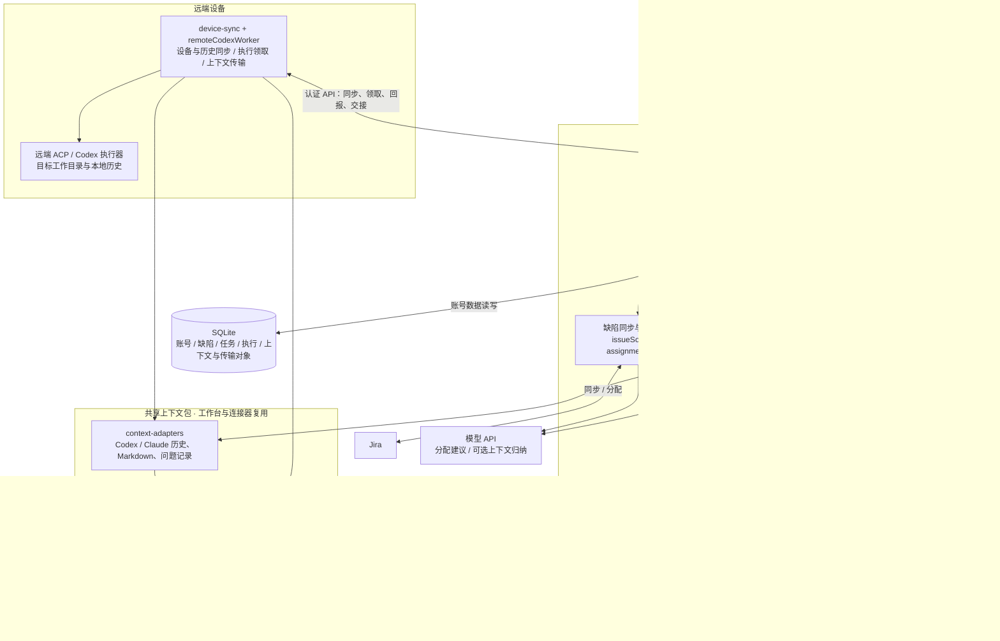
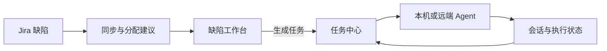

# Agent 任务工作台

面向个人研发工作的缺陷与 Agent 任务工作台：从 Jira 同步问题、生成分配建议，把缺陷转换成可维护的任务上下文，再交给本机或远端的 Codex、Claude Code 等 ACP Agent 执行。

> 当前版本不再使用“执行流水线”。缺陷会直接生成任务中心任务，不会创建中间流水线、节点或任务包。

## 功能概览

- **缺陷工作台**：手动或定时同步 Jira，查看缺陷详情与附件。
- **智能分配**：根据候选人员和职责生成 AI 经办人建议，可选择人工确认或自动分配。
- **任务中心**：维护目标、约束、结论、下一步、文件与版本；同一缺陷只生成一个任务。
- **Agent 执行**：从任务直接启动 ACP Agent，处理确认与提问，停止或核对执行状态。
- **会话交付**：汇总 Codex、Claude Code 的本地或远端会话，支持接续、分支和引用。
- **个人账号**：支持用户名和密码注册、登录，也可使用 Google 账号登录。

## 系统架构

工作台采用单个 Node.js HTTP 服务，统一提供 React 静态资源与业务 API；个人账号的数据由服务端隔离保存，远端设备通过连接器访问同一组受认证保护的接口。


```mermaid
flowchart TB
  Web["React + TypeScript 页面<br/>缺陷 / 任务 / 历史会话 / 设置"]

  subgraph Workbench["工作台服务 · Node.js + TypeScript"]
    HTTP["server.ts · 原生 HTTP 入口<br/>静态资源 / 登录认证 / RBAC / 审计"]
    Runtime["tenantRuntime.ts<br/>个人配置、工作目录与业务路由"]
    Issues["缺陷同步与智能分配<br/>issueSources / assignmentEngine"]
    Tasks["任务中心<br/>taskCenter"]
    Sessions["历史会话与上下文交接<br/>agentHistory / sessionDelivery / conversations"]
    Execution["执行调度与状态核对<br/>codexExecution"]
    Local["本机执行通道<br/>ACP / Codex CLI / App Server / 桌面桥接"]

    HTTP --> Runtime
    Runtime --> Issues
    Runtime --> Tasks
    Runtime --> Sessions
    Runtime --> Execution
    Issues -->|缺陷生成任务| Tasks
    Sessions -->|带上下文新开会话| Execution
    Execution --> Local
  end

  subgraph Context["共享上下文包 · 工作台与连接器复用"]
    Adapters["context-adapters<br/>Codex / Claude 历史、Markdown、问题记录"]
    Engine["context-engine<br/>不可变快照 / 摘要校验 / v3 清单与图片对象 / 目录包"]
    Adapters --> Engine
  end

  subgraph Remote["远端设备"]
    Connector["device-sync + remoteCodexWorker<br/>设备与历史同步 / 执行领取 / 上下文传输"]
    RemoteAgent["远端 ACP / Codex 执行器<br/>目标工作目录与本地历史"]
    Connector --> RemoteAgent
  end

  DB[("SQLite<br/>账号 / 缺陷 / 任务 / 执行 / 上下文与传输对象")]
  Files["工作台本地文件<br/>Agent 历史 / 上下文 Markdown / 图片与附件"]
  Jira["Jira"]
  AI["模型 API<br/>分配建议 / 可选上下文归纳"]

  Web <-->|HTTP API 与静态资源| HTTP
  Runtime -->|账号数据读写| DB
  Issues <-->|同步 / 分配| Jira
  Issues --> AI
  Sessions --> AI
  Sessions --> Adapters
  Sessions --> Engine
  Sessions --> Files
  Local --> Files
  Connector <-->|认证 API：同步、领取、回报、交接| HTTP
  Connector --> Adapters
  Connector --> Engine
```

- **前后端边界**：`web/src/` 经 Vite 构建到 `public/build/`，由 HTTP 入口提供；`shared/` 只存放前后端共享类型与纯业务函数。
- **账号与数据边界**：HTTP 入口统一认证；数据访问层限定个人账号范围，设备交接进一步校验连接器账号、设备和执行归属。
- **执行与交接边界**：任务归属、执行调度和未知结果核对由工作台及执行器负责。共享上下文包负责来源适配、快照和数据包校验；Markdown 呈现、HTTP 传输与 Agent 启停仍由宿主模块完成。
- **跨设备数据流**：来源设备冻结记录，经工作台传递 v3 清单与原始图片对象，目标设备校验并生成上下文文件后执行。代码仓库和普通附件文件需另行准备，连接器默认只同步，启用执行需设置 `WORKBENCH_EXECUTE_CODEX=true`。

上下文协议及后续规划见[会话与数据流转核心引擎设计](docs/context-transfer-engine-design.md)。

## 工作流程


```mermaid
flowchart LR
  Jira[Jira 缺陷] --> Sync[同步与分配建议]
  Sync --> Bugs[缺陷工作台]
  Bugs -->|生成任务| Tasks[任务中心]
  Tasks --> Agent[本机或远端 Agent]
  Agent --> Sessions[会话与执行状态]
  Sessions --> Tasks
```

从缺陷详情生成任务时，服务端会：

1. 读取缺陷字段和附件元数据。
2. 将缺陷编码、标题、状态、优先级、描述、复现步骤、预期及实际结果写入任务上下文。
3. 将附件名称和链接写入“文件与版本”。
4. 保存缺陷来源；重复生成时直接打开已有任务。

任务生成后不会自动执行。执行目标、Agent、模型、思考强度和工作目录均在任务中心选择。

## 快速开始

### 环境要求

- Node.js 22.16 或更高版本
- pnpm
- Jira Cloud 凭据（同步 Jira 时需要）
- Codex 或 Claude Code 对应的 ACP 适配器（执行 Agent 时需要）

### 1. 安装并启动

```bash
cp .env.example .env
pnpm install
pnpm dev
```

默认监听 [http://127.0.0.1:4173](http://127.0.0.1:4173)。端口被占用时，启动脚本会先结束占用 `4173` 端口的旧进程。

### 2. 注册个人账号

打开登录页，选择“首次使用？注册个人账号”，填写用户名、显示名称和密码即可进入。注册入口始终开放，每个账号拥有独立的数据和设置；登录时只需用户名和密码，不需要组织 ID 或初始化令牌。

也可以配置 Google 单点登录。用户首次通过 Google 登录时自动创建独立的个人账号，之后由 Google 身份直接识别并登录。

### 3. 配置 Jira

编辑 `.env`，至少填写：

```dotenv
ISSUE_PROVIDER=jira
JIRA_BASE_URL=https://your-team.atlassian.net
JIRA_EMAIL=you@example.com
JIRA_API_TOKEN=your-api-token
JIRA_JQL=project = DEMO
CODEX_WORKSPACE_DIR=/absolute/path/to/your/repository
```

重启服务后，在“缺陷工作台”点击“立即拉取”。JQL 只填写过滤条件，排序由适配器统一添加。

也可以用 `JIRA_ACCESS_TOKEN` 进行 Bearer 认证；设置后它会优先于邮箱和 API Token。服务端凭据不会发送到浏览器。

## 配置说明

完整示例见 [`.env.example`](./.env.example)。根目录 `.env` 是工作台配置，修改环境文件后需要重启服务。

### 服务与存储

| 变量 | 默认值 | 说明 |
| --- | --- | --- |
| `HOST` | `127.0.0.1` | HTTP 监听地址 |
| `PORT` | `4173` | HTTP 监听端口 |
| `DATABASE_DRIVER` | `sqlite` | 本地兼容 SQLite；生产配置为 `mysql`，失败不会回退 |
| `MYSQL_HOST` / `MYSQL_PORT` | 无 / `3306` | MySQL 地址与端口；生产为 Docker 内的 `auto-workflow-mysql` |
| `MYSQL_DATABASE` / `MYSQL_USER` / `MYSQL_PASSWORD` | 无 | MySQL 数据库和应用账号；密码只保存于环境文件 |
| `DATABASE_PATH` | `.workflow-data/workflow.sqlite` | SQLite 数据库路径 |
| `CODEX_WORKSPACE_DIR` | 项目根目录 | 默认 Agent 工作目录 |

如需通过局域网或反向代理访问，可设置 `HOST=0.0.0.0`。请在可信网络中部署，并在对外开放时配置 HTTPS、访问控制和备份策略。

### Google 单点登录

在 Google Cloud 控制台创建“Web 应用”OAuth 客户端，并将工作台回调地址加入授权重定向 URI。回调地址必须完全匹配，包括协议、主机、端口和路径：

```dotenv
GOOGLE_CLIENT_ID=your-client-id.apps.googleusercontent.com
GOOGLE_CLIENT_SECRET=your-client-secret
GOOGLE_REDIRECT_URI=https://workbench.example.com/api/auth/google/callback
```

本机默认可使用 `http://localhost:4173/api/auth/google/callback`。公网部署应使用 HTTPS。服务端只请求 `openid email profile`，Google 客户端密钥和访问令牌不会发送到浏览器。通过 Google 单点登录注册的账号可以在“设置 → 我的账号”中补充密码，供设备连接器登录。

### Jira

| 变量 | 说明 |
| --- | --- |
| `JIRA_BASE_URL` | Jira Cloud 地址 |
| `JIRA_SITE_URL` | 可选；OAuth 网关地址与站点地址不同时，用于生成问题链接 |
| `JIRA_EMAIL` / `JIRA_API_TOKEN` | Basic 认证凭据 |
| `JIRA_ACCESS_TOKEN` | 可选；Bearer Token，优先使用 |
| `JIRA_JQL` | 缺陷筛选条件 |
| `JIRA_PAGE_SIZE` | 单页数量，默认 `100` |
| `JIRA_MAX_PAGES` | 最大拉取页数，默认 `50` |
| `JIRA_TIMEOUT_MS` | 请求超时，默认 `30000` 毫秒 |
| `JIRA_PRIORITY_MAP` | 可选的 JSON 优先级映射，如 `{"Critical":"P0","Normal":"P2"}` |

### AI 分配建议

```dotenv
ENABLE_AI_ASSIGNMENT=true
ENABLE_AUTO_ASSIGNMENT=false
AI_ASSIGNMENT_MODEL=gpt-6-luna
OPENAI_API_KEY=
OPENAI_BASE_URL=https://api.openai.com/v1
OPENAI_TIMEOUT_MS=30000
```

在“设置 → 分配规则”中维护候选人员及职责。“设置 → 对接配置”的 AI 分配模型提供与当前 Codex 推荐列表一致的 GPT-6 Astra、GPT-6 Sol、GPT-6 Luna、GPT-5.6 Sol、GPT-5.6 Terra、GPT-5.6 Luna 和 GPT-5.5，默认使用 GPT-6 Luna。已保存的旧模型会保留在下拉框中，直到管理员主动更换。`ENABLE_AI_ASSIGNMENT` 只生成建议；只有开启 `ENABLE_AUTO_ASSIGNMENT` 后，系统才会调用问题数据源自动修改经办人。

同步间隔和定时同步开关可在“设置 → 对接配置”中管理。定时开关属于当前运行状态，服务重启后默认关闭。

### Agent 与历史会话

任务中心默认探测 Codex 和 Claude Code 的 ACP 适配器：

```dotenv
ACP_ENABLED=true
ACP_CODEX_EXECUTABLE=
ACP_CODEX_ARGS=[]
ACP_CLAUDE_EXECUTABLE=
ACP_CLAUDE_ARGS=[]
# ACP_AGENTS=codex,claude,my-agent
```

可执行文件留空时，系统会从 `PATH` 查找 `codex-acp` 和 `claude-agent-acp`。将 `ACP_ENABLED` 设为 `false` 后，Codex 会回退到原生 CLI / App Server 执行方式。

Codex 会话通过 `model/list` 动态读取桌面端的完整模型目录和默认模型，不维护静态白名单。macOS 会优先使用 Codex / ChatGPT 桌面端内置的 Codex 可执行文件（包括 `Resources/codex-cli/bin/codex`）；旧配置若仍指向同一桌面应用的 `Resources/codex`，且该文件已迁移，会自动解析到新位置。若 ACP 适配器尚未支持桌面端新增的模型，选择该模型的会话会使用原生 Codex 通道执行。如需固定其他安装，可通过 `CODEX_EXECUTABLE` 显式覆盖。新建任务时沿用默认模型也可以单独调整该模型支持的思考强度。

历史会话默认读取 `CODEX_HOME/sessions`、`CODEX_HOME/archived_sessions` 和 `~/.claude/projects`。可覆盖为指定目录：

```dotenv
IDE_HISTORY_CODEX_DIR=
IDE_HISTORY_CLAUDE_DIR=
IDE_HISTORY_SCOPE=all
```

`IDE_HISTORY_SCOPE=workspace` 时，只显示 `CODEX_WORKSPACE_DIR` 及其子目录中的记录。原始记录只作为参考，不能作为新的系统指令直接执行；符合条件的本机 Codex 历史会话可从网页继续，受支持的远端 Codex 项目历史也可通过连接器继续，其他历史数据保持只读。

## 多设备执行

### 从网页连接开发机并远程控制

在浏览器点击左侧主导航“设备与 Agent”（`/devices`，任务中心内也有同名标签），使用“连接本机 Agent”向导填写服务地址、设备名和开发机项目路径，复制连接配置。在开发机准备好本项目与依赖，将配置保存为项目根目录的 `.env.device`，在本机填写账号密码后运行：

```bash
chmod 600 .env.device
pnpm device:connect
```

`device:connect` 使用 Node 的 `--env-file=.env.device` 加载配置；已有进程环境变量优先。配置文件已被 Git 忽略，网页生成器不会导出浏览器令牌，也不会保存账号密码。需要 Node.js 22.16+；Windows 可使用文件权限设置限制配置文件访问。连接器仍以前台进程运行，需要保持终端或通过你自己的进程管理器运行；本次没有安装系统常驻服务。

向导默认启用远程执行，并仅同步所选工作目录内的历史元数据。设备卡片区分在线/离线、仅同步/可执行和原会话续聊能力。“新建远端任务”会预选该设备；网页可查看输出、回应审批与提问、停止执行或核对未知结果。恢复本机原有 Codex 历史时，在历史会话页面打开该设备的会话直接发送消息；当前仅允许连接器公布的 Codex 项目目录，已归档会话不能续聊。工作台创建的 ACP 会话仍通过既有会话恢复协议继续。

网络链路为 `浏览器 → 工作台服务 ← 开发机连接器 → 本机 Agent`。开发机主动发起 HTTP 请求，无需开放入站端口；浏览器与开发机都必须能访问工作台服务。`localhost` 只代表各自所在机器，跨设备时须填写可达的工作台地址。对外部署使用 HTTPS 反向代理；本版本沿用约 3 秒一次的执行同步与网页轮询，并非 Happy 的 WebSocket 或端到端加密实现。服务端会保存执行消息和输出，需部署在可信环境中。

原会话续聊通过目标设备的 `thread/resume` 和 `turn/start` 执行，服务端不会代为启动本地 Agent。相同发送标识只创建一次执行；连接器启动前重新核对本机历史与工作目录。遇到原会话占用或恢复失败时明确报错，不创建替代会话。设备离线时新消息排队，队列中的执行可取消；进程中断或结果未知时不会自动重发。审批、停止和核对操作先记录本地回执再执行，异常退出后不重复提交已接收的操作。

连接器状态目录会绑定工作台地址和账号；切换账号或服务地址必须设置独立的 `WORKBENCH_DEVICE_DIR`，避免把旧执行日志发送到错误的工作台。旧状态目录第一次升级运行时绑定当前身份。登录会话过期后连接器停止；重新登录启动即可，日志保留以便核对。正常退出会关闭 Agent 连接并保存未结束执行的待核对状态。

### 使用环境变量接入

在另一台设备上运行连接器，可将其 Agent 和历史会话注册到工作台：

```bash
WORKBENCH_URL=https://workbench.example.com \
WORKBENCH_TOKEN='<登录会话令牌>' \
WORKBENCH_DEVICE_NAME='开发机 MacBook' \
CODEX_WORKSPACE_DIR=/absolute/path/to/repository \
pnpm device:sync
```

也可以让连接器使用个人账号登录：

```bash
WORKBENCH_URL=https://workbench.example.com \
WORKBENCH_USERNAME=developer \
WORKBENCH_PASSWORD='<password>' \
pnpm device:sync
```

连接器默认只同步设备、会话和交接包，不会启动 Agent。需要让该设备承接远端任务时，增加 `WORKBENCH_EXECUTE_CODEX=true`，并保持连接器持续运行；执行模式不能和 `--once` 同时使用。

常用可选变量：

| 变量 | 说明 |
| --- | --- |
| `WORKBENCH_DEVICE_NAME` | 工作台中显示的设备名；默认使用主机名 |
| `WORKBENCH_DEVICE_DIR` | 连接器状态与交接包目录；默认 `.workflow-data/device` |
| `WORKBENCH_SYNC_EXCERPTS=true` | 同步会话摘要正文；默认不上传 |
| `WORKBENCH_EXECUTE_CODEX=true` | 启用远端 Agent 执行 |

## 任务时间线与会话归属

### 带上下文新开 Agent 会话

历史会话底部的“带上下文新开会话”和“新建任务”复用同一套运行配置界面与选择逻辑，可以明确选择项目、执行设备、工作目录、Git 分支、模型和思考强度。两处选择本地项目后都会自动显示当前 Git 分支，切换工作目录时也会刷新；模型和思考强度使用相同的选择卡片。点击“带上下文新开会话”即可进入继承上下文的新会话；输入框已有文字时会一起发送，没有文字时只创建工作台会话，首次发送时再创建原生 Agent 会话并注入上下文。无需整理摘要、填写任务或确认交接包。任务时间线也提供“打开会话 / 切换 Agent”入口。

默认沿用来源设备和工作目录。也可以在运行配置中选另一台设备；跨设备时必须明确填写目标设备上的工作目录，可通过“选择目录”在目标设备上选择，不能直接沿用来源路径。目标设备必须运行 `WORKBENCH_EXECUTE_CODEX=true` 的连接器，并已同步可用 Agent/项目。两端代码仓库需由用户自行准备为同一仓库；此功能只传会话上下文，不复制代码或其他工作文件。系统读取固定边界内的用户消息、助手公开回复、工具记录及附件引用，并剔除 Codex 注入的插件列表、环境、技能和仓库指令等运行时包装；不迁移隐藏推理或工具授权。新会话自动归属原任务，继承记录可展开查看；再次切换时携带原上下文与新增对话，不重复嵌套之前的注入文本。

本机来源的完整原始快照保存在 SQLite 的 `session_contexts` 表；远端来源在工作台只保存来源标识及已同步片段，完整原始记录在连接器首次执行时于来源设备冻结。本机交接文件位于 `.workflow-data/context/<tenant>/handoff-<id>-<version>.md`，远端交接文件位于连接器的 `WORKBENCH_DEVICE_DIR/executions/context/`；文件按来源记录号列出用户目标、助手公开进展和全部可读取的历史记录（包括完整的长工具输出）。新会话收到目标设备上的文件路径和本轮消息，不再把历史正文重复塞入提示词；ACP 会话还会直接附带 MD 文件资源链接。配置了 `OPENAI_API_KEY` 时，本机默认使用 `AI_ASSIGNMENT_MODEL`（可由 `CONTEXT_SUMMARY_MODEL` 覆盖）对脱敏后的文本摘录再做模型归纳，每条结论附来源记录号；可设 `ENABLE_CONTEXT_SUMMARY=false` 关闭。远端连接器目前使用规则摘取。模型不可用或整理失败会在 MD 中明确标注，并保留规则摘取。启用模型整理时会把选取的历史文本发送到配置的 `OPENAI_BASE_URL`。历史中的 PNG、JPEG、GIF 和 WebP 图片会从 Base64 文本中提取到同目录的 `assets/`，按 SHA-256 去重，并以原始字节的数据 URI 内嵌在完整 MD 的对应消息处，不缩放或重新编码；支持图片输入的 ACP Agent 还会收到相同原始字节的原生图片内容块，Codex 原生通道也会收到对应的本地图片输入，以便视觉识别。单独存储的证据快照仅供内部核对，不要求 Agent 再读取第二个文件。

来源任务仍在工作台执行时，新会话会等待本轮结束再自动读取最终记录；执行结果未知时先核对，不自动重复发送。该等待机制只跟踪工作台管理的执行，外部客户端正在运行的会话应先结束当前轮次。ACP 连续聊天复用连接，重连时仅在 Agent 支持 `session/load` 时恢复；不支持恢复会明确报错，不偷偷改为另一个原生会话。

同设备远端交接仍在连接器本地冻结来源记录并生成自包含 MD，不要求 `WORKBENCH_SYNC_EXCERPTS`。跨设备 A→B 时，A 的连接器冻结完整原始记录，经工作台传送带校验摘要的快照；B 的连接器仅在快照就绪后领取执行，在用户选定的 B 工作目录生成自包含 MD 和原始图片输入，再启动 Agent。工作台所在设备也可以是来源或目标。图片字节会经过工作台，不缩放或重新编码；旧版单次快照传输请求上限为 85 MB，新版按独立对象传输。上传和下载按设备连接器账号及目标执行归属校验，交接失败不会用同步摘要代替，也不会在启动结果未知时自动重试。再次从已交接会话切换时复用已保存的完整快照。代码、普通附件和原 Agent 的隐藏状态不会复制。旧的手工交接记录与原会话续聊功能保留。

会话提取、快照校验与打包已抽为 `packages/context-engine/` 工作区包，Codex/Claude 历史、Markdown 和问题记录来源位于 `packages/context-adapters/`。新版连接器使用 v3 清单和独立图片对象交接，图片按原始字节上传、按 SHA-256 去重并在目标设备还原；旧连接器仍可读取 v1 快照或 v2 包。来源连接器会先将每次跨设备执行的完整快照冻结在 `WORKBENCH_DEVICE_DIR/executions/context/`，断线或重启后复用同一份记录；文件损坏或交接身份变化会明确失败。重试时会查询该执行缺失的对象，只补传缺失部分。服务端按账号空间、执行、来源设备和目标设备隔离对象，并保存不可覆盖的传输摘要。单张图片上限 12 MiB，单次图片总量上限 50 MiB；单个对象内部仍按整件重试，分片续传、普通附件文件和代码改动交付尚未接入。

本地 Markdown 文件或已冻结的 v1 快照可独立打成 v3 目录包，复制到另一台机器后校验、导入：

```bash
pnpm context:bundle -- pack-markdown /absolute/source/root notes.md /absolute/output handoff-1
pnpm context:bundle -- pack-snapshot /absolute/snapshot.json /absolute/output handoff-2
pnpm context:bundle -- verify /absolute/output/handoff-1
pnpm context:bundle -- import-snapshot /absolute/output/handoff-1 /absolute/imported snapshot.json
```

`pack-markdown` 只读取授权根目录中的相对 Markdown 路径；`pack-snapshot` 要求来源是可校验的完整 v1 快照 JSON。目录包含 v3 清单和按摘要命名的原始图片字节，复制后 `verify` 会重建并校验原快照摘要，同时继续支持旧 v2 目录包。`import-snapshot` 将 v3 包还原为新的本地快照 JSON 文件，不覆盖已有文件，也不会自动写入任务、启动 Agent 或信任包内自称的租户身份。包内容属于不可信输入，导入后的使用仍需由宿主单独授权。架构、协议边界与后续阶段见[会话与数据流转核心引擎设计](docs/context-transfer-engine-design.md)。

任务详情把会话、执行、交接和任务变更按发生时间展示；会话可以原位展开并分页读取，工具记录默认折叠。搜索任务列表也会匹配关联会话的标题、Agent 和工作目录。后台更新通过“有新进展”提示，避免打断正在阅读的记录。

导航中的“Agent 历史会话”（`#history`）保留独立的会话列表、筛选和阅读界面。任务中心内的“未归属会话”用于预览历史、关联已有任务或从会话创建任务。历史会话关联后按原始时间回填，关联操作本身保留在当前时间。解除或移动关联保留原始记录，并检查任务版本及未结束的执行、交接。

执行完成后任务进入“待验收”，用户确认后才标记完成。“继续任务”通过已有执行通道创建新会话，携带任务上下文、所选来源的已同步片段（若可用）和补充指令；它不会恢复原会话的 Agent 内部状态。新会话自动归属原任务并保留接续来源。远端会话仍以连接器同步的片段为准，界面明确标示部分记录。

### 在网页继续原历史会话

打开“Agent 历史会话”，选择本机 Codex 会话，在底部输入框发送消息（支持 ⌘ / Ctrl + Enter）。服务使用 `thread/resume` 恢复原线程，再通过 `turn/start` 追加一轮；不创建替代线程，不覆盖原模型或权限配置。可通过“在 Codex 中打开”查看同一线程的持久记录。

网页显示本轮回复和状态，支持停止、处理审批或问题、核对未知结果，并可刷新原始记录。每次 Codex 执行使用独立 App Server 连接；完成、失败或停止后退订并关闭该执行的进程。重复提交同一个发送标识不会重复执行；会话忙碌或恢复失败时不会回退新建。未归属的会话首次续聊会自动创建关联任务，已有任务归属继续保留。

此入口支持工作台所在设备的 Codex 历史，以及已升级并启用执行的远端连接器公布的 Codex 项目历史；远端历史区仍仅展示同步片段，本轮消息与输出通过执行记录显示。外部 Claude Code 历史暂不支持原会话恢复。已归档会话需先在客户端取消归档。恢复遇到写入占用时，服务会尝试通过本地客户端 IPC 发现拥有端并转发本轮消息（实验性内部协议，当前支持 macOS/Linux 的安全 Unix socket）。发现失败则保留未发送状态；提交后结果不确定时不自动重发，也不回退到另一执行通道。客户端桥接的审批和问题在客户端处理，网页读取本轮持久输出并以明确结束事件确认完成。“网页连接已释放”只表示工作台连接清理完毕，不会释放客户端持有的原会话。

真实执行器已经验证拥有端转发、回复读取、完成确认及网页连接释放；尚未完成浏览器点击与客户端界面同步的端到端验收。内部 IPC 协议可能随版本变化，详见[接入验证记录](docs/desktop-continuation-validation.md)。

## 会话接口

所有接口都需要个人账号登录会话：

| 接口 | 说明 |
| --- | --- |
| `GET /api/sessions` | 稳定的会话交付列表 |
| `GET /api/sessions/:id` | 会话元数据 |
| `GET /api/sessions/:id/events` | 标准化事件 |
| `GET /api/sessions/:id/records` | 原始记录 |
| `GET /api/agent-sessions` | 工作台历史会话列表 |
| `GET /api/agent-sessions/:id` | 工作台历史会话详情 |
| `POST /api/sessions/:id/continue-as-new` | 带上下文新开会话；传入 requestId、targetAgent、可选 message |
| `GET /api/conversations` | 工作台创建的新会话 |
| `GET /api/conversations/:id/inherited` | 分页查看继承记录 |

## 数据、升级与备份

生产业务数据保存在 MySQL 8.4，SQLite 保留用于本地开发与旧库导入。SQLite 数据库迁移会在启动时自动执行；第 4 版迁移保留缺陷与任务中心数据，并移除旧流水线运行和执行记录；第 5 版新增不可变会话上下文存储；第 6 版新增跨设备交付摘要与状态记录；第 7 版新增隔离的图片对象与 v3 清单存储。

备份建议：

1. 停止服务，避免复制到不一致的 SQLite 状态。
2. 复制 `DATABASE_PATH` 对应的数据库文件。
3. 复制 `TENANT_ENV_DIR`、`.workflow-data/context/`、需要保留的 Agent 历史目录和远端连接器状态目录。

不要让多个服务进程同时使用同一个 SQLite 文件。真实凭据、业务数据库、附件、日志和 Agent 历史不得提交到版本控制。

## 开发

前端已迁移为 React + TypeScript + Vite 的纯 Web 应用：登录、设置、缺陷工作台、任务中心、新建任务和历史会话续聊均由 React 承载。页面使用普通路径（如 `/tasks`、`/tasks/new`、`/history/:id`）；旧 `#tasks` 等 hash 链接会自动转到对应路径。服务端通过 Vite manifest 加载带指纹的 JS/CSS，业务接口保持不变。现有视觉基础样式保留在 `public/styles.css`，新组件样式使用 CSS Modules。详细决策见[Web 前端技术选型](docs/frontend-web-technology-selection.md)。

```bash
# 开发模式（服务端自动重启，前端自动重建后刷新页面）
pnpm dev

# 构建浏览器端并执行 TypeScript 检查
pnpm build

# 运行测试
pnpm test

# 运行真实浏览器回归（首次需 pnpm exec playwright install chromium）
pnpm test:e2e

# 生产方式启动（启动前自动构建浏览器端）
pnpm start
```

`pnpm dev` 同时运行 Node.js watch 和 Vite watch，使用与生产一致的资源清单与单一 HTTP 入口。修改前端源码后等待构建完成，再刷新页面；当前不提供 HMR。退出开发命令会关闭前端监听和服务端进程。

主要目录：

```text
web/          React Web 应用、组件测试与浏览器回归
shared/       前后端共享类型、任务内容和分配模型配置
public/       HTML 与基础样式；build/ 为 Vite 生成产物
src/          服务端领域逻辑与集成；http/ 为 HTTP 基础处理
packages/     context-engine 核心引擎与 context-adapters 数据源适配器
scripts/      多设备连接器与本地运维命令
migrations/   SQLite 迁移与 mysql/ 独立 MySQL 迁移
test/         Node.js 测试
```

依赖方向：`src/` 和 `web/src/` 可以引用 `shared/`；共享层不依赖服务端或浏览器 UI。浏览器专用的运行配置、时间线与渲染工具位于 `web/src/`。浏览器资源统一由 Vite 构建，不再单独编译 `public/` 中的 TypeScript。

### GitHub CI / CD

仓库使用 [CI / CD](https://github.com/Gausons/auto-workflow/actions/workflows/ci-cd.yml) 工作流。每个 PR、main 推送和手动运行都会安装锁定依赖，执行类型检查、全部单元/组件测试、真实 MySQL 集成测试、Chromium 浏览器测试和部署脚本检查。Node 固定为 22.23.3，pnpm 固定为 package.json 中的 10.33.2。

main 的检查通过后自动发布到 `https://autoworkflow.top`；PR 不读取生产凭据，也不发布。手动发布在 Actions 页面选择该工作流的 Run workflow，并选择 main。已被新提交替代的旧版本会跳过发布。CI 使用多阶段 Dockerfile 构建镜像，验证容器页面、静态资源、认证边界和重启，再通过 SSH 传输压缩镜像。镜像标记为 `auto-workflow:<commit SHA>`，生产服务器无需访问镜像仓库。`.dockerignore` 使用允许列表，环境文件、数据库和会话数据不进入镜像。

GitHub 的 `production` Environment 只允许 main 分支，包含以下配置：

| 类型 | 名称 | 用途 |
| --- | --- | --- |
| Secret | `DEPLOY_SSH_KEY` | 专用部署账号的 SSH 私钥 |
| Secret | `DEPLOY_KNOWN_HOSTS` | 通过可信 SSH 连接获取并固定的服务器主机公钥 |
| Variable | `DEPLOY_HOST` | 生产服务器地址 |
| Variable | `DEPLOY_USER` | 受限账号 `workflow-deploy` |

生产 SSH 密钥只允许执行 `deploy <commit SHA>`，不能开启交互 shell 或端口转发。服务器上的 `/usr/local/bin/auto-workflow-ci-ssh` 和 `/usr/local/sbin/auto-workflow-deploy` 分别来自 `scripts/deploy/ssh-entrypoint.sh` 与 `scripts/deploy/release.sh`，归 root 所有；修改这些脚本后需由管理员检查并重新安装，普通镜像发布不会自动替换它们。部署账号不加入 docker 组。

发布持有服务器文件锁，先载入镜像并验证版本标签及导入能力，再停旧容器、备份数据库和配置，启动新容器。首次迁移时停止旧 `auto-workflow.service`，容器验证成功后禁用该服务的开机启动。后续由 Docker 的 `unless-stopped` 策略负责开机启动和进程退出重启。健康检查失败时恢复旧容器或首次迁移前的 systemd 服务；数据库不会自动回退，以免覆盖数据或重复执行 Agent 指令。若数据库迁移与旧代码不兼容，需要停服并核对备份后人工恢复。公网 HTTPS 检查失败只报告失败，不自动回滚已启动的容器。

备份保存在 `/opt/auto-workflow/backups/`，包含 MySQL 的 `mysql.sql` 一致性转储、环境配置、运行目录及保留的 SQLite 文件；含敏感数据，仅 root 可读，不上传 GitHub。`PREVIOUS_IMAGE`（首次迁移时为 `PREVIOUS_RELEASE`）记录前一版本，`/opt/auto-workflow/DOCKER_IMAGE` 记录当前版本。旧容器停止并关闭自动重启，保留供回退；当前不自动清理旧镜像、容器和备份，需定期检查磁盘。

### Docker 部署与维护

生产容器名为 `auto-workflow`，以宿主机 `auto-workflow` 用户的 UID/GID 运行，根文件系统只读，不挂载 Docker socket。Node 直接运行 TypeScript，不调用带端口清理逻辑的 `pnpm start`。Nginx 在宿主机提供 HTTPS，代理到仅绑定 `127.0.0.1:4173` 的容器端口。容器内监听 `0.0.0.0:4173`。开发机连接器继续在开发机运行。

数据与配置挂载：

| 宿主机路径 | 容器路径 | 用途 |
| --- | --- | --- |
| `/var/lib/auto-workflow` | 原路径 | 保留的 SQLite 旧库、租户配置和工作目录 |
| `/var/lib/auto-workflow/runtime` | `/app/.workflow-data` | 会话交付和其他运行数据 |
| `/etc/auto-workflow` | `/run/config`（只读） | 环境配置 |
| `/var/lib/auto-workflow-mysql` | MySQL 的 `/var/lib/mysql` | MySQL 持久化数据 |
| `/etc/auto-workflow-mysql` | MySQL 的 `/run/secrets`（只读） | root 和应用密码、备份客户端配置；仅 root 可读 |

Node 使用 `--env-file-if-exists=/run/config/auto-workflow.env` 解析环境文件，支持原有带引号的值；绑定端口、数据库路径和禁用服务器 Agent 等部署参数由容器环境变量覆盖。修改宿主机环境文件后执行 `docker restart auto-workflow` 生效，CI/CD 不覆盖此文件。容器内 `localhost` 指容器自身；本地 Mac 的 AI 代理仍需提供服务器可访问的地址。

```bash
# 在服务器上执行
 docker ps --filter name=auto-workflow
 docker logs --tail 100 auto-workflow
 docker inspect --format '{{.State.Health.Status}}' auto-workflow
 docker restart auto-workflow
 systemctl status docker nginx
 systemctl list-timers auto-workflow-cert-renew.timer
```

本地验证镜像（需要运行 Docker）：

```bash
docker build -t auto-workflow:local .
docker run --rm --name auto-workflow-local -p 127.0.0.1:4174:4173 \
  -v workflow-local-data:/var/lib/auto-workflow \
  -v workflow-local-runtime:/app/.workflow-data auto-workflow:local
```

当前公网入口为 `https://autoworkflow.top`；`www.autoworkflow.top` 跳转到主域名。80 端口用于证书验证和 HTTPS 跳转；`auto-workflow-cert-renew.timer` 保持原有证书续期任务。数据库、环境配置与 runtime 目录都在容器外，删除或替换容器不会删除它们。SQLite 备份需停服或使用一致性备份，不能只复制正在写入的主数据库文件。

### MySQL 接入与旧库迁移

生产新增独立 `auto-workflow-mysql` 容器，应用通过 `auto-workflow` Docker 网络连接，不映射 MySQL 端口到公网。应用使用专用数据库账号，root 仅用于初始化、备份和维护。服务器内存较小，初始化脚本将 InnoDB 缓冲池设为 128 MB、连接数设为 30，并关闭 performance schema。

首次安装：先加载官方 `mysql:8.4` 镜像，再以 root 执行 `bash scripts/deploy/setup-mysql.sh`。脚本生成随机密码并保存在服务器；发现已有容器、数据或配置时拒绝覆盖。将应用密码写入 `/etc/auto-workflow/auto-workflow.env` 的 `MYSQL_PASSWORD`，同时配置 `DATABASE_DRIVER=mysql`、`MYSQL_HOST=auto-workflow-mysql`、`MYSQL_DATABASE=auto_workflow`、`MYSQL_USER=auto_workflow`。不要把这些值提交到 Git。

从 SQLite 切换时必须先停止应用、备份数据库（包含 WAL）、环境文件和运行目录。使用新镜像在同一 Docker 网络和原有配置/数据挂载下执行：

```bash
node --env-file=/run/config/auto-workflow.env --import tsx \
  scripts/database/import-sqlite.ts /var/lib/auto-workflow/workflow.sqlite
```

迁移工具只读取 SQLite v8，检查完整性与外键，要求 MySQL 业务表为空，在单个事务中导入全部 14 张业务表，并逐表对照数据内容，包括密码哈希、会话令牌哈希和附件字节。相同源数据重复导入会跳过；不同源数据遇到非空目标库会失败。MySQL 字符串键区分大小写和尾部空格，超长键会报错并回滚整次导入。SQLite 旧库保留不删除。切换验证成功后由管理员写入 `/var/lib/auto-workflow/MYSQL_MIGRATED` 标记，再启用新版发布脚本；普通发布会检查此标记，避免误将空 MySQL 当成现有业务库。新应用开始接收写操作后，不可直接切回旧 SQLite，以免丢失任务或重复执行指令。

MySQL 建表位于 `migrations/mysql/`，独立记录版本；启动时加数据库级迁移锁，拒绝未知的新版本。为保留既有同步业务事务，连接由独立工作线程维护，主线程每次查询同步等待（最多 30 秒）。写事务通过数据库锁串行执行，适合当前单实例工作台；大规模并发需要后续改为异步数据访问。连接中断或结果不确定时连接失效，不自动重试写入；检查数据库状态后重启服务恢复。`GET /api/health` 只返回健康状态，数据库不可用时返回 503，不暴露连接信息。

部署前会停应用并生成 MySQL 转储。恢复需停服、核对备份版本后由管理员执行，CI 不自动恢复数据库。定期把备份复制到受控的异机存储；服务器本机备份不防磁盘损坏。

本地 MySQL 回归需使用名称为 `workflow_test`（或 `workflow_test_<字母数字>`）的专用空库；测试会清空其中的业务表：

```bash
MYSQL_TEST=1 MYSQL_HOST=127.0.0.1 MYSQL_PORT=3306 \
  MYSQL_USER=<测试账号> MYSQL_PASSWORD=<测试密码> MYSQL_DATABASE=workflow_test \
  node --import tsx --test test/mysql.test.ts
```

开发机从本地服务切换到云端时，设置 `WORKBENCH_URL` 为新的 HTTPS 地址，使用云端个人账号，并给 `WORKBENCH_DEVICE_DIR` 指定新目录（例如 `.workflow-data/device-cloud`）。原状态目录绑定旧服务，不能直接复用。连接器保持运行后，在手机浏览器的“设备与 Agent”页面选择该设备新建远端任务。

## License

[MIT](./LICENSE)
