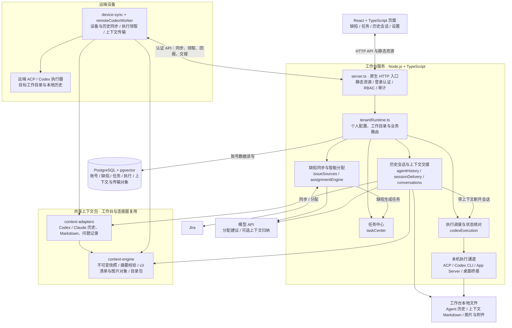
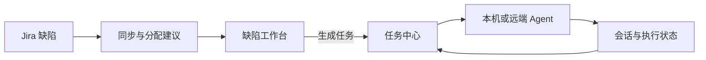

# AgentFlow · Agent 任务工作台

面向个人研发工作的缺陷与 Agent 任务工作台：从 Jira 同步问题、生成分配建议，把缺陷转换成可维护的任务上下文，再交给本机或远端的 Codex、Claude Code 等 ACP Agent 执行。

> 当前版本不再使用“执行流水线”。缺陷会直接生成任务中心任务，不会创建中间流水线、节点或任务包。

## 功能概览

- **缺陷工作台**：手动或定时同步 Jira，按标题、编号或经办人搜索缺陷；双栏浏览列表与详情，窄屏自动上下排列。同步信息可展开查看，描述支持安全的基础富文本排版，更新时间显示为本地日期时间。
- **智能分配**：根据候选人员和职责生成 AI 经办人建议，可选择人工确认或自动分配。
- **任务中心**：维护目标、约束、结论、下一步、文件与版本；同一缺陷只生成一个任务。任务列表与活动记录独立滚动，支持关键词与状态组合筛选（待处理：等待输入、执行异常、待验收；进行中：待接续、进行中），详情始终对应当前筛选结果。上下文可展开，底部固定保留继续任务与处理待办入口；手机端点选任务后进入详情，可返回列表。
- **Agent 执行**：从任务直接启动 ACP Agent，处理确认与提问，停止或核对执行状态。
- **会话交付**：汇总 Codex、Claude Code 的本地或远端会话，支持接续、分支和引用。
- **个人账号**：支持用户名和密码注册、登录，也可使用 Google 账号登录。

## 系统架构

工作台采用单个 Node.js HTTP 服务，统一提供 React 静态资源与业务 API；个人账号的数据由服务端隔离保存，远端设备通过连接器访问同一组受认证保护的接口。


```mermaid
flowchart TB
  Web["React + TypeScript 页面<br/>缺陷 / 任务 / 历史会话 / 设置"]

  subgraph Workbench["工作台服务 · Node.js + TypeScript"]
    HTTP["server.ts · 原生 HTTP 入口<br/>静态资源 / 登录认证 / RBAC / 审计"]
    Runtime["tenantRuntime.ts<br/>个人配置、工作目录与业务路由"]
    Issues["缺陷同步与智能分配<br/>issueSources / assignmentEngine"]
    Tasks["任务中心<br/>taskCenter"]
    Sessions["历史会话与上下文交接<br/>agentHistory / sessionDelivery / conversations"]
    Execution["执行调度与状态核对<br/>codexExecution"]
    Local["本机执行通道<br/>ACP / Codex CLI / App Server / 桌面桥接"]

    HTTP --> Runtime
    Runtime --> Issues
    Runtime --> Tasks
    Runtime --> Sessions
    Runtime --> Execution
    Issues -->|缺陷生成任务| Tasks
    Sessions -->|带上下文新开会话| Execution
    Execution --> Local
  end

  subgraph Context["共享上下文包 · 工作台与连接器复用"]
    Adapters["context-adapters<br/>Codex / Claude 历史、Markdown、问题记录"]
    Engine["context-engine<br/>不可变快照 / 摘要校验 / v3 清单与图片对象 / 目录包"]
    Adapters --> Engine
  end

  subgraph Remote["远端设备"]
    Connector["device-sync + remoteCodexWorker<br/>设备与历史同步 / 执行领取 / 上下文传输"]
    RemoteAgent["远端 ACP / Codex 执行器<br/>目标工作目录与本地历史"]
    Connector --> RemoteAgent
  end

  DB[("PostgreSQL + pgvector<br/>账号 / 缺陷 / 任务 / 执行 / 上下文与传输对象")]
  Files["工作台本地文件<br/>Agent 历史 / 上下文 Markdown / 图片与附件"]
  Jira["Jira"]
  AI["模型 API<br/>分配建议 / 可选上下文归纳"]

  Web <-->|HTTP API 与静态资源| HTTP
  Runtime -->|账号数据读写| DB
  Issues <-->|同步 / 分配| Jira
  Issues --> AI
  Sessions --> AI
  Sessions --> Adapters
  Sessions --> Engine
  Sessions --> Files
  Local --> Files
  Connector <-->|认证 API：同步、领取、回报、交接| HTTP
  Connector --> Adapters
  Connector --> Engine
```

- **前后端边界**：`web/src/` 经 Vite 构建到 `public/build/`，由 HTTP 入口提供；`shared/` 只存放前后端共享类型与纯业务函数。
- **账号与数据边界**：HTTP 入口统一认证；数据访问层限定个人账号范围，设备交接进一步校验连接器账号、设备和执行归属。
- **执行与交接边界**：任务归属、执行调度和未知结果核对由工作台及执行器负责。共享上下文包负责来源适配、快照和数据包校验；Markdown 呈现、HTTP 传输与 Agent 启停仍由宿主模块完成。
- **跨设备数据流**：来源设备冻结记录，经工作台传递 v3 清单与原始图片对象，目标设备校验并生成上下文文件后执行。代码仓库和普通附件文件需另行准备；连接器默认启用执行与历史摘要同步，可用环境变量显式关闭。

上下文协议及后续规划见[会话与数据流转核心引擎设计](docs/context-transfer-engine-design.md)。

## 工作流程


```mermaid
flowchart LR
  Jira[Jira 缺陷] --> Sync[同步与分配建议]
  Sync --> Bugs[缺陷工作台]
  Bugs -->|生成任务| Tasks[任务中心]
  Tasks --> Agent[本机或远端 Agent]
  Agent --> Sessions[会话与执行状态]
  Sessions --> Tasks
```

从缺陷详情生成任务时，服务端会：

1. 读取缺陷字段和附件元数据。
2. 将缺陷编码、标题、状态、优先级、描述、复现步骤、预期及实际结果写入任务上下文。
3. 将附件名称和链接写入“文件与版本”。
4. 保存缺陷来源；重复生成时直接打开已有任务。

任务生成后不会自动执行。执行目标、Agent、模型、思考强度和工作目录均在任务中心选择。

## 快速开始

### 环境要求

- Node.js 22.16 或更高版本
- pnpm
- Jira Cloud 凭据（同步 Jira 时需要）
- Codex 或 Claude Code 对应的 ACP 适配器（执行 Agent 时需要）

### 1. 安装并启动

```bash
cp .env.example .env
pnpm install
pnpm dev
```

默认监听 [http://127.0.0.1:4173](http://127.0.0.1:4173)。端口被占用时，启动脚本会先结束占用 `4173` 端口的旧进程。

### 2. 注册个人账号

打开登录页，选择“首次使用？注册个人账号”，填写用户名、显示名称和密码即可进入。注册入口始终开放，每个账号拥有独立的数据和设置；登录时只需用户名和密码，不需要组织 ID 或初始化令牌。

也可以配置 Google 单点登录。用户首次通过 Google 登录时自动创建独立的个人账号，之后由 Google 身份直接识别并登录。

### 3. 配置 Jira

编辑 `.env`，至少填写：

```dotenv
ISSUE_PROVIDER=jira
JIRA_BASE_URL=https://your-team.atlassian.net
JIRA_EMAIL=you@example.com
JIRA_API_TOKEN=your-api-token
JIRA_JQL=project = DEMO
CODEX_WORKSPACE_DIR=/absolute/path/to/your/repository
```

重启服务后，在“缺陷工作台”点击“立即拉取”。JQL 只填写过滤条件，排序由适配器统一添加。

也可以用 `JIRA_ACCESS_TOKEN` 进行 Bearer 认证；设置后它会优先于邮箱和 API Token。服务端凭据不会发送到浏览器。

## 配置说明

完整示例见 [`.env.example`](./.env.example)。根目录 `.env` 是工作台配置，修改环境文件后需要重启服务。

### 服务与存储

| 变量 | 默认值 | 说明 |
| --- | --- | --- |
| `HOST` | `127.0.0.1` | HTTP 监听地址 |
| `PORT` | `4173` | HTTP 监听端口 |
| `DATABASE_DRIVER` | `postgres` | 唯一支持的数据库驱动，配置错误直接报错 |
| `PGHOST` / `PGPORT` | 无 / `5432` | 本机开发 `127.0.0.1:15432`，生产 Docker 内 `auto-workflow-postgres:5432` |
| `PGDATABASE` / `PGUSER` / `PGPASSWORD` | 无 | PostgreSQL 数据库和应用账号；密码只保存于环境文件 |
| `CODEX_WORKSPACE_DIR` | 项目根目录 | 默认 Agent 工作目录 |

如需通过局域网或反向代理访问，可设置 `HOST=0.0.0.0`。请在可信网络中部署，并在对外开放时配置 HTTPS、访问控制和备份策略。

### Google 单点登录

在 Google Cloud 控制台创建“Web 应用”OAuth 客户端，并将工作台回调地址加入授权重定向 URI。回调地址必须完全匹配，包括协议、主机、端口和路径：

```dotenv
GOOGLE_CLIENT_ID=your-client-id.apps.googleusercontent.com
GOOGLE_CLIENT_SECRET=your-client-secret
GOOGLE_REDIRECT_URI=https://workbench.example.com/api/auth/google/callback
```

本机默认可使用 `http://localhost:4173/api/auth/google/callback`。公网部署应使用 HTTPS。服务端只请求 `openid email profile`，Google 客户端密钥和访问令牌不会发送到浏览器。通过 Google 单点登录注册的账号可以在“设置 → 我的账号”中补充密码，供设备连接器登录。

### Jira

| 变量 | 说明 |
| --- | --- |
| `JIRA_BASE_URL` | Jira Cloud 地址 |
| `JIRA_SITE_URL` | 可选；OAuth 网关地址与站点地址不同时，用于生成问题链接 |
| `JIRA_EMAIL` / `JIRA_API_TOKEN` | Basic 认证凭据 |
| `JIRA_ACCESS_TOKEN` | 可选；Bearer Token，优先使用 |
| `JIRA_JQL` | 缺陷筛选条件 |
| `JIRA_PAGE_SIZE` | 单页数量，默认 `100` |
| `JIRA_MAX_PAGES` | 最大拉取页数，默认 `50` |
| `JIRA_TIMEOUT_MS` | 请求超时，默认 `30000` 毫秒 |
| `JIRA_PRIORITY_MAP` | 可选的 JSON 优先级映射，如 `{"Critical":"P0","Normal":"P2"}` |

### AI 分配建议

```dotenv
ENABLE_AI_ASSIGNMENT=true
ENABLE_AUTO_ASSIGNMENT=false
AI_ASSIGNMENT_MODEL=gpt-6-luna
OPENAI_API_KEY=
OPENAI_BASE_URL=https://api.openai.com/v1
OPENAI_TIMEOUT_MS=30000
```

在“设置 → 分配规则”中维护候选人员及职责。“设置 → 对接配置”的 AI 分配模型提供与当前 Codex 推荐列表一致的 GPT-6 Astra、GPT-6 Sol、GPT-6 Luna、GPT-5.6 Sol、GPT-5.6 Terra、GPT-5.6 Luna 和 GPT-5.5，默认使用 GPT-6 Luna。已保存的旧模型会保留在下拉框中，直到管理员主动更换。`ENABLE_AI_ASSIGNMENT` 只生成建议；只有开启 `ENABLE_AUTO_ASSIGNMENT` 后，系统才会调用问题数据源自动修改经办人。

同步间隔和定时同步开关可在“设置 → 对接配置”中管理。定时开关属于当前运行状态，服务重启后默认关闭。

### Agent 与历史会话

任务中心默认探测 Codex 和 Claude Code 的 ACP 适配器：

```dotenv
ACP_ENABLED=true
ACP_CODEX_EXECUTABLE=
ACP_CODEX_ARGS=[]
ACP_CLAUDE_EXECUTABLE=
ACP_CLAUDE_ARGS=[]
# ACP_AGENTS=codex,claude,my-agent
```

可执行文件留空时，系统会从 `PATH` 查找 `codex-acp` 和 `claude-agent-acp`。将 `ACP_ENABLED` 设为 `false` 后，Codex 会回退到原生 CLI / App Server 执行方式。

Codex 会话通过 `model/list` 动态读取桌面端的完整模型目录和默认模型，不维护静态白名单。macOS 会优先使用 Codex / ChatGPT 桌面端内置的 Codex 可执行文件（包括 `Resources/codex-cli/bin/codex`）；旧配置若仍指向同一桌面应用的 `Resources/codex`，且该文件已迁移，会自动解析到新位置。若 ACP 适配器尚未支持桌面端新增的模型，选择该模型的会话会使用原生 Codex 通道执行。如需固定其他安装，可通过 `CODEX_EXECUTABLE` 显式覆盖。新建任务时沿用默认模型也可以单独调整该模型支持的思考强度。

历史会话默认读取 `CODEX_HOME/sessions`、`CODEX_HOME/archived_sessions` 和 `~/.claude/projects`。可覆盖为指定目录：

```dotenv
IDE_HISTORY_CODEX_DIR=
IDE_HISTORY_CLAUDE_DIR=
IDE_HISTORY_SCOPE=all
```

`IDE_HISTORY_SCOPE=workspace` 时，只显示 `CODEX_WORKSPACE_DIR` 及其子目录中的记录。原始记录只作为参考，不能作为新的系统指令直接执行；符合条件的本机 Codex 历史会话可从网页继续，受支持的远端 Codex 项目历史也可通过连接器继续，其他历史数据保持只读。

历史标题优先保留来源的明确命名，否则采用第一条实际用户消息；Codex 自动附带的页面上下文（`external_codex_apps_open_page`）、环境和仓库指令不作为问题或消息气泡显示。正文中引用的页面标签示例仍会保留。本地服务重启后重新解析原始历史；远端需更新并重启来源连接器，升级后的同步索引会自动重新处理既有记录。

## 多设备执行

### 从网页连接开发机并远程控制

在浏览器点击左侧主导航“设备与 Agent”（`/devices`，任务中心内也有同名标签），使用“连接本机 Agent”向导填写服务地址并复制三项登录配置。开发机只需 Node.js 22.16+、Git 和已安装登录的 Agent，无需下载本项目源码。

连接器独立包发布到 npm 后，可以安装并运行：

```bash
npm install -g agent-workbench-connector
agent-workbench-connector --env-file ./agent.env
```

先将向导生成的配置保存到 `agent.env` 并填写账号密码；macOS/Linux 使用 `chmod 600 agent.env`，Windows 使用文件权限限制当前用户可读。尚未发布到 registry 时，可安装维护者提供的 `agent-workbench-connector-0.3.0.tgz`：`npm install -g ./agent-workbench-connector-0.3.0.tgz`，同样无需源码。安装包不包含 Agent 可执行程序，Codex / Claude 仍需自行安装并登录。

`agent-workbench-connector` 默认读取 `~/.bugflow/agent.env`（存在时），支持 `--env-file`、`--help`、`--version` 和仅同步模式的 `--once`。已有环境变量优先，不自动读取当前目录的 `.env`。默认设备状态位于 `~/.workflow-data/devices/<连接标识>/`，从不同目录启动不会改变设备身份。迁移已有连接器时，先正常停止旧进程，再将 `WORKBENCH_DEVICE_DIR` 指向旧状态目录的绝对路径以保留身份和执行日志；不要同时运行两个处理同一设备的进程。升级包不会删除设备状态。

维护者运行 `pnpm agent:pack` 生成 `dist/device-agent/agent-workbench-connector-0.3.0.tgz`；CI 也保存独立安装包供下载。构建只复用已有 Vite 和 ACP SDK，不发布整个工作台，不包含 `.env`、数据库和本地会话。npm 发布由 `agent-vX.Y.Z` 标签触发，完整 CI 通过后发布同一次构建的安装包，普通构建不会发布。配置见下文“连接器 npm 发布”，包说明见 [device-agent](packages/device-agent/README.md)。仓库开发仍统一使用 pnpm，上面的 npm 命令用于开发机安装发行包。

### 从源码启动连接器（开发调试）

维护工作台源码时，仍可把线上连接配置保存为项目根目录的 `.env.device`，在本机填写账号密码后运行：

```bash
chmod 600 .env.device
pnpm device:connect
```

`device:connect` 使用 Node 的 `--env-file=.env.device` 加载配置；已有进程环境变量优先。配置文件已被 Git 忽略，网页生成器不会导出浏览器令牌，也不会保存账号密码。需要 Node.js 22.16+；Windows 可使用文件权限设置限制配置文件访问。连接器仍以前台进程运行，需要保持终端或通过你自己的进程管理器运行；本次没有安装系统常驻服务。

本地开发使用独立的 `.env.device.dev`，默认连接 `http://127.0.0.1:4173`，并使用独立状态目录，避免与线上连接器共用身份和执行日志。先填写本地工作台的个人账号，再运行：

```bash
chmod 600 .env.device.dev
pnpm device:connect:dev
```

`device:connect:dev` 使用 `--env-file=.env.device.dev`；两个设备配置文件都被 Git 忽略，不应提交账号或密码。

连接器默认以当前用户主目录作为工作目录、启用远程执行、扫描全部工作区历史并同步最近的用户/助手摘要。设备卡片区分在线/离线、仅同步/可执行和原会话续聊能力。“新建远端任务”会预选该设备；网页可查看输出、回应审批与提问、停止执行或核对未知结果。恢复本机原有 Codex 历史时，在历史会话页面打开该设备的会话直接发送消息；当前仅允许连接器公布或在目标机器上明确选择的目录，已归档会话不能续聊。工作台创建的 ACP 会话仍通过既有会话恢复协议继续。

网络链路为 `浏览器 → 工作台服务 ← 开发机连接器 → 本机 Agent`。开发机主动发起 HTTP 请求，无需开放入站端口；浏览器与开发机都必须能访问工作台服务。`localhost` 只代表各自所在机器，跨设备时须填写可达的工作台地址。对外部署使用 HTTPS 反向代理。浏览器先通过 HTTP 读取完整快照，再使用带租户级单调版本的 SSE 接收实时失效通知；连接中断后携带最后版本重连，服务端检测到版本落后时通知浏览器重新拉取。连接器仍以 HTTP 心跳处理设备在线和执行控制，但会在本地保存会话指纹，只上传新增或变化的会话；首次运行和索引损坏时执行完整同步。服务端会保存执行消息和输出，当前尚未实现 Happy 的端到端加密，仍需部署在可信环境中。

原会话续聊通过目标设备的 `thread/resume` 和 `turn/start` 执行，服务端不会代为启动本地 Agent。相同发送标识只创建一次执行；连接器启动前重新核对本机历史与工作目录。遇到原会话占用或恢复失败时明确报错，不创建替代会话。设备离线时新消息排队，队列中的执行可取消；进程中断或结果未知时不会自动重发。审批、停止和核对操作先记录本地回执再执行，异常退出后不重复提交已接收的操作。

连接器状态目录会绑定工作台地址和账号。未配置 `WORKBENCH_DEVICE_DIR` 时，连接器按工作台 origin、租户和账号生成独立目录，因此一台机器可以同时运行多个连接器连接不同服务器或账号；显式指定目录时仍会校验绑定身份，避免把旧执行日志发送到错误的工作台。登录会话过期后连接器停止；重新登录启动即可，日志保留以便核对。正常退出会关闭 Agent 连接并保存未结束执行的待核对状态。

同时连接多台服务器时，将三项登录配置分别保存为已被 Git 忽略的 `.env.server-a`、`.env.server-b`，并在不同终端启动：

```bash
agent-workbench-connector --env-file .env.server-a
agent-workbench-connector --env-file .env.server-b
```

两个进程会使用不同的自动状态目录和设备标识，互不复用执行日志。

新建任务与历史会话的运行配置均支持远端 Git 分支读取、创建和切换。更新工作台后，需要同步更新并重启开发机连接器（`pnpm device:connect` 或 `pnpm device:connect:dev`）；旧连接器会提示升级。操作只针对连接器公布的项目目录，或当前账号通过目标设备“选择目录”授权的目录。为避免运行中的 Agent 遇到代码分支变化，目标设备存在排队、执行中或结果待核对的任务时，暂不允许创建或切换分支；分支操作期间，新的 Agent 执行等待领取。外部客户端自行运行的任务不在此保护范围内。Git 冲突不会强制覆盖未提交文件。

远端 Git 请求通过工作台的 `/api/task-center/git` 提交与查询，连接器通过 `/api/task-center/git-action` 领取和回报。请求标识保证重复提交不重复执行；连接器在执行前记录本地日志，回报断网后只重传结果，异常退出后显示“结果待核对”，不会自动重复切换。设备离线时拒绝新操作，未领取请求在 90 秒后过期，已领取但超过 120 秒无回报的请求标记为未知，需刷新并在目标设备核对实际分支。

### 使用环境变量接入

在另一台设备上运行连接器，可将其 Agent 和历史会话注册到工作台：

```bash
WORKBENCH_URL=https://workbench.example.com \
WORKBENCH_TOKEN='<登录会话令牌>' \
pnpm device:sync
```

也可以让连接器使用个人账号登录：

```bash
WORKBENCH_URL=https://workbench.example.com \
WORKBENCH_USERNAME=developer \
WORKBENCH_PASSWORD='<password>' \
pnpm device:sync
```

连接器默认启用远程执行和历史摘要同步，并保持持续运行。仅同步时设置 `WORKBENCH_EXECUTE_CODEX=false`；只有关闭执行后才能使用 `--once`。如果不希望上传摘要正文，设置 `WORKBENCH_SYNC_EXCERPTS=false`。

常用可选变量：

| 变量 | 说明 |
| --- | --- |
| `WORKBENCH_DEVICE_NAME` | 工作台中显示的设备名；默认使用主机名 |
| `WORKBENCH_DEVICE_DIR` | 连接器状态与交接包目录；独立包默认在 `~/.workflow-data/devices/`，源码脚本默认在启动目录的 `.workflow-data/devices/` 下，均按服务器、租户和账号隔离 |
| `CODEX_WORKSPACE_DIR` | 默认 Agent 工作目录；默认当前用户主目录 |
| `WORKBENCH_SYNC_EXCERPTS=false` | 关闭会话摘要正文同步；默认同步 |
| `WORKBENCH_EXECUTE_CODEX=false` | 关闭远端 Agent 执行；默认启用 |

连接器的增量会话索引保存在 `WORKBENCH_DEVICE_DIR/session-sync-index.json`。索引只包含会话标识与内容指纹，不保存摘要正文；一次同步全部成功后才原子替换。摘要由连接器限制为最多 23,000 字符，服务端拒绝超限摘要。

新版连接器同步最近 30 条结构化记录，保留用户/助手消息、工具调用与结果、轮次标识、时间和可预览图片，历史页与任务会话使用和本地相同的消息气泡、Markdown、工具折叠及图片组件。列表显示原始记录总数，详情标明已同步范围；页头与输入框统一按设备公布的能力判断是否可续聊。

对话区按 Codex 风格排版：用户消息在右侧浅蓝气泡中，助手回复直接显示，支持 Markdown 表格与真实消息时间。Codex 明确标记为 `commentary` 的公开进展与工具记录归入默认折叠的工作过程，`final` 和未标记阶段的回复保留在正文；不推测缺失的阶段、耗时或状态。同步范围收在可展开说明中，旧版纯文本摘要单独折叠并提示升级连接器，不再混作逐条对话。“刷新会话”会同时更新列表与当前正文。

每个会话的结构化正文预览最多保留 23,000 字符文本，优先保留近期记录；超限文本明确标注。新版连接器对新增或发生变化的会话单独同步图片，图片不受最近 30 条记录窗口影响；历史页将已同步图片放回对应的消息位置，进入可见区域时读取原图，也可下载；早于正文预览窗口的图片直接显示，并标注来源记录号及“完整正文未同步”，不将图片附带文本冒充完整消息。左侧搜索和筛选区保持可见，会话列表独立滚动。只接受来源记录中嵌入的 PNG、JPEG、GIF、WebP，不读取任意文件路径或远程图片地址，不缩放或重新编码。单张原图最多 12 MiB，每个会话最多 50 MiB、1000 张；缺少原始数据的图片保留原因，超过会话上限或上传失败时连接器明确报错并保留待同步状态。旧连接器的内嵌图片预览仍受 256 KiB 数据 URI 上限约束。

图片通过受认证保护的 `POST /api/task-center/history-images` 单独上传，`GET /api/agent-sessions/:id/images` 分页返回图片元数据，`GET /api/agent-sessions/:id/images/:imageId` 按需返回原图；上传检查账号、设备和会话归属，读取按账号空间隔离。图片按来源记录和内容摘要去重，失败后查询已保存的图片，只补传缺失对象；本轮记录范围内的全部图片上传成功后才确认会话增量指纹。关闭 `WORKBENCH_SYNC_EXCERPTS` 后，下次同步会同时删除正文预览和独立图片。数据库迁移 004 只创建 `remote_session_images` 表，不回填旧数据，也不改变现有增量索引；未变化的旧会话不会因升级而重新上传。需先更新工作台，再更新并重启连接器。

Codex 分支和子会话保留文件首个会话头中的身份，继承的父会话头不覆盖它；Claude 子 Agent 使用父会话 ID 与 Agent ID 组合标识，正文和图片分别保存。同一 Agent 的同一原生会话存在多个文件时，连接器只同步更新时间最新的文件；时间相同时按本地历史 ID 稳定选择。图片上传仅覆盖本轮已上报的记录范围，同步期间追加的图片随下一轮新增记录上传。若因会话身份冲突持续出现“会话记录已变化，请重新同步”，更新并重启连接器后会按正确身份重新同步，无需删除原始会话或增量索引。

连接器按请求实际字节大小分批，结构化正文和图片只通过详情接口返回，不随历史列表或任务中心全量快照发送。更早的文字记录仍需在来源设备查看；来源记录损坏、未写完或超出读取上限时保留警告。

连接器生成预览时保留完整 Unicode 字符；来源记录中的空字符（NUL）和不成对的 UTF-16 代理项以 `�` 显示，并标记预览不完整，原始会话文件不变。同步请求按完整 UTF-8 解码，网络分包不会改变中文或 emoji。服务端只接受符合当前同步格式的预览；非法字符、超限文本或图片等不合规输入返回 HTTP 400，并回滚整批心跳，不再自动修正。工作台与连接器需同步更新并重启。

结构化预览独立保存在 `remote_session_history`，按账号空间和会话隔离；心跳仅更新发生变化的预览，任务总数据保留范围等小型元数据，避免每次心跳重写全部图片。数据库迁移 003 会将早期版本内嵌在任务数据中的预览移入独立表。关闭正文同步时，对应预览和元数据在同一事务中清除。

需更新并重启连接器才能获得逐条显示；同步格式升级会使旧索引自动重新同步，无需删除索引。旧连接器上传的纯文本仍显示为“仅同步摘要”或“正文未同步”，不会猜测摘要里的角色边界。`WORKBENCH_SYNC_EXCERPTS=false` 同时关闭摘要、结构化正文和图片同步；下次同步会清除对应会话在服务端的历史预览。

## 任务时间线与会话归属

### 带上下文新开 Agent 会话

历史会话底部默认续聊当前会话，显示当前运行配置。点击“带上下文新开会话”后进入新会话配置模式，与“新建任务”复用项目、执行设备、工作目录、Git 分支、模型和思考强度选择。主按钮和 ⌘ / Ctrl + Enter 都执行当前模式的操作；新会话模式下，有文字时“创建并发送”，没有文字时仅“创建会话”，首次发送时再创建原生 Agent 会话并注入上下文。返回当前会话会保留草稿；在页面内切换到其他会话再返回，也会恢复新建模式、所选配置和未决创建请求。后台创建完成不会打断正在查看的其他会话。原会话执行中、结果未知或连接尚未释放时，界面禁止重复发起操作；失败重试沿用同一请求标识。任务时间线也提供“打开会话 / 切换 Agent”入口。

默认沿用来源设备和工作目录。远端历史目录与目标 Agent 默认目录不同时，创建前会自动在目标设备打开目录选择器；确认后使用实际选中的目录继续创建，取消或选择失败时保留输入且不创建会话。“使用默认目录”明确使用当前执行目标的默认目录。也可以在运行配置中选另一台设备；跨设备时必须明确填写目标设备上的工作目录，可通过“选择目录”在目标设备上选择，不能直接沿用来源路径。目标设备必须运行 `WORKBENCH_EXECUTE_CODEX=true` 的连接器，并已同步可用 Agent/项目。两端代码仓库需由用户自行准备为同一仓库；此功能只传会话上下文，不复制代码或其他工作文件。系统读取固定边界内的用户消息、助手公开回复、工具记录及附件引用，并剔除 Codex 注入的插件列表、环境、技能和仓库指令等运行时包装；不迁移隐藏推理或工具授权。新会话自动归属原任务，继承记录可展开查看；再次切换时携带原上下文与新增对话，不重复嵌套之前的注入文本。

本机来源的完整原始快照保存在 PostgreSQL 的 `session_contexts` 表；远端来源在工作台只保存来源标识及已同步片段，完整原始记录在连接器首次执行时于来源设备冻结。本机交接文件位于 `.workflow-data/context/<tenant>/`，远端位于连接器的 `WORKBENCH_DEVICE_DIR/executions/context/`。Agent 首先读取 `handoff-<id>-<version>.md`，长度不超过配置预算与 24,000 字符中的较小值，包含原始目标、最近用户要求、任务引用和近期工具结果；旧记录仅从首读文件省略。`full-<id>-v2.md` 保存全部规范化记录和完整长工具输出，`evidence-<id>-source.json` 保存可校验摘要的原始快照。首读文件链接完整记录，方便按需核对。新会话收到目标设备上的首读文件路径和本轮消息；ACP 会话还会附带该文件资源链接。

配置了 `OPENAI_API_KEY` 时，本机默认使用 `AI_ASSIGNMENT_MODEL`（可由 `CONTEXT_SUMMARY_MODEL` 覆盖）对脱敏后的文本摘录再做模型归纳，每条结论附来源记录号，并记录归纳覆盖范围。摘录优先保留最近轮次，同时纳入工具参数及结果；助手自述完成不视为验证通过。可设 `ENABLE_CONTEXT_SUMMARY=false` 关闭。远端连接器目前使用规则摘取。模型不可用或整理失败会明确标注，并保留规则摘取。启用模型整理时会把选取的历史文本发送到配置的 `OPENAI_BASE_URL`。

用户消息和工具输出中的 PNG、JPEG、GIF、WebP 图片会提取到同目录的 `assets/`，按原始字节的 SHA-256 去重，不缩放或重新编码。首读和完整阅读文件不内嵌 Base64；含图片时另存 `export-<id>-v2.md`，以原始数据 URI 提供自包含导出。支持图片输入的 ACP Agent 会收到相同字节的原生图片内容块，Codex 原生通道收到本地图片输入。普通附件只保留名称、路径及未复制说明。隐藏推理和旧会话工具授权不会传入新会话。

继承上下文默认显示折叠卡片，展开后显示来源、分类统计、原始目标与最近要求；完整明细在独立抽屉中按页查看。页面通过 `/context-preview` 获取规范化文本、图片和工具记录，不直接渲染原始协议 JSON。单条预览文本最多 12,000 字符，单张预览图片最多 2 MiB、每份预览总图片最多 8 MiB，超出时明确提示；这些显示限制不会裁剪实际交接快照。“上下文已准备”只表示交接文件可用，不表示 Agent 已经读取。

来源任务仍在工作台执行时，新会话会等待本轮结束再自动读取最终记录；执行结果未知时先核对，不自动重复发送。该等待机制只跟踪工作台管理的执行，外部客户端正在运行的会话应先结束当前轮次。ACP 连续聊天复用连接，重连时仅在 Agent 支持 `session/load` 时恢复；不支持恢复会明确报错，不偷偷改为另一个原生会话。

同设备远端交接仍在连接器本地冻结来源记录并生成交接文件，不要求 `WORKBENCH_SYNC_EXCERPTS`。更新并重启连接器后，会回报实际准备的记录数、去重图片数和来源是否完整；页面将这些数量与服务端可预览片段分开展示。旧连接器未回报时不推断完整上下文数量。跨设备 A→B 时，A 的连接器冻结完整原始记录，经工作台传送带校验摘要的快照；B 的连接器仅在快照就绪后领取执行，在用户选定的 B 工作目录生成交接文件和原始图片输入，再启动 Agent。工作台所在设备也可以是来源或目标。图片字节会经过工作台，不缩放或重新编码；旧版单次快照传输请求上限为 85 MB，新版按独立对象传输。上传和下载按设备连接器账号及目标执行归属校验，交接失败不会用同步摘要代替，也不会在启动结果未知时自动重试。再次从已交接会话切换时复用已保存的完整快照。代码、普通附件和原 Agent 的隐藏状态不会复制。旧的手工交接记录与原会话续聊功能保留。

会话提取、快照校验与打包已抽为 `packages/context-engine/` 工作区包，Codex/Claude 历史、Markdown 和问题记录来源位于 `packages/context-adapters/`。新版连接器使用 v3 清单和独立图片对象交接，图片按原始字节上传、按 SHA-256 去重并在目标设备还原；旧连接器仍可读取 v1 快照或 v2 包。来源连接器会先将每次跨设备执行的完整快照冻结在 `WORKBENCH_DEVICE_DIR/executions/context/`，断线或重启后复用同一份记录；文件损坏或交接身份变化会明确失败。重试时会查询该执行缺失的对象，只补传缺失部分。服务端按账号空间、执行、来源设备和目标设备隔离对象，并保存不可覆盖的传输摘要。单张图片上限 12 MiB，单次图片总量上限 50 MiB；单个对象内部仍按整件重试，分片续传、普通附件文件和代码改动交付尚未接入。

本地 Markdown 文件或已冻结的 v1 快照可独立打成 v3 目录包，复制到另一台机器后校验、导入：

```bash
pnpm context:bundle -- pack-markdown /absolute/source/root notes.md /absolute/output handoff-1
pnpm context:bundle -- pack-snapshot /absolute/snapshot.json /absolute/output handoff-2
pnpm context:bundle -- verify /absolute/output/handoff-1
pnpm context:bundle -- import-snapshot /absolute/output/handoff-1 /absolute/imported snapshot.json
```

`pack-markdown` 只读取授权根目录中的相对 Markdown 路径；`pack-snapshot` 要求来源是可校验的完整 v1 快照 JSON。目录包含 v3 清单和按摘要命名的原始图片字节，复制后 `verify` 会重建并校验原快照摘要，同时继续支持旧 v2 目录包。`import-snapshot` 将 v3 包还原为新的本地快照 JSON 文件，不覆盖已有文件，也不会自动写入任务、启动 Agent 或信任包内自称的租户身份。包内容属于不可信输入，导入后的使用仍需由宿主单独授权。架构、协议边界与后续阶段见[会话与数据流转核心引擎设计](docs/context-transfer-engine-design.md)。

任务详情把会话、执行、交接和任务变更按发生时间展示；会话可以原位展开并分页读取，工具记录默认折叠。搜索任务列表也会匹配关联会话的标题、Agent 和工作目录。后台更新通过“有新进展”提示，避免打断正在阅读的记录。

导航中的“Agent 历史会话”（`#history`）保留独立的会话列表、筛选和阅读界面。任务中心内的“未归属会话”用于预览历史、关联已有任务或从会话创建任务。历史会话关联后按原始时间回填，关联操作本身保留在当前时间。解除或移动关联保留原始记录，并检查任务版本及未结束的执行、交接。

执行完成后任务进入“待验收”，用户确认后才标记完成。“继续任务”通过已有执行通道创建新会话，携带任务上下文、所选来源的已同步片段（若可用）和补充指令；它不会恢复原会话的 Agent 内部状态。新会话自动归属原任务并保留接续来源。远端会话仍以连接器同步的片段为准，界面明确标示部分记录。

### 在网页继续原历史会话

打开“Agent 历史会话”，选择本机 Codex 会话，在底部输入框发送消息（支持 ⌘ / Ctrl + Enter）。服务使用 `thread/resume` 恢复原线程，再通过 `turn/start` 追加一轮；不创建替代线程，不覆盖原模型或权限配置。可通过“在 Codex 中打开”查看同一线程的持久记录。

网页显示本轮回复和状态，支持停止、处理审批或问题、核对未知结果，并可刷新原始记录。每次 Codex 执行使用独立 App Server 连接；完成、失败或停止后退订并关闭该执行的进程。重复提交同一个发送标识不会重复执行；会话忙碌或恢复失败时不会回退新建。未归属的会话首次续聊会自动创建关联任务，已有任务归属继续保留。

此入口支持工作台所在设备的 Codex 历史，以及已升级并启用执行的远端连接器公布的 Codex 项目历史；远端历史区仍仅展示同步片段，本轮消息与输出通过执行记录显示。外部 Claude Code 历史暂不支持原会话恢复。已归档会话需先在客户端取消归档。恢复遇到写入占用时，服务会尝试通过本地客户端 IPC 发现拥有端并转发本轮消息（实验性内部协议，当前支持 macOS/Linux 的安全 Unix socket）。发现失败则保留未发送状态；提交后结果不确定时不自动重发，也不回退到另一执行通道。客户端桥接的审批和问题在客户端处理，网页读取本轮持久输出并以明确结束事件确认完成。“网页连接已释放”只表示工作台连接清理完毕，不会释放客户端持有的原会话。

真实执行器已经验证拥有端转发、回复读取、完成确认及网页连接释放；尚未完成浏览器点击与客户端界面同步的端到端验收。内部 IPC 协议可能随版本变化，详见[接入验证记录](docs/desktop-continuation-validation.md)。

## 会话接口

所有接口都需要个人账号登录会话：

| 接口 | 说明 |
| --- | --- |
| `GET /api/sessions` | 稳定的会话交付列表 |
| `GET /api/sessions/:id` | 会话元数据 |
| `GET /api/sessions/:id/events` | 标准化事件 |
| `GET /api/sessions/:id/records` | 原始记录 |
| `GET /api/agent-sessions` | 工作台历史会话列表 |
| `GET /api/agent-sessions/:id` | 工作台历史会话详情 |
| `POST /api/sessions/:id/continue-as-new` | 带上下文新开会话；传入 requestId、targetAgent、可选 message |
| `GET /api/conversations` | 工作台创建的新会话 |
| `GET /api/conversations/:id/inherited` | 原始继承记录，供连接器分页读取 |
| `GET /api/conversations/:id/context-preview` | 规范化的只读上下文预览、来源和分类统计 |

## 数据、升级与备份

开发、生产和自动测试统一使用 PostgreSQL 17 + pgvector 0.8.6。应用启动时按 migrations/postgres/ 中的版本顺序执行事务迁移。版本 2 删除已完成迁移的历史导入回执。

备份使用 pg_dump -Fc，恢复使用 pg_restore；恢复前停止应用并核对数据库版本。同时保存租户配置、上下文文件和远端连接器状态。凭据、业务数据库、附件、日志和 Agent 历史不得提交到版本控制。

## 开发

前端已迁移为 React + TypeScript + Vite 的纯 Web 应用：登录、设置、缺陷工作台、任务中心、新建任务和历史会话续聊均由 React 承载。页面使用普通路径（如 `/tasks`、`/tasks/new`、`/history/:id`）；旧 `#tasks` 等 hash 链接会自动转到对应路径。服务端通过 Vite manifest 加载带指纹的 JS/CSS，业务接口保持不变。现有视觉基础样式保留在 `public/styles.css`，新组件样式使用 CSS Modules。详细决策见[Web 前端技术选型](docs/frontend-web-technology-selection.md)。

```bash
# 开发模式（服务端自动重启，前端自动重建后刷新页面）
pnpm dev

# 构建浏览器端并执行 TypeScript 检查
pnpm build

# 运行测试
pnpm test

# 运行真实浏览器回归（首次需 pnpm exec playwright install chromium）
pnpm test:e2e

# 生产方式启动（启动前自动构建浏览器端）
pnpm start
```

`pnpm dev` 同时运行 Node.js watch 和 Vite watch，使用与生产一致的资源清单与单一 HTTP 入口。修改前端源码后等待构建完成，再刷新页面；当前不提供 HMR。退出开发命令会关闭前端监听和服务端进程。

主要目录：

```text
web/          React Web 应用、组件测试与浏览器回归
shared/       前后端共享类型、任务内容和分配模型配置
public/       HTML 与基础样式；build/ 为 Vite 生成产物
src/          服务端领域逻辑与集成；http/ 为 HTTP 基础处理
packages/     context-engine 核心引擎与 context-adapters 数据源适配器
scripts/      多设备连接器与本地运维命令
migrations/   postgres/ 中的 PostgreSQL 版本迁移
test/         Node.js 测试
```

依赖方向：`src/` 和 `web/src/` 可以引用 `shared/`；共享层不依赖服务端或浏览器 UI。浏览器专用的运行配置、时间线与渲染工具位于 `web/src/`。浏览器资源统一由 Vite 构建，不再单独编译 `public/` 中的 TypeScript。

### GitHub CI / CD

连接器安装回归使用临时空缓存，从公共 npm registry 安装打包产物及运行时依赖，不依赖开发者机器或 Runner 的历史缓存，因此执行 `pnpm test` 需要访问 `registry.npmjs.org`。安装失败会输出依赖解析诊断；测试失败时生产部署会被跳过，服务器不会更新。

仓库使用 [CI / CD](https://github.com/Gausons/auto-workflow/actions/workflows/ci-cd.yml) 工作流。每个 PR、main 推送、`agent-v*` 标签推送和手动运行都会安装锁定依赖，执行类型检查、全部单元/组件测试、真实 PostgreSQL / pgvector 测试、Chromium 浏览器测试和部署脚本检查。Node 固定为 22.23.3，pnpm 固定为 package.json 中的 10.33.2。

#### 连接器 npm 发布

`publish_agent` 只在本仓库的 `agent-vX.Y.Z` 正式版本标签上通过 push 或 workflow_dispatch 启动且全部检查通过后运行，与网站部署独立；标签提交必须已合入 main，标签版本必须等于 `packages/device-agent/package.json` 及安装包中的版本。发布任务下载本次 CI 的 `agent-workbench-connector` Artifact，不重新构建，串行发布到 npm 的 `latest`。PR、普通 main 提交、在 main 上手动运行 CI / CD 不会发布 npm；连接器标签不会部署网站。

首次配置：

1. 在 GitHub 创建独立的 `npm` Environment，仅允许 `agent-v*` 标签，建议设置审核人，并用仓库 Ruleset 限制这些标签的创建、更新和删除。
2. 包已存在时，在 npm 的 `agent-workbench-connector` 包设置添加 GitHub Actions Trusted Publisher：Owner **Gausons**、Repository **auto-workflow**、Workflow **ci-cd.yml**、Environment **npm**，允许直接 `npm publish`。字段大小写须完全一致。OIDC 使用短期凭据，无需保存本机登录 Token；其他包的可信发布配置不会随改名自动转移。参考 [npm 可信发布文档](https://docs.npmjs.com/trusted-publishers/)。
3. 若包尚不存在，可先由维护者手动发布首个已验证 tgz，再配置可信发布；也可在 `npm` Environment 添加临时 `NPM_TOKEN` Secret，让首次标签发布在 CI 完成。后者需要有创建该包权限、可非交互发布的 npm granular token（按账号策略设置 bypass 2FA、最小权限及短有效期）。本机 `npm login` 不会给 GitHub Runner 授权。不要将本机 `.npmrc` 提交或把 Token 发到聊天中。首次发布完成并配置好可信发布后删除该 Secret。

日常一键发布（无需手动改版本或新增长期 Token）：

1. 将功能改动和本工作流合入 main。
2. 打开 GitHub **Actions → Release Agent → Run workflow**，分支选择 **main**。
3. 选择 `patch`（如 0.3.0 → 0.3.1）、`minor`（0.3.0 → 0.4.0）或 `major`（0.3.0 → 1.0.0），运行。
4. 流程只修改连接器包的 `version`，自动创建版本提交，并将 main 和 `agent-vX.Y.Z` 标签原子推送。然后显式启动该标签上的 **CI / CD**；全部检查通过后，经已有 `npm` Environment 审核（如配置）发布。**Release Agent 成功仅表示准备完成，最终结果看后续 CI / CD 的 publish_agent。** 等该发布完成后再发下一个版本。

准备任务使用内置 `GITHUB_TOKEN` 的 `contents: write` 和 `actions: write`；组织策略必须允许这些权限，main 与标签保护规则必须允许机器人进行相应推送。若规则要求所有变更必须走 PR，则此直接提交模式会失败，应继续用下方手动版本 PR 流程，不要为此关闭保护。准备任务不安装项目依赖、不获取 npm 凭据、不部署网站。npm Trusted Publisher 仍填写 **ci-cd.yml**，不是 release-agent.yml；现有 npm 环境和信任配置无需修改。

GitHub 内置令牌推送不会触发 push 工作流，因此这里使用显式 workflow_dispatch，见 [GitHub 令牌触发规则](https://docs.github.com/en/actions/concepts/security/github_token)。同一准备任务重新运行会核验并复用该任务已创建的版本标签，不会再次递增；其他任务的同名标签、执行期间前进的 main、推送权限不足都会明确失败，不强推、不覆盖。如果提交和标签已创建但后续检查失败，修复前先检查发布状态；未发布且无需修改源码时可重跑该标签上的 CI / CD。已发布版本不得重发；需要改源码时使用下一版本，保留失败标签供核对。

也保留手动方式：修改连接器包的 `version`、提交并合入 main，再对包含这些改动的提交打标签，例如尚未发布的版本为 0.3.1 时：

```bash
git tag agent-v0.3.1 <已合入-main-的提交SHA>
git push origin agent-v0.3.1
```

发布使用固定 npm 11.5.1（支持 OIDC）；仓库依赖和这个隔离的发布工具仍由 pnpm 安装。发布后从公共 registry 安装精确版本并核对 CLI 版本，不启动 Agent。若发布失败或发布后验证失败，先检查 npm 上该版本的状态再处理；已发布的同名同版本不可覆盖，失败时不自动另开新版本、重发、撤回或移动旧标签。网络传播延迟导致安装验证失败时也不代表发布未发生。

#### 工作台网站部署

main 的检查通过后自动发布到 `https://autoworkflow.top`；PR 不读取生产凭据、不推送镜像，也不发布。手动发布在 Actions 页面选择该工作流的 Run workflow，并选择 main。已被新提交替代的旧版本会跳过发布。CI 使用多阶段 Dockerfile 构建镜像，验证容器页面、静态资源、认证边界和重启，然后将同一个已验证镜像以 `ghcr.io/gausons/auto-workflow:<commit SHA>` 推送到 GHCR。新版服务器部署助手声明 `registry-v1` 能力后，生产机直接按不可变 digest 拉取该镜像；升级过渡期若服务器仍是旧助手，工作流会使用同一次构建导出的压缩镜像。生产容器健康检查通过后，同一镜像摘要会提升为 `latest`。域名备案期间默认跳过公网 HTTPS 检查；备案完成后将 `production` Environment 的 `DEPLOY_VERIFY_PUBLIC_HTTPS` 设为 `true`，恢复公网检查并要求其通过后才提升标签；正式部署和问题核对仍应使用 commit SHA 或 digest，不依赖可变的 `latest`。`.dockerignore` 使用允许列表，环境文件、数据库和会话数据不进入镜像。

GHCR 使用工作流内置的 `GITHUB_TOKEN` 和最小 `packages: write` 权限，不需要新增长期 Registry 密钥。首次推送会创建 GitHub Package，仓库管理员需在 Package settings 中将 `auto-workflow` 设置为 Public，之后开源用户可直接拉取；若尚未公开，不影响当前 SSH 生产发布：

```bash
docker pull ghcr.io/gausons/auto-workflow:latest
# 生产环境建议固定工作流输出的 commit SHA 或 sha256 digest。
```

GitHub 的 `production` Environment 只允许 main 分支，包含以下配置：

| 类型 | 名称 | 用途 |
| --- | --- | --- |
| Secret | `DEPLOY_SSH_KEY` | 专用部署账号的 SSH 私钥 |
| Secret | `DEPLOY_KNOWN_HOSTS` | 通过可信 SSH 连接获取并固定的服务器主机公钥 |
| Variable | `DEPLOY_HOST` | 生产服务器地址 |
| Variable | `DEPLOY_USER` | 受限账号 `workflow-deploy` |
| Variable | `DEPLOY_VERIFY_PUBLIC_HTTPS` | 仅为 `true` 时启用公网 HTTPS 检查；备案期间不设置或设为 `false`，备案完成后设为 `true` |

生产 SSH 密钥只允许执行只读的 `capabilities` 探测，以及 `deploy <commit SHA> [sha256:<digest>]`，不能开启交互 shell 或端口转发。服务器上的 `/usr/local/bin/auto-workflow-ci-ssh` 和 `/usr/local/sbin/auto-workflow-deploy` 分别来自 `scripts/deploy/ssh-entrypoint.sh` 与 `scripts/deploy/release.sh`，归 root 所有；修改这些脚本后需由管理员检查并重新安装，普通镜像发布不会自动替换它们。部署账号不加入 docker 组。安装本版本的两个脚本并将 GHCR Package 设为 Public 后，下一次发布会自动切换到 registry 模式；确认服务器已连续成功使用该模式后，才可以另行删除过渡期的 Artifact 导出与旧命令兼容逻辑。

升级服务器助手时，先确认匿名 `docker pull ghcr.io/gausons/auto-workflow:<commit SHA>` 成功，再先安装向后兼容的发布脚本，最后安装会声明 `registry-v1` 的 SSH 入口；不得颠倒顺序，否则入口可能在发布脚本尚不支持 digest 时提前启用新协议：

```bash
# 在服务器仓库副本中以 root 执行；安装前先核对来源提交和文件内容。
install -o root -g root -m 0755 scripts/deploy/release.sh /usr/local/sbin/auto-workflow-deploy
install -o root -g root -m 0755 scripts/deploy/ssh-entrypoint.sh /usr/local/bin/auto-workflow-ci-ssh
```

发布持有服务器文件锁，registry 模式先拉取精确 digest，过渡模式则载入传输的镜像；两种模式都会验证版本标签、运行平台及导入能力，再停旧容器、备份数据库和配置，启动新容器。首次迁移时停止旧 `auto-workflow.service`，容器验证成功后禁用该服务的开机启动。后续由 Docker 的 `unless-stopped` 策略负责开机启动和进程退出重启。健康检查失败时恢复旧容器或首次迁移前的 systemd 服务；数据库不会自动回退，以免覆盖数据或重复执行 Agent 指令。若数据库迁移与旧代码不兼容，需要停服并核对备份后人工恢复。启用公网 HTTPS 检查后，检查失败只报告失败，不自动回滚已启动的容器，也不会移动 GHCR 的 `latest` 标签。

备份保存在 `/opt/auto-workflow/backups/`，包含 PostgreSQL 的 `postgres.dump` 一致性转储、环境配置和运行目录；含敏感数据，仅 root 可读，不上传 GitHub。`PREVIOUS_IMAGE`（首次迁移时为 `PREVIOUS_RELEASE`）记录前一版本，`/opt/auto-workflow/DOCKER_IMAGE` 记录当前版本。旧容器停止并关闭自动重启，保留供回退；当前不自动清理旧镜像、容器和备份，需定期检查磁盘。

### Docker 部署与维护

生产容器名为 `auto-workflow`，以宿主机 `auto-workflow` 用户的 UID/GID 运行，根文件系统只读，不挂载 Docker socket。Node 直接运行 TypeScript，不调用带端口清理逻辑的 `pnpm start`。Nginx 在宿主机提供 HTTPS，代理到仅绑定 `127.0.0.1:4173` 的容器端口。容器内监听 `0.0.0.0:4173`。开发机连接器继续在开发机运行。

数据与配置挂载：

| 宿主机路径 | 容器路径 | 用途 |
| --- | --- | --- |
| `/var/lib/auto-workflow` | 原路径 | 租户配置和工作目录 |
| `/var/lib/auto-workflow/runtime` | `/app/.workflow-data` | 会话交付和其他运行数据 |
| `/etc/auto-workflow` | `/run/config`（只读） | 环境配置 |
| `/var/lib/auto-workflow-postgres` | PostgreSQL 的 `/var/lib/postgresql/data` | PostgreSQL 持久化数据 |
| `/etc/auto-workflow-postgres` | 单独密码文件挂载到 `/run/secrets`（只读） | 管理员与应用密码；宿主机父目录仅 root 可访问 |

Node 使用 `--env-file-if-exists=/run/config/auto-workflow.env` 解析环境文件，支持原有带引号的值；绑定端口、数据库连接和禁用服务器 Agent 等部署参数由容器环境变量覆盖。修改宿主机环境文件后执行 `docker restart auto-workflow` 生效，CI/CD 不覆盖此文件。容器内 `localhost` 指容器自身；本地 Mac 的 AI 代理仍需提供服务器可访问的地址。

```bash
# 在服务器上执行
 docker ps --filter name=auto-workflow
 docker logs --tail 100 auto-workflow
 docker inspect --format '{{.State.Health.Status}}' auto-workflow
 docker restart auto-workflow
 systemctl status docker nginx
 systemctl list-timers auto-workflow-cert-renew.timer
```

本地验证镜像（需要运行 Docker）：

```bash
docker build -t auto-workflow:local .
docker run --rm --name auto-workflow-local -p 127.0.0.1:4174:4173 \
  -v workflow-local-data:/var/lib/auto-workflow \
  -v workflow-local-runtime:/app/.workflow-data auto-workflow:local
```

当前公网入口为 `https://autoworkflow.top`；`www.autoworkflow.top` 跳转到主域名。80 端口用于证书验证和 HTTPS 跳转；`auto-workflow-cert-renew.timer` 保持原有证书续期任务。数据库、环境配置与 runtime 目录都在容器外，删除或替换容器不会删除它们。数据库备份通过 pg_dump 获取一致性快照。

### 本地开发 PostgreSQL + pgvector

开发应用仍通过 `pnpm dev` 运行。`compose.postgres.yaml` 提供 PostgreSQL 17 + pgvector 0.8.6，监听 `127.0.0.1:15432`，数据库和普通应用账号均为 `auto_workflow`。持久化卷为 `auto-workflow-postgres-dev-data`；不要运行 `down -v` 删除数据库卷。

新开发机先准备 Docker 和本地 `.env`（参考 `.env.example`，不要覆盖已有配置），再初始化密码：

```bash
umask 077
mkdir -p .workflow-data/postgres-dev
chmod 700 .workflow-data/postgres-dev
[ -f .workflow-data/postgres-dev/admin-password ] || openssl rand -hex 32 > .workflow-data/postgres-dev/admin-password
[ -f .workflow-data/postgres-dev/app-password ] || openssl rand -hex 32 > .workflow-data/postgres-dev/app-password
# 父目录仅当前用户可访问；容器只挂载单独文件，初始化的 postgres 用户需读取应用密码。
chmod 644 .workflow-data/postgres-dev/app-password
docker compose -f compose.postgres.yaml up -d --wait
```

将应用密码填入 `.env` 的 `PGPASSWORD`，使用示例中的 `DATABASE_DRIVER=postgres` 和 `PG*` 参数，然后 `pnpm dev`。数据库初始化脚本创建非超级用户 `auto_workflow` 并启用 `vector` 扩展；普通应用启动不需要管理员密码。已有数据卷不会重新运行初始化脚本，覆盖密码文件不会修改现有账号密码。

```bash
# 日常启动
 docker compose -f compose.postgres.yaml up -d --wait
 pnpm dev
# 停止数据库，保留数据
 docker compose -f compose.postgres.yaml stop
```

### PostgreSQL 生产部署与迁移

生产使用独立 `auto-workflow-postgres` 容器，通过 `auto-workflow` Docker 网络访问，不映射数据库端口到公网。先加载 `pgvector/pgvector:0.8.6-pg17-bookworm` 镜像，再以 root 执行：

```bash
bash scripts/deploy/setup-postgres.sh scripts/database/postgres-init/001-app.sh
```

脚本拒绝覆盖已有数据或配置，生成随机密码，初始化普通应用账号并启用 pgvector。数据库设置 128 MB shared_buffers 和 30 个连接。生产 `.env` 配置 `DATABASE_DRIVER=postgres`、`PGHOST=auto-workflow-postgres`、`PGPORT=5432`、`PGDATABASE=auto_workflow`、`PGUSER=auto_workflow`，`PGPASSWORD` 来自服务器的应用密码文件。

PostgreSQL 初始化验证完成后创建 `/var/lib/auto-workflow/POSTGRES_MIGRATED` 标记，并安装新版 `scripts/deploy/release.sh`。CI 发布检查此标记，停应用后通过 `pg_dump -Fc` 备份到 `postgres.dump`，再替换应用容器。恢复需管理员停服、核对版本后使用 `pg_restore`；不会自动恢复旧库，避免覆盖任务或重复执行 Agent 指令。新库接收写入后不可直接切回旧库。

PostgreSQL 的建表位于 `migrations/postgres/`，使用事务和 advisory lock 执行迁移，拒绝未知新版本；通过数据库事务锁保留既有串行写入语义。当前仍使用工作线程维持同步数据库接口，每次查询最多等待 30 秒，连接失效后不自动重复写入，核对结果后重启应用恢复。`GET /api/health` 检查数据库，失败返回 503。

### 向量搜索准备情况

pgvector 扩展已启用，集成测试覆盖向量写入、余弦距离排序、HNSW 索引及带租户条件的查询。业务向量表、文本切分、embedding 模型和维度尚未选定，因此本次不创建固定维度的业务向量列，也不新增搜索 HTTP 接口。后续应按租户及模型版本隔离向量，并在查询中检查业务授权；有 HNSW 索引并不自动提供租户权限隔离。可参考 [pgvector 官方文档](https://github.com/pgvector/pgvector)。

pnpm test 和 pnpm test:e2e 自动启动临时 PostgreSQL 容器，测试结束后移除容器及其数据卷；本地需要 Docker。CI 复用工作流的 PostgreSQL 服务。所有测试仅允许 workflow_test 库，各测试使用独立 schema，并发和重连均在真实数据库上验证。运行指定测试：

```bash
node --import tsx scripts/testing/run.ts node test/database.test.ts
```

CI 的 TEST_PGHOST、TEST_PGPORT、TEST_PGUSER、TEST_PGPASSWORD、TEST_PGDATABASE 仅连接临时测试服务；不得用于业务库。

开发机从本地服务切换到云端时，设置 `WORKBENCH_URL` 为新的 HTTPS 地址并使用云端个人账号。默认状态目录按服务器和账号自动隔离，不需要手工切换；显式设置 `WORKBENCH_DEVICE_DIR` 时不能把已绑定其他服务的目录复用。连接器保持运行后，在手机浏览器的“设备与 Agent”页面选择该设备新建远端任务。

## License

[MIT](./LICENSE)
