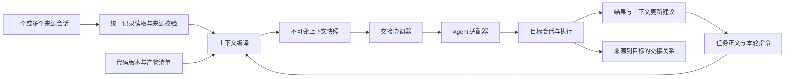

# 跨 Agent 会话上下文交接：现状与落地方案

日期：2026-09-21。依据当前工作区代码和已有验证记录；下文保留设计与后续路线；已落地范围见紧接的实施记录。工作区已有的历史适配器及测试修改保持不动。

## 实施记录（2026-09-22）

已实现主交互：在会话输入区选择 Agent 后直接新开会话；当前输入可同时发送，没有输入则等首次发送再创建原生会话。支持继承记录查看、来源链、同任务归属、同设备工作目录继承、长历史规则摘取及本机完整原文、请求去重、已管理来源执行的等待、ACP 连接复用和按能力恢复。

实际落点为 `contextCompiler.ts`、`conversations.ts` 和 `005_session_context.sql`，复用原执行器与任务存储，没有实现下文规划的全部独立 handoff 表。主 API 是 `POST /api/sessions/:id/continue-as-new`，不需要前端预览快照。

远端仍以已有同步片段为准；跨设备代码/附件交付、远端长历史文件交付、模型摘要与通用已有会话引用属于后续阶段。原生会话格式通过文本参考上下文适配，图片视觉输入的跨 Agent 等价性尚未保证。等待只覆盖工作台跟踪的执行。

验证包括真实 ACP 子进程协议与 HTTP 集成测试，以及隔离浏览器环境中的新建、继承和连续两轮交互；Agent 回复来自确定性测试适配器，不等于真实模型账号端到端验收。

## 1. 产品目标与边界

核心体验：用户在当前会话选择“用 Claude / Codex 新开会话”，系统自动带上已有上下文并打开目标新会话，用户直接继续聊天。无需选择交接模式、整理任务、填写下一步、确认摘要或预览快照。设备和工作目录沿用当前可用配置；没有可用默认值时才补充选择。

建议将任务作为长期工作载体，会话作为某个 Agent 的一次参与，上下文快照作为可迁移资产。缺陷只是任务来源之一；直接从历史会话交接时可以自动建立任务，用户不必先整理任务表单。

后台可以保留三种关系语义，但不要求用户在主流程选择；首期产品入口只提供带上下文新开会话：

| 操作 | 语义 | 首期策略 |
| --- | --- | --- |
| 接续 | 同一任务交给新的目标会话继续 | 核心能力，优先完成 Codex ↔ Claude |
| 分支 | 在固定快照上另建任务探索，保留来源关系 | 随接续复用快照；隔离写入工作区 |
| 引用 | 将选定资料提供给已有会话，不转移任务归属 | 先导出，适配器支持后提供原生追加 |

“原会话恢复”是另一个能力：保持原生会话 ID，在同一 Agent 中追加轮次。跨 Agent 接续传递用户要求、工作事实、产物和公开记录；不能承诺迁移模型内部状态、隐藏推理、已生效的工具授权或正在执行的进程。

## 2. 当前现状

| 模块 | 已有能力及代码依据 | 当前边界 |
| --- | --- | --- |
| 历史读取 | `src/agentHistory/` 适配 Codex、Claude；可查看消息和工具记录 | 历史可读不等于目标执行时已携带历史 |
| 会话交付 | `src/sessionDelivery/` 提供分页、快照校验、增量游标、来源行号、敏感字段处理 | 主要是本地文件读取接口，没有接入跨 Agent 上下文编译；游标签名密钥在重启后变化 |
| 任务上下文 | `src/taskCenter.ts` 支持 Markdown、contextVersion、revision、会话归属、分支关系 | 当前正文和版本号不等于可查询的完整版本历史；没有自动提取结论及证据链 |
| 手工交接 | `handoff/ack` 已有接续、分支、引用、固定 packet、待接收/已接收/已开始状态 | 启动靠人工关联新会话；不能证明目标 Agent 实际收到并使用了 packet |
| 直接执行 | `src/codexExecution.ts` 组合任务正文、来源片段和本轮指令，支持本地/远端 | 与手工交接两套入口互斥；未消费 handoff packet；来源仅取单会话 |
| ACP | `src/acpAgent.ts` 完成 initialize/new/prompt、输出、权限交互和取消 | 当前实现每次新建会话，未提供通用已有会话 load/append |
| 原会话续聊 | `continueHistory` 支持本机 Codex；具备 requestId 去重、忙碌检查及未知结果核对 | Claude 和远端历史尚未支持；桌面 IPC 是实验性路径 |
| 多设备 | `scripts/device-sync.ts` 同步目录、片段、交接包；RemoteCodexWorker 领取执行 | 默认不上传正文；可选仅最近 30 条中的用户/助手文本、末尾 24000 字符；收到包不会启动 |
| 文件与代码 | 任务保存文件描述；执行支持本地附件；可查询/切换 Git 分支 | 未交付未提交改动、附件和仓库快照；远端执行拒绝上传附件 |
| 持久化 | SQLite 事务及租户隔离；任务中心存放于每租户一个 JSON payload | 交接、执行、上下文缺少独立约束和索引，不宜长期承载完整历史 |

最影响核心体验的三个断点：

1. **有历史，没有统一上下文构建。** 本地 catalog 的 excerpt 为空；execute 的来源查找只看持久化 sessions，再取 output/excerpt。仅关联的本地历史可能退化为“仅有来源索引”。sessionDelivery 的完整读取能力尚未串入此路径。
2. **有交接，没有自动执行闭环。** 连接器只把 packet 写入 inbox 并确认 received；直接执行还要求先取消待处理的手动交接。
3. **有会话串联，没有产物连续性。** 新 Agent 可能知道上一段说了什么，却拿不到对应代码和验证证据；完成后也没有结构化结果更新长期上下文。

已有桌面接入验证记录见 `docs/desktop-continuation-validation.md`：正式执行器的 IPC 转发已实测，浏览器与桌面完整联动验收尚未完成。不能将此能力视为所有 Agent 的通用交接基础。

## 3. 建议架构

复用现有执行器、租户权限、历史适配器和时间线。新增上下文编译器与交接协调器，不另建一套调度系统，也不把复制厂商原始会话文件作为主方案。

### 3.1 统一、不可变的上下文快照

建议 `ContextSnapshot v1` 包含：

- 身份：schemaVersion、snapshotId、tenantId、taskId、taskRevision、contextVersion、createdAt、digest。
- 用户意图：任务正文、明确约束、本轮指令；保留原文，不让摘要替换要求。
- 工作状态：已完成、决定及理由、未解决问题、失败尝试、下一步、验收标准；每项注明是用户确认、来源事实还是模型提炼。
- 来源：sourceSessionIds、device/agent/nativeId、固定读取边界、sourceDigest、事件/行号引用。
- 证据：选定消息、关键工具输出、测试结论及引用；摘要的关键事实必须能定位原文。
- 产物：仓库标识、base commit、分支、dirty 状态、可选 patch、附件内容哈希和相对路径。
- 覆盖情况：完整/部分/仅索引、缺失内容、裁剪项、估算 token 数、摘要生成器及版本。

快照冻结后只读。用户修改预览会生成新快照；执行绑定准确的 snapshotId 和 digest。历史游标仅用于读取过程，不能作为长期交接凭据：当前游标重启失效，因此选中的脱敏证据应单独持久化，并保存稳定哈希。

默认按原始顺序携带全部可迁移的会话记录，包括用户消息、助手公开回复、工具调用与结果，以及可用附件引用。预算充足时不先摘要、不按规则只选最近片段。上下文超出目标预算时后台自动压缩较早记录，保留最近完整轮次和明确要求，同时保存可检索原文；不增加人工审批步骤。新会话再次切换时复用既有来源链和上下文底稿，只追加新增记录，避免反复摘要导致遗忘或重复嵌套。

长记录采用“简要上下文 + 证据索引 + 按需读取”。首期把必要证据直接打包，不要求所有 Agent 都能调用工作台接口；后续仅为具有对应工具能力的 Agent 开放租户/任务范围内的只读检索。多来源出现冲突时保留分歧，不静默拼成确定结论。

### 3.2 Agent 能力声明

定义统一接口 `capabilities / createSession / appendTurn / cancel / reconcile`，以已探测能力决定可用操作：

| 能力 | 用途 | 当前代码基础 |
| --- | --- | --- |
| createWithContext | 快照注入新会话 | Codex/Claude ACP 新建与 prompt |
| resumeNative | 恢复原生会话 | 本机 Codex 专用实现 |
| appendExisting | 给已有会话追加引用 | 需要分别实现、验证；不能因支持 ACP 就默认支持 |
| readEvidence | 按需取详细证据 | 新增，可选 |
| deliverArtifacts | 接收代码/附件 | 新增，先同机校验，后跨设备交付 |

能力不足时明确展示“新会话接续”或“导出交接内容”。用户选定原会话追加后，失败不能悄悄改为创建新会话。桌面 IPC 隔离为专用适配器，不成为跨 Agent MVP 的依赖。

### 3.3 交接与执行闭环

建议交接状态：`draft → ready → queued → launching → started`，异常分支为 `blocked / unknown / failed / cancelled`。执行继续沿用现有 running/waiting/completed 等状态；交接 started 只表示目标绑定并成功提交上下文，不表示任务完成。

1. 用户发起带上下文新建后，后台读取来源固定边界、生成快照并检查目标。前端直接打开新会话，显示准备上下文进度；没有独立预览审批阶段。
2. 前端提交 requestId、sourceSessionId、目标 Agent 及可选的下一条消息；服务端解析任务、读取版本并生成 snapshotId。在同一事务中冻结上下文、预留目标会话及按需创建 execution；同 requestId、同参数返回同结果，参数不同返回冲突。没有新消息且源轮次已完成时只准备新会话，不自行执行历史中的旧要求。仅支持 new/prompt 的适配器将上下文在用户第一次发送时与新消息一并提交；初始化上下文不启动业务动作。
3. 同任务的接续限制一个活动执行；锁住的是任务执行权，不必锁死用户的笔记编辑。执行引用固定版本，新增笔记只影响下一次快照。
4. 源会话运行中，接续需等待或显式停止并确认落盘；分支可基于固定边界，但必须隔离写入工作区。首期不提供两个 Agent 对同一目录并行修改。
5. 远端领取复用现有 worker。先持久化领取意图，再创建会话；得到原生会话 ID 后及时保存，提交成功再标记 started。收到 JSON 文件只能标记 delivered。
6. 断线或提交响应丢失进入 unknown，保留源任务与证据。先核对目标，不自动重发；不宣称外部 Agent 调用具有严格 exactly-once 保证。
7. 重试有独立 attempt 和已知失败依据；不能因为租约过期就让第二个 worker 再启动一次。取消后仍应检查已启动目标的实际状态。
8. 结果自动归属任务，并产生“结论/改动/验证/剩余工作”更新建议。自动追加执行证据；修改用户目标或合并冲突结论需用户处理。任务继续沿用人工验收完成。

权限沿用现有租户和角色；快照、证据下载、交接查询及 worker 回报都校验租户/任务与设备归属。用户指令和历史参考资料在 prompt 中分区，历史里的系统指令、凭据和已授权动作不迁移。脱敏是尽力处理，不能描述为可识别任意秘密。

### 3.4 文件与工作区连续性

首期先支持同机同仓库，记录 commit、工作区和 dirty 清单，启动前重新校验；来源对应文件已变化时提示差异或阻止自动接续，避免仅凭相同 cwd 判断一致。

跨设备第二阶段通过仓库映射加 commit/patch/附件内容哈希交付。路径使用相对路径并验证边界；目标缺少基础提交、patch 冲突、附件缺失时进入 blocked。下载成功和应用成功分别记录；不把提交、推送、覆盖目标改动隐含在“交接”操作内。

分支上下文与 Git 分支分开建模；创建了分支任务不代表已经创建隔离 worktree。

## 4. 代码与数据落点

| 改动位置 | 内容 |
| --- | --- |
| 新增 `src/contextSnapshot.ts` | 类型、版本、快照哈希、来源和覆盖率契约 |
| 新增 `src/contextCompiler.ts` | 统一读取历史/执行/远端片段，预算、规则裁剪、证据引用 |
| 新增 `src/handoffService.ts` | preview/commit/cancel/reconcile；交接与执行事务协同 |
| `src/sessionDelivery/` | 提取可复用内部读取 API；持久化选定证据；避免绕过现有来源校验 |
| `src/codexExecution.ts` | execute 接受快照引用，停止各自拼接上下文；复用既有原生恢复路径 |
| `src/acpAgent.ts` | 能力注册、注入统一 prompt；已有会话追加按实际能力实现 |
| `src/remoteCodexWorker.ts`、`scripts/device-sync.ts` | 消费绑定快照的 execution，回报 snapshot digest/目标会话/提交状态 |
| `public/taskCenter.ts`、历史页 | 带上下文新开会话、继承历史展示、后台准备进度、普通聊天输入框 |
| 新增数据库迁移 | context_snapshots、context_evidence、session_handoffs、handoff_attempts |

新增表均带 tenant_id；`(tenant_id, request_id)` 唯一，executionId 与 handoffId 建立唯一绑定。首期执行仍可保留在 task_centers payload，通过同一 SQLite 事务协调新增表和旧 payload；后续再拆 executions，避免为交接功能先重写整个任务中心。

建议新增接口：`POST /api/sessions/:id/continue-as-new`，入参为 requestId、targetAgent、可选 message/目标位置，直接返回新会话标识和 preparing/ready 状态。来源解析、快照生成、执行绑定均由服务端完成。保留后台交接查询、取消和核对接口，但不让前端先调用 preview 再提交快照。继续沿用已有 execution 状态和交互接口。

历史 handoff packet 保留为 legacy 手工记录，不自动补发；新服务仅处理新 schemaVersion。采用功能开关逐步替换入口，回滚时关闭新提交但保留快照、已启动执行及核对能力。

## 5. 用户交互

主入口为当前会话中的“用其他 Agent 新开会话”，也可以在输入框旁切换 Agent 后发送下一条消息。

1. 用户选择目标 Agent，立即进入新会话视图。Agent 相同时也支持带上下文新建。
2. 系统自动继承当前会话上下文、工作目录、附件引用及任务归属；原会话保留。
3. 页面显示可折叠的继承历史，与目标会话新产生的消息区分；默认只展示简短“接续自…”链接。
4. 若用户同时发送新消息，准备完成后自动执行该消息；若只要求新建，则准备好输入框等待用户继续，不自动重做旧任务。
5. 源轮次仍运行时，默认排队等当前轮次完成再取上下文，展示等待状态；不暗中停止原会话或同时修改同一目录。
6. 后台自动处理格式转换、超长压缩、来源存储和执行去重。只有无法继续的真实错误才在当前会话显示，不另开交接审批流程。

快照是后台实现细节，不作为主交互概念。验收强调新会话能直接理解“按刚才的方案继续”“修复上面的失败”等承接表达，无需用户重复描述。

## 6. 分阶段交付与验收

以下是按 1 名熟悉项目的全栈工程师估算的有效开发时间，包含集成测试；适配器和真实设备问题可能延长排期。

| 阶段 | 预计 | 交付和退出条件 |
| --- | --- | --- |
| P0：同机交接闭环 | 7–10 工作日 | 快照 v1、统一历史读取、交接执行事务、幂等、来源链、UI；Codex→Claude→Codex 在同任务完成真实验收 |
| P1：跨设备可用 | 5–8 工作日 | 来源设备快照同步、仓库映射、patch/附件交付、断线核对；远端收到上下文及必要产物后成功执行 |
| P2：已有会话与上下文质量 | 5–8 工作日 | 按能力实现已有会话引用、多个来源冲突呈现、可追溯摘要、结果回写；摘要与真实证据一致 |

P0 推荐按三次可审查变更推进：

1. 快照契约、证据存储与编译器，修复本地历史只有索引的问题；先无 UI 切换。
2. handoff→execution 闭环及故障核对，复用现有本地/远端执行器；保留旧记录。
3. 统一交接入口、时间线与真实双向交接验收。

核心验收用例：

- Codex 定位问题并留下未提交修改，Claude 在同机接手补测试，再由 Codex 接手修复；三段会话保留同一任务和可查看的快照链。
- 单独关联的本地历史、远端片段和执行生成会话都能形成正确来源；无正文时明确 partial，不能假装已携带全文。
- 交接中途服务重启、设备离线、启动后响应丢失：不重复启动；恢复后可核对原目标。
- 连点提交和参数变化复用 requestId 分别验证幂等与冲突；两个操作者同时接续只有一个成功。
- 任务编辑、历史新增、源文件截短/替换不会改变已冻结快照；后台捕获发生冲突时重新读取，不能混入两个版本。
- 代码版本不符、附件缺失和 patch 冲突能阻塞；分支任务不与原任务同时修改同一目录。
- 跨租户快照/证据不可读；已知凭据脱敏；历史指令不提升为本轮用户授权。
- 结果回写保留用户目标和验收要求，失败尝试不会被摘要写成已完成。

上线建议跟踪：交接后首轮可执行率、重复启动次数、上下文不足导致的澄清率、关键约束遗漏率、新会话就绪耗时与上下文大小。P0 门槛是上述场景通过、故障注入下重复启动为零；成功率目标待真实试点建立基线，不预先宣称无损迁移。

## 7. 优先级结论

第一优先级是让任意已接入来源会话都能生成足够、准确、可追溯的快照，并通过现有执行器真正交给另一 Agent。先交付“同机跨 Agent 连续工作”的完整演示，再拓展跨设备产物和已有会话注入。差异化最终体现为工作可以连续交接且能核对依据，而不只是把多个 Agent 的聊天记录放在同一个页面。
