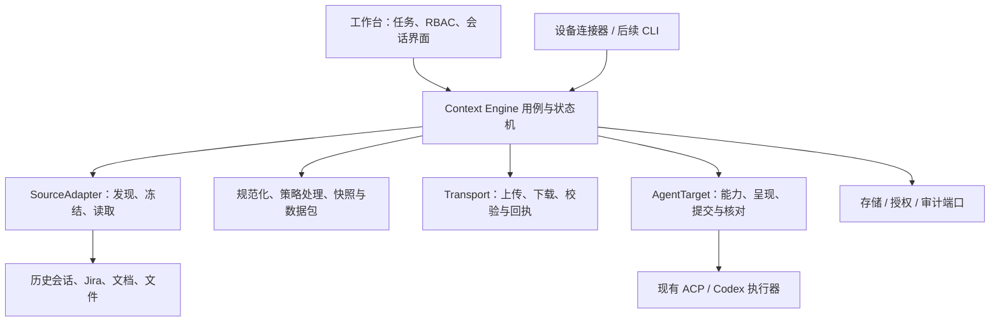

# 会话与数据流转核心引擎设计

状态：分阶段实施中。日期：2026-09-23。

当前落地：P0/P1 的包边界、数据源注册、Codex/Claude 会话解码适配、Markdown 来源、v1 快照统一校验；P2 的问题记录来源适配器、v3 图片对象拆分、HTTP 原始字节传输和第 7 版对象存储。跨设备交接保留 v1/v2 读取兼容，目录包提供独立打包与校验命令。下文 P2/P3 中的通用离线导入、对象分片续传、普通附件、代码 patch、通用目标适配器及独立交付状态机仍是后续工作；当前执行归属和未知结果核对仍由工作台及现有执行器负责。

## 1. 决策与目标

将会话提取、上下文构建、数据打包、跨设备传输和 Agent 交付抽为独立的 `context-engine`。工作台与设备连接器使用同一套引擎；业务层只负责选择来源、目标、权限和任务归属。

第一阶段采用仓库内独立 TypeScript 包，有独立入口、测试和协议版本，可被其他项目直接依赖。先不拆 Git 仓库、不部署新微服务，避免接口尚在变化时引入发布与运维负担。边界稳定后可以独立发布包，或在引擎外增加服务入口。

核心资产是可核验、可重放读取的不可变数据包。Markdown 是供 Agent 阅读的一种呈现，不是跨机器协议；会话流转也不等同于复制原生 Agent 会话文件。

本方案中“数据源扩展”包含会话记录、问题单、文档、文件及后续代码产物；“目标扩展”包含不同 Agent 和只接收数据包的导出目标。二者分别扩展。

首期覆盖当前租户内、本机与远端设备之间的 Codex/Claude 上下文交付，同时用问题单或 Markdown 文件源验证扩展性。跨组织共享、自动合并多机数据库、迁移隐藏状态、运行进程与工具授权不属于首期范围。

## 2. 现有能力与抽取依据

以当前源码和 README 为准；旧文档 `agent-context-handoff-plan.md` 中部分“尚未接入”“远端仅片段”的描述已落后于当前实现。

| 当前模块 | 已有能力 | 拆分方向 |
| --- | --- | --- |
| `src/agentHistory/` | Codex/Claude 历史发现、预览、工作区范围校验 | 会话来源适配器及本地读取基础设施 |
| `src/sessionDelivery/` | 固定读取边界、哈希校验、分页、增量读取、脱敏 | 读取与规范化基础；HTTP 游标留在接口适配层 |
| `src/contextCompiler.ts` | 厂商记录解析、清理、冻结、图片提取、提示构建 | 拆为来源解码、快照、资产处理、目标呈现 |
| `src/contextMarkdown.ts` / `contextModelSummary.ts` | 自包含 Markdown、证据文件、可选模型摘要 | 呈现与摘要插件 |
| `src/conversations.ts` | 任务归属、新会话、来源等待、传输校验、执行绑定 | 业务归属留工作台；流转状态与用例移到引擎 |
| `src/remoteCodexWorker.ts` | 来源冻结、上传下载、目标上下文落盘、执行领取 | 共用引擎；设备进程保留连接、心跳与执行宿主 |
| `src/codexExecution.ts` / `acpAgent.ts` | Agent 启动、恢复、停止、结果核对 | 经 AgentTarget 端口复用，不重写执行器 |
| `src/issueSources/` | 已有 IssueSource 注册机制与 Jira 接入 | 包装成只读上下文来源；分配、状态修改保留业务接口 |
| `src/database.ts` | `session_contexts` 与租户任务数据 | 引擎存储端口的 SQLite 实现 |

当前关键耦合：完整交付限制为 Codex/Claude；编译器再次判断厂商记录结构；引擎候选代码依赖 `public/taskTypes`、HTTP 错误和业务数据库；跨设备包校验在服务端与 worker 重复实现。仅移动文件不能形成真正的扩展边界。

## 3. 架构边界



引擎负责数据完整性、协议版本、不可变快照、来源链、交付状态与幂等语义。它不依赖 HTTP 框架、页面类型、Jira 业务流程或具体数据库。

工作台负责认证、RBAC 规则、任务归属和执行调度；通过受信宿主提供授权上下文。引擎每个入口仍调用授权端口并要求明确租户和设备范围，不能把上游 HTTP 已鉴权当作唯一边界。任务/execution 通过外部关联 ID 接入，不能成为纯导出、离线导入的必选实体。

设备连接器负责实际文件访问、Agent 进程和目标工作区映射；工作台协调传输并保存状态。设备不是整库副本，多机交换不可变数据与明确命令，不进行 SQLite 文件复制或任意双向业务状态合并。

建议目录：

```text
packages/context-engine/
  src/contracts/       类型、运行时校验、错误码、协议版本
  src/core/            capture / compose / pack / deliver / reconcile
  src/ports/           Source、Target、Transport、Store、Policy、Audit
  test/                核心状态机和协议一致性测试
packages/context-adapters/
  src/sources/         codex-history、claude-history、issue-source、markdown
  src/targets/         acp、codex-native、export
  src/renderers/       markdown、summary
  src/storage/         sqlite、filesystem
  src/transports/      workbench-http、local
src/engineIntegration/ 工作台服务适配、任务映射与组合入口
```

初期适配器集中一个包，按目录隔离；出现独立依赖或发布需求后再拆。所有包使用现有 Node/TypeScript/ESM 与 pnpm，不新增框架。核心不得反向导入 `src/` 或 `public/`；现有前端类型通过映射层衔接。

## 4. 数据协议

| 对象 | 作用与关键字段 |
| --- | --- |
| SourceRef | `provider / instanceId / deviceId / nativeId / revision`；实例区分不同 Jira 站点、不同历史目录，同名会话不能冲突 |
| Capture | 固定源版本与读取边界，记录 captureId、adapterVersion、边界类型、sourceDigest、覆盖情况 |
| ContextEvent | 稳定 eventId、来源定位、源内顺序、时间、类型、结构化内容块及 trust 标记 |
| Artifact | 内容摘要、字节数、媒体类型、安全逻辑名称、来源引用；不携带目标绝对路径 |
| ContextSnapshot | 多来源事件与资产引用、父快照、要求与结论、覆盖报告、转换记录；冻结后不可修改 |
| ContextBundle | 可传输 manifest、事件对象与资产对象；绑定快照、协议版本和完整性摘要 |
| Delivery | 某个 bundle 发往某个设备/目标的过程、请求幂等键、状态、回执和原生会话关联 |

ContextEvent 的类型采用 message、tool_call、tool_result、document、issue、artifact_ref、notice。内容块采用 text、image_ref、file_ref、structured；厂商原始 JSON 不再塞进 text 字段让核心二次解析。原始来源可保存于受控本地证据区，数据包只包含策略允许导出的证据，不能绕过过滤把原始日志整体装包。

来源定位保留厂商事件 ID 或记录号/字节边界；eventId 从来源身份、固定边界和源内位置生成，不能仅用文本哈希，否则两次内容相同的用户指令会被误去重。厂商镜像事件去重由对应适配器负责。

多来源只保证各自内部顺序。跨设备时间不可靠，不按时间戳推断因果；使用 parentSnapshot、derivedFrom、toolCallId 表示显式关系。重新交接复用父快照并追加新事件；重复来源事件按身份去重，用户要求冲突保留来源和分歧。

覆盖报告采用 `complete | partial | index_only`，并列出缺失记录、过滤项、附件缺失、未完成尾部和捕获一致性。complete 仅指声明范围内可导出的内容齐全，不包含隐藏推理、工具权限或完整运行环境。无版本化能力的 API 来源明确标为 best_effort，不伪装成原子快照。

## 5. 插件接口与数据源扩展

以下是概念接口；实施时需同步提供运行时 schema 和契约测试，不能仅依靠 TypeScript 类型校验外部数据。

```ts
interface SourceAdapter {
  descriptor: SourceDescriptor; // provider、版本、资源类型、能力
  discover(ctx: SourceContext, query: SourceQuery): Promise<SourcePage>;
  capture(ctx: SourceContext, ref: SourceRef): Promise<Capture>;
  read(ctx: SourceContext, capture: Capture): AsyncIterable<ContextEvent>;
  readArtifact?(ctx: SourceContext, ref: ArtifactRef): AsyncIterable<Uint8Array>;
}

interface AgentTarget {
  capabilities(ctx: TargetContext): Promise<TargetCapabilities>;
  prepare(ctx: TargetContext, bundle: VerifiedBundle): Promise<PreparedInput>;
  submit(ctx: TargetContext, input: PreparedInput,
    request: DeliveryRequest): Promise<SubmissionReceipt>;
  reconcile(ctx: TargetContext, request: DeliveryRequest): Promise<SubmissionStatus>;
}
```

Source 能力声明包括增量读取、版本化冻结、资产读取及一致性级别；不支持的操作明确返回能力错误。Target 分别声明新建、原生恢复、追加、图片输入和结果核对，不能因支持 ACP 就默认拥有全部能力。

数据源插件只负责连接与格式转换，核心统一执行导出策略、预算、包校验和状态转换。上下文包含按租户注入的凭据提供器、受控文件根/网络访问、取消信号与配额；凭据不进入 SourceRef、包或日志。

注册采用受控静态注册表和配置 schema，每个租户独立实例；首期不支持从用户上传数据包动态加载代码。进程内插件是受信代码，端口封装不等于安全沙箱；未来需要第三方不可信插件时单独设计进程隔离。

扩展验收示例：添加 Markdown 来源时，只实现发现/冻结/读取并注册，直接复用包导出、跨设备传输与 Agent 交付，不修改核心的 provider 分支。Jira 使用现有 IssueSource 包装标题、描述和附件，其 assign/transition 行为不进入流转引擎。

## 6. 数据打包与目标落盘

逻辑包布局如下；首期先实现目录包及 HTTP 对象传输，离线归档作为同一协议的附加容器格式。

```text
manifest.json
events/<digest>.jsonl
objects/sha256/<digest>     图片、文档等原始字节
views/context.md           可选派生视图
```

manifest 描述 schemaVersion、快照与来源链、每个对象的摘要/大小/类型、覆盖报告及转换策略版本。manifestDigest 对不含自身摘要与签名的规范化 manifest 字节计算；固定字段排序、编码与数组顺序规则，并提供不同宿主共享的黄金样例。bundle 的根摘要绑定所有对象摘要，传输过程逐对象校验。

摘要保证完整性，不证明发送者身份。在线由认证通道和授权设备绑定身份；未来离线包使用受信签名或明确的导入信任判定，不能凭包内自称的 tenantId 授权。内容去重与存在性查询均限定租户，首期不做跨租户去重。

图片保留原始字节，取消传输层的 Base64 多次膨胀；目标呈现可继续生成现有自包含 Markdown 和原生图片输入。Markdown、模型摘要是有版本的派生产物，失败保留证据并显示原因，不覆盖底稿。模型摘要沿用现有显式配置与脱敏策略，记录模型及所用证据摘要。

包必须区分 embedded、reference_only、missing 资产；声明必需的资产缺失时禁止启动，不能将仅 URL 的附件标为已传送。首期保留普通附件引用的兼容行为，后续按来源权限增加下载。外部 URL 获取需要来源适配器控制地址、重定向和大小，避免任意网络读取。

目标先写入隔离临时目录，完成摘要及配额检查后原子发布。拒绝绝对路径、`..`、符号链接逃逸、设备文件和归档炸弹；文件名由引擎生成，用户名称只作展示元数据。提供包/对象/解压后字节和记录数限制、取消清理与磁盘满恢复。

代码产物作为第二阶段 Artifact 扩展：repositoryId、baseCommit、patch、未跟踪文件清单及验证证据。目标工作区独立映射，检验基线与 dirty 状态后才允许应用；不以目录名推定同仓库，不自动覆盖目标改动。普通上下文交付沿用当前不复制代码的行为。

## 7. 多机传输与多 Agent 交付

首期保持现有拓扑：来源设备 A → 工作台中转 → 目标设备 B；同设备传递走本地 Transport。数据包不绑定某一次执行，可重复用于显式创建的多个 Delivery；传输请求与 Agent 提交分别使用幂等键。

1. 工作台验证来源读取、目标写入/执行权限，创建交付意图；等待工作台已知的来源轮次结束，未知执行先核对。
2. A 冻结声明范围内的记录，持久保存 Capture，再规范化并生成 bundle。重试始终读取这一 Capture，源文件变化不能悄悄改包。
3. A 上传 manifest 和对象，中转端在隔离区验证完整性，齐全后才发布 ready。目标离线时保留交付队列。
4. B 按目标设备身份和 Delivery 归属领取，下载并验证包，再在选定的 B 工作区生成 Agent 输入。
5. 持久化提交意图后调用现有执行器，保存接收回执与 nativeSessionId；执行结果仍由现有执行系统跟踪。
6. 目标产生新记录后成为新的 SourceRef；下一次交付显式选择是否包含，不自动传播给所有订阅者或启动其他 Agent。

包状态与交付状态分离：

```text
Bundle:   capturing → sealed → transferring → available
Delivery: waiting_source → waiting_bundle → preparing → ready
          → submitting → accepted
                           ↘ unknown → reconcile → accepted / failed / unknown
```

各非终态可进入带阶段信息的 failed；提交前可 cancelled，提交后取消必须交由执行器核对，不能把“停止下载”当成“Agent 已取消”。accepted 表示执行通道确认接收，不等于任务完成，也不证明模型理解了全部上下文。

并发采用 `(tenantId, requestId)` 唯一约束及请求指纹，相同键不同内容返回冲突；状态更新使用 revision 比较。可恢复的传输工作使用租约和 fencing token 防止过期 worker 提交状态。租约过期不能授权重复 Agent 提交。

传输允许校验后的重试与缺失对象补传；大对象分片和断点续传放在第二阶段。首期保留当前 85 MB 请求上限，新增对象传输时另设并公布单对象与整包配额，不悄悄放宽。Agent 提交若超时或在回执落库前进程崩溃，保持 unknown 并核对；只有目标能证明未提交时才能继续发送。协议不承诺跨外部进程 exactly-once。

## 8. 存储、审计与生命周期

建议新增引擎专属表 `context_captures`、`context_snapshots`、`context_bundles`、`context_objects`、`context_bundle_objects`、`context_deliveries`、`context_delivery_events`；按阶段落地，租户 ID 进入所有主/外键及唯一约束。状态、请求指纹、revision、租约与错误阶段落库，不仅放在内存。

对象字节通过 BlobStore 保存于租户隔离目录；SQLite 保存元数据、引用和事务状态。文件发布成功后才提交 available，失败由可恢复的暂存记录清理；垃圾回收只删除无引用且超过宽限期的对象，并排除进行中的上传与交付。

引擎事件与交付状态在同一事务写入；通过 outbox 或宿主同库事务更新任务时间线。不能靠两个互不相关的写入分别宣称“交付已创建”和“执行已绑定”。不同存储宿主使用幂等事件消费及补偿核对。

审计保存操作者、来源设备、目标设备、包摘要、授权决策、转换版本和状态变更，避免记录完整敏感正文。成员停用、设备解绑后，后续读包、领取及提交都重新鉴权；已经被授权下载的副本无法远程保证撤回，此边界应在产品说明中明确。

## 9. 渐进实施与兼容

| 阶段 | 内容 | 完成标准 |
| --- | --- | --- |
| P0：协议与行为基线 | 固定 Source/Event/Bundle/Delivery schema、错误码和契约夹具；补齐现有交接路径矩阵 | 能说明每项现有行为由谁承担，无接口或用户流程变化 |
| P1：独立包与垂直闭环 | 抽取记录规范化、快照、图片及呈现；封装 Codex/Claude 来源；由工作台和 worker 共用 | 本机与 A→B 会话交接都经过引擎；核心不导入工作台或前端；新增 Markdown 来源不改核心 |
| P2：可移植数据包 | manifest/对象存储、独立 Delivery 持久化、HTTP 对象传输、Jira 来源包装、离线导入导出 | 包可不依附任务导出并在另一宿主验证；断线与重启可恢复；旧客户端兼容清晰 |
| P3：增量及产物 | 缺失对象补传优化、分片、文档/附件插件、受控代码 patch 交付 | 大包资源有界、基线冲突可见、代码改动无静默覆盖 |

P1 提供旧 `SessionContext v1` 到新内部模型的兼容适配，读取旧记录不改写原摘要，不让正在排队的交接切换协议。新旧协议通过设备 capability/schemaVersions 协商，旧连接器继续走现有受限格式，不支持的必要资产明确阻止交付。

迁移使用下一个可用编号，不修改已发布迁移。先迁移新增交付，存量执行沿旧路径跑完；新路径可在提交前按租户开关回退，已提交或 unknown 交付只能沿原执行记录核对，不能通过回滚重新执行。移除旧链路前验证所有持久化非终态均有恢复路径。

## 10. 验证与验收

复用当前 `sessionDelivery.test.ts`、`conversations.test.ts`、`agentHistory.test.ts`、`codexExecution.test.ts`、`conversationHttp.test.ts`，将协议行为逐步下沉为独立包契约测试；业务层继续验证任务归属和权限。

- 数据一致性：长工具输出、图片原字节、源文件追加/替换/截断、损坏记录、重复镜像、来源链多次交接、摘要失败及部分覆盖。
- 扩展性：Codex、Claude、Markdown 和问题单使用同一用例；只读数据源无需实现 Agent 操作，导出目标无需启动 Agent。
- 多机矩阵：本机→本机、A→A、A→B、本机→B、A→本机；覆盖设备离线、重启、上传中断、缺失对象及源快照丢失。
- 并发与执行：重复键、不同载荷复用键、两个 worker 领取、租约过期、提交后断网、回执落库前崩溃；未知结果不得生成替代会话。
- 安全：未授权、跨租户、跨设备归属、权限撤销、包路径越界、篡改摘要、超额资源、凭据泄露及不可信历史指令。
- 兼容：旧库升级/新库初始化、SessionContext v1、旧连接器、非终态恢复、协议拒绝与回滚行为。

实施跨模块及存储变更时运行 `pnpm typecheck` 和完整 `pnpm test`；必要的浏览器行为验证独立记录。用确定性 Agent 适配器验证协议与幂等，再对真实 Agent 做端到端验收，二者结果分开记录。

首个可交付里程碑建议为 P0 + P1：形成真正可独立维护的引擎包，保留当前体验，用第三种数据源证明扩展边界；随后再扩展传输协议和代码产物，避免把抽取工作扩大为整个工作台重写。
