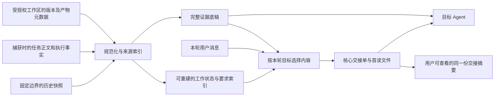

# 带上下文新开会话：上下文质量优化方案

日期：2026-10-08。状态：P0 已实施，P1 已接入实际交接单展示与远端回报，其余阶段待实施。基于提交 `19f99ca` 的源码、README 与现有测试梳理；本次仅交付文档，未修改运行逻辑。

## 1. 建议方向

把首读上下文组织成一份能直接接手工作的交接单：**当前目标、有效约束、工作进度、关键决策、改动与验证、未解决问题、下一步**。完整历史继续作为证据底稿，按本轮消息补充相关记录。

核心验收是：用户只说“按刚才的方案继续”“修复上面的失败”，新 Agent 能找到所指内容，遵守已经确定的要求，接着未完成的工作推进。

本方案复用已实现的会话创建、不可变快照、跨设备传输、图片交付和执行去重。默认仍是一键创建，不增加摘要确认、手工整理任务等必经步骤。优先优化当前选中会话及其继承链，不默认搜索用户的其他会话。

## 2. 当前实际能力与不足

### 已有基础

| 能力 | 当前实现 | 代码依据 |
| --- | --- | --- |
| 历史捕获与连续交接 | 捕获用户消息、助手公开回复、工具记录及附件引用；再次切换追加新轮次，避免嵌套注入文本 | `src/conversations.ts` 的 `source()`；`src/contextCompiler.ts` |
| 任务上下文 | 已有关联任务会注入任务正文，兼容目标、约束、结论、下一步、文件等旧字段；从历史自动创建的新任务最初只有会话标题 | `src/conversations.ts` 的 `create()`；`shared/taskContent.ts` |
| 分层文件 | 首读 Markdown 最多 24,000 字符，另存完整规范化原文、审计快照及图片原件 | `src/contextMarkdown.ts` 的 `renderContextMarkdown()` |
| 首读内容选择 | 第一条用户消息、最后三条用户消息、最后一条任务参考，加上预算内最近轮次；长记录保留首尾 | `src/contextMarkdown.ts:74`；`shared/contextContent.ts:107` |
| 可选模型整理 | 从最近优先的 80,000 字符摘录生成目标、约束、决定、已完成、下一步、待核对，每项附来源记录号 | `src/contextModelSummary.ts` |
| 远端与图片 | 来源设备可冻结完整记录，跨设备传输快照与原始图片；普通附件和代码文件仍只保留引用 | `src/remoteCodexWorker.ts`；`packages/context-engine/README.md` |
| 用户查看 | 折叠卡片展示来源、记录分类统计及原文摘录；抽屉分页查看明细 | `web/src/history/InheritedContext.tsx`；`src/contextPreview.ts` |

旧的 `docs/agent-context-handoff-plan.md` 保留了早期现状，其中“远端仅片段”“模型摘要待实现”等描述已过时；本方案按当前源码与 README 判断。

### 需要解决的内容问题

1. **中途确定的重要内容没有稳定保留机制。** 首尾消息与最近轮次优先，会让较早但仍有效的接口约束、验收要求、方案理由退出首读内容。模型整理也受最近优先的输入窗口限制。
2. **本轮消息没有参与内容筛选。** `contextPrompt()` 接收本轮消息，但摘要和记录选择没有消费它；“继续第二个方案”和“查上次测试失败”使用同样的历史阅读材料。
3. **工作状态依赖读者从文本还原。** 已管理会话主要拼接 `userMessage / contextEvents / output`，没有单独带上执行状态、停止原因和待核对结果；任务正文也不包含版本与状态元数据。
4. **决定、建议、旧结论不够容易区分。** 摘要已有约束与决定字段，但没有明确的已确认、已否决、已替代关系，也没有独立的失败尝试和验证记录。
5. **证据引用有效，不等于结论已经证实。** 当前模型输出校验能确认记录号存在，不能保证该记录支持对应说法；已有提示词和“待证据核对”文案应继续保留，并增加结构化验证事实。
6. **工作区连续性信息不足。** 当前沿用或选择目录，但交接正文没有统一提供仓库版本、未提交改动和文件可用性。相同路径、相同分支名都不能证明代码相同。
7. **预览与实际首读材料不一致。** 预览由快照另行生成摘录，用户不能直接知道最终交接重点是什么；远端实际完整快照通常在首次执行准备时才可用。

这些属于内容选择和表达上的缺口，不表示完整底稿中的相应记录已被删除，也不表示现有测试已证明真实模型会发生某种失败。

## 3. 应该带什么内容

“必带”表示在来源可获取时进入核心区；不存在或无法核实时明确标记未知，不由模型补写。

| 内容 | 应包含的信息 | 选择策略与用途 |
| --- | --- | --- |
| 当前目标与验收标准 | 现在要解决什么、做到什么算完成、此次工作的范围 | 必带；历史目标已调整时保留当前版本，原始目标作为背景 |
| 本轮用户要求 | 原文、明确对象，以及“刚才/第二个/上面的失败”的候选指代 | 原文完整保留，放在当前请求区；歧义不伪装成确定解释 |
| 仍有效的约束 | 接口兼容、禁止新增依赖、数据边界、用户偏好、明确不做的范围 | 必带；保留短原文与出处，避免改写否定词或适用条件 |
| 执行检查点 | 上一轮已结束/失败/停止/待核对，已完成与尚未完成的步骤 | 必带；执行结束不等于任务验收通过 |
| 决策与失败尝试 | 已采用方案及理由、被否决方案及原因、试过什么和结果 | 与当前工作相关者优先；助手建议不能自动标为用户决定 |
| 改动与产物 | 仓库相对路径、用途、变更状态、相关 commit/PR/文档引用、未提交改动 | 涉及代码或文件时带；内容仍按需读取，链接不能冒充已交付文件 |
| 验证证据 | 命令、运行目录、退出码、关键输出、时间、对应代码状态、未运行项 | 涉及验证时带；旧版本通过不得推导当前版本通过 |
| 未解决问题与下一步 | 当前阻塞点、尚未回答的问题、建议从哪里开始、哪些事实需核对 | 必带；建议下一步与本轮用户指令分别标记 |
| 最近相关轮次 | 最近的用户修正、方案正文、必要的工具调用与结果 | 按本轮意图选择，尽量完整保留上下文关联 |
| 相关图片与附件 | 用户正在讨论的截图/设计稿、对应消息、文件名、可用性和摘要 | 相关原图优先；全部可用原件保存在证据层，缺失项明确列出 |
| 来源与覆盖 | 来源会话、快照摘要、记录定位、捕获范围、节选/缺失原因 | 始终保留简短说明；便于核对与追溯 |

不默认进入首读区的内容：无关闲聊、重复进度播报、重复搜索结果、安装成功的冗长日志、完整大文件和整段 diff。它们仍可存在于允许导出的证据底稿中。

继续排除隐藏推理、凭据、旧工具授权和运行时注入包装。目标仓库的 `AGENTS.md`、实际环境和工具能力在目标端按需重新读取；历史用户要求是参考资料，不提升为系统指令。

## 4. 内容组织与生成策略

### 4.1 三层阅读材料

| 层级 | 建议内容 | 呈现方式 |
| --- | --- | --- |
| 核心交接单 | 目标、关键约束、检查点、阻塞、下一步与关键引用 | 从同一份派生对象生成，建议先控制在 1,500–2,500 字符，放入首次 prompt 的历史参考区 |
| 本轮相关证据 | 方案原文、失败结果、有关的最近轮次、改动与验证表 | 继续放在首读 Markdown，附记录链接；与核心区去重 |
| 完整证据 | 可导出的规范化历史、审计快照、图片原件、详细工具输出 | 复用现有 full/evidence/assets；后续可增加按轮次或记录范围分片 |

核心区直接注入，能让新 Agent 在尚未调用文件工具时看到必要背景；详细交接文件仍需按任务需要读取。这只是提高信息可达性，不宣称模型已经阅读或理解。

首期保留 24,000 字符的首读安全上限，核心区加相关证据共同计入预算，不把内联部分额外堆叠一次。本轮消息另行完整保留。正常交接建议先以 6,000–12,000 字符为内容目标，再用评测调节；这些是初始产品参数，不是模型容量结论。

token 数采用明确标注的估算；有匹配目标模型的计数能力再精确核算，并给系统提示、工具定义、图片和后续输出留出空间。不能把字符数当作 token 数。

### 4.2 两步构建：稳定事实 + 本轮相关证据



**第一步：对冻结底稿建立工作状态索引。**

- 先提取确定性信息：任务字段、执行状态、工具调用/结果关联、退出码、文件变更事件与来源定位。
- 扫描完整的可用用户记录，建立要求索引；优先保留约束、验收标准和明确修正的短原文。不能只在最近 80,000 字符中寻找长期要求。
- 规则只能识别候选要求和显式结构。语义不清时保持原文和“待核对”状态，不承诺关键词规则能识别所有约束或撤销关系。
- 有模型时，按轮次分块提炼候选事实，再合并；每个分块和最终事实都有证据引用、覆盖信息。先保证确定性基线可用，模型只增强组织和表达。
- 工具记录按 `turnId / callId` 关联；ACP 的同一次工具进度更新在首读投影中合并，失败结果和最终状态保留，原始事件仍存底稿。

**第二步：结合本轮消息选择证据。**

优先级顺序：

1. 当前明确要求、有效约束、验收标准、执行未知状态及关键缺失说明。
2. 本轮直接提到的方案、文件、缺陷、测试、图片及其相关记录。
3. 与当前工作有关的最近失败、未完成步骤、已确认决定及被否决方案。
4. 最近完整轮次；必要时携带此前轮次的工具调用参数与结果。
5. 其余历史背景和进度信息。

首期用文件路径、问题编号、测试名、方案序号、工具调用 ID、关键词及相邻轮次做召回；“继续”使用最近未完成事项，“刚才的第二个方案”带上候选方案原文及用户选择，不只带一句摘要。多个候选无法消歧时列出冲突，交由正常对话处理，不暗自选定。

首次创建没有消息时不启动 Agent，按已有捕获机制形成通用概览：本机已就绪来源在创建时冻结；工作台跟踪的来源轮次尚未结束时，准备完成前重新捕获最终记录；远端创建先记录来源身份和已有片段，完整记录在首次执行准备时由来源设备冻结。概览必须标出实际捕获时点，不能把远端点击创建的时间当作完整历史的冻结边界。

首次发送时，基于实际可用的完整快照与本轮消息编译交接材料。已冻结来源不因后续新增历史而静默改变；任务元数据和完整快照若在不同时间捕获，分别保留版本与时间。同一发送请求重试复用已绑定的派生产物，避免重算造成交接内容变化。

### 4.3 避免过期事实和摘要失真

每项事实至少记录：类别、文本、依据类型、来源引用、适用范围，以及当前/已替代/有冲突状态。

依据类型区分：用户明确表述、结构化执行观测、助手自述、模型归纳。不能用一个统一“置信度分数”代替这些差异。

合并规则：

- 本轮明确要求优先；同一来源链内用户明确修正可以替代旧要求，保留替代关系和出处。
- 新消息只说“继续”时，不撤销已有约束。不同主题的要求不能仅因时间较晚就相互覆盖。
- 任务正文和会话要求有冲突时，展示两者及版本；不能以抓取时间较新为由认定谁覆盖谁。
- 助手说“测试通过”，但没有对应工具证据，标为“助手报告通过，尚无验证记录”；工具结果冲突时并列保留。
- 测试成功绑定具体命令和可确认的代码状态，不推导所有测试通过；其后相关代码又有变化时标为需要重验。
- 失败尝试记录适用条件；后续有新证据时允许重新评估，不能永久禁止所有相似方案。

摘要只是可重建的派生数据，多次切换继续复用原始证据链。可以增量更新索引，但不以“上一份摘要的摘要”作为唯一输入。来源位置用于去重；两条内容一样、但属于不同轮次的用户消息不能按文本哈希合并。

### 4.4 预算不足与质量退化

- 优先减少重复播报、无关工具输出和长日志中段；错误码、失败断言、命令、文件定位尽量保留。
- 工具调用与结果共同纳入预算；无法带全时保留摘要、关联 ID 和完整证据入口，明确节选。
- 核心要求过多时，把详细要求分组写入必读证据文件，核心区列出读取入口和未展开数量；不能静默丢弃并宣称已经完整继承。
- 必要事实或文件不可用时说明具体缺失；是否能执行取决于本轮任务是否依赖它，避免普通历史节选也阻塞所有任务。
- 模型服务关闭或失败时，继续使用确定性原文与执行事实，展示整理方式及缺失范围。现有远端连接器未调用模型摘要，首期同样获得规则层改进。
- 不默认把远端完整历史新增发送到模型服务。后续统一语义整理必须沿用用户配置的数据处理范围，并明确哪些摘录会发给配置的服务。

### 4.5 文件、代码和图片的处理

代码任务先增加轻量工作区检查点：捕获时间、设备、仓库标识、HEAD、分支、dirty 状态、变更文件清单、可确认的文件摘要。只在已授权工作目录读取，仓库地址中的凭据不得进入交接材料。

历史代码状态和目标端当前状态分别记录。比较结果可以是匹配、不匹配、无法核对；非 Git 目录明确标记。若状态变化，旧验证结论不自动适用于新状态。采集失败应可见，但只有本轮依赖该状态才阻塞。

本阶段不自动复制仓库、提交、推送或应用 patch。普通附件继续区分“可读取”“仅引用”“缺失”，跨设备路径使用目标端映射，不能照搬来源绝对路径。

图片原件继续完整保存，原生图片输入按本轮相关性选择，并保留来源映射。只有目标能按路径读取图片时才可减少首轮附带原图；否则保留必要原图或明确能力限制。截图对应哪个页面、错误或设计稿要保留文字说明，不根据未分析的图片编造结论。

## 5. 交接效果示例

以下为虚构验收示例，不是当前仓库的缺陷结论。来源历史中：用户中途要求保持接口兼容；选择了方案 B；Agent 修改了一个文件；相关测试仍失败；助手的最终回复却声称已完成。

用户在新会话输入：“按刚才的方案继续，把测试补好。”

期望交接单：

```text
当前目标
修复重复提交问题；原有 API 参数与返回格式必须保持兼容。
验收：重复请求只产生一条记录，并补齐并发回归测试。

已确认要求
- 不新增生产依赖。（来源：用户记录 18）
- 采用方案 B：事务内核对幂等键；不采用内存锁方案。
  理由：需要覆盖多进程。（来源：方案记录 25、用户记录 28）

当前进度
- src/example.ts 已修改，尚未提交。（来源：文件事件 42）
- 测试修复仍未完成；上一轮执行已结束，不等于任务完成。

验证
- pnpm exec ... example.test.ts：退出码 1。
- 失败：并发请求产生两条记录。（来源：工具记录 46）
- 助手曾称“已完成”，与工具结果不一致，待核对。
- 验证所用代码状态无法完整确认，继续前需核对当前文件。

建议接续点
先读失败用例和方案 B 原文，再补并发处理并重跑相关测试。

证据与限制
方案：记录 25；调用/结果：记录 45–46；完整原文：full-....md。
代码文件未随上下文复制；请检查目标目录中的改动。
```

本轮用户消息放在这份历史参考资料之外。新 Agent 可以把建议接续点作为工作线索，但只能在本轮授权范围内行动。

## 6. 产品交互

保留“带上下文新开会话 → 创建 / 创建并发送”。默认无需填写额外字段，也无需先预览确认。

继承卡片从“多少条记录”扩展为简短的工作概览，例如：

> 接续自：修复重复提交 · 4 项有效约束 · 2 处改动 · 1 项失败验证

数字来自明确的派生分类；缺数据不显示为零或已完成。展开后展示当前目标、约束、进度、验证、下一步，以及本轮实际选入的证据。

保留原文明细入口；摘要每项可跳转对应记录。补充“为什么带上这条”的简短原因，如“本轮提及”“仍有效的约束”“最近失败”。用户手动固定或排除记录可放到后续阶段，不作为默认必经操作。

需要区分：来源已冻结、交接材料已生成、执行通道已接收。除非有明确工具读取事件，不显示“Agent 已阅读”；即使看到读取事件，也不宣称模型已经理解。

无消息创建时展示通用概览；首次发送后展示该执行绑定的最终材料。远端未回传实际材料时显示“等待来源设备准备”，不能把服务器已有摘要片段标为最终交接摘要。

## 7. 实现落点与兼容策略

建议新增派生契约 `ContextBrief v1`，与现有 `SessionContext v1` 原始快照分开，避免改变现有摘要计算和传输兼容性。

| 派生对象信息 | 目的 |
| --- | --- |
| `snapshotId / snapshotDigest / taskRevision / contextVersion` | 绑定原始证据及实际捕获的任务版本；任务数据缺失时明确为空 |
| `policyVersion / extractorVersion / rendererVersion` | 使规则变化可追踪、可重建 |
| `intentDigest / selectedEvidenceDigest` | 区分不同本轮请求及其证据选择 |
| `facts / executionCheckpoint / artifactIndex` | 结构化工作状态、要求、产物与证据引用 |
| `coverage / omitted / conflicts / warnings` | 说明处理范围、节选和无法核对事项 |
| `modelConfigVersion / generationStatus` | 可选模型归纳的来源和可用状态 |

首期证据引用可采用 `{ snapshotId, record }` 加原始 `source/line/turnId/callId` 定位；展示记录号不是跨快照稳定身份。新增索引时保留原始事件身份映射，不能让再次交接的编号变化导致错误引用。

| 模块 | 建议改动 |
| --- | --- |
| `shared/contextContent.ts` | 扩展选择策略输入，支持必保候选、本轮关联、工具成对选取和选择原因；保持纯函数 |
| 新增职责明确的状态投影模块 | 构建要求索引、执行检查点、验证与产物索引；不继续扩大 `tenantRuntime.ts` |
| `src/conversations.ts` | 捕获准确的任务/执行元数据；保留工具事件身份、阶段和轮次；在首次发送绑定交接产物 |
| `src/contextModelSummary.ts` | 结构化事实分类、来源校验、冲突与覆盖报告；按证据与策略版本缓存 |
| `src/contextCompiler.ts`、`src/contextMarkdown.ts` | 接收本轮选择结果；同一派生对象生成内联核心、首读文件和 UI 数据 |
| `src/contextPreview.ts`、`shared/contextPreviewTypes.ts` | 增加交接概览及编译状态，保留现有原文分页接口语义 |
| `web/src/history/InheritedContext.tsx` | 展示实际工作状态、证据与缺失；继续复用 API client 和 TanStack Query |
| `src/remoteCodexWorker.ts`、上下文包 | 本机与远端共用内容选择基线；按能力传递派生材料及覆盖信息 |

边界要求：

- 任务与执行语义由工作台映射成中立输入，`context-engine` 不反向依赖应用数据库、任务类型或 UI；包调用只使用声明的导出。
- 基础事实索引按快照与提取策略缓存；本轮投影另外包含消息摘要、目标能力、预算、工作区观测摘要及渲染版本。不能继续仅按快照缓存与请求相关的全部结果。
- 已冻结快照和已绑定执行的交接材料不可原地改写。用户后续编辑任务或刷新来源时生成新版本，不混入同一次交接。
- 优先复用现有存储与事务；需要持久化新引用或元数据时新增下一个可用迁移，覆盖旧库升级和新库初始化，不改已发布迁移。
- 若派生字段进入跨设备协议，显式版本化并协商能力；旧连接器保持现有交接路径并标明功能差异，不把新字段偷偷塞进严格校验的旧协议。
- 新增读取接口或改变接口时同步检查 `src/rbac.ts`。完整原文、派生摘要和缓存都按租户、来源与执行归属隔离。
- 继续沿用幂等、忙碌检查及未知结果核对。摘要、读取和传输重试不应再次提交 Agent 指令；必要输入缺失与模型整理失败分别处理。

## 8. 分阶段实施

| 阶段 | 交付范围 | 完成标准 |
| --- | --- | --- |
| P0：先解决接手质量 | 要求原文索引；本轮消息关联选择；从已可用数据提取执行状态与验证证据；prompt/文件中的核心交接单；本机与连接器复用规则选择器 | 明确的中途约束、方案指代和最近失败在无模型配置时仍能正确交接；来源没有提供的状态标为未知 |
| P1：统一体验与工作区依据 | UI 展示执行实际绑定的交接摘要；按协议能力补齐远端状态元数据与派生概览回传；Git/文件检查点；图片选择能力校验 | 用户可核对实际携带内容；跨设备不会把旧验证当成目标工作区已通过 |
| P2：长链路语义质量 | 分块提炼、明确替代关系、增量事实索引、证据分片；可选固定关键记录 | 多次切换不累积摘要失真；长历史性能和覆盖指标达到评测基线 |

P0 建议拆成三个可审查变更：先落类型、基线夹具和选择器；再接入工作台/连接器编译与执行绑定；最后加入 prompt/Markdown 核心摘要和针对性端到端验证。UI 概览及远端补充元数据归 P1；语义复杂的要求替代关系归 P2，P0 先保留原文与冲突候选。各阶段独立验收，不把多来源知识库、向量检索或自动代码搬运作为前置依赖。

## 9. 验收与评测

### 确定性回归场景

| 场景 | 必须观察到的结果 |
| --- | --- |
| 很早的一条用户约束夹在长历史中 | 仍有约束原文或明确的必读引用，不被近期日志挤掉 |
| 原方案 A 被用户明确改成 B | B 是当前选择，A 保留为已替代背景，不能仍列入下一步 |
| 用户说“继续第二个方案” | 召回方案列表和选择依据；存在两个候选列表时明确歧义 |
| 助手说通过，但工具失败 | 失败结果与冲突说明进入核心或关键证据，不生成“已验证完成” |
| 上一轮被停止、失败或结果未知 | 明确执行检查点；遵守既有未知结果核对，不自动重复动作 |
| 同一次工具有大量进度更新 | 首读只保留必要状态和结果，完整事件仍可追溯 |
| 连续切换三次以上 | 中途约束、来源关系、失败证据持续存在，无注入嵌套和错误去重 |
| 本轮只问一个文件或一张截图 | 优先带相关证据，减少无关历史；必要原图仍可访问 |
| 切换设备、代码版本变化、附件缺失 | 分别标明源状态和目标状态，旧验证不被当作当前结论 |
| 只创建、不发送 | 不启动 Agent；首次发送使用实际消息选择内容 |
| 超预算、模型不可用、来源不完整 | 明确选取范围与缺失，核心原文和执行事实仍可核对 |
| 重复请求、并发、断线重启 | 同一执行绑定相同交接材料，不重复创建或提交 |
| 未授权、跨租户、错误设备归属、路径越界 | 拒绝读取或使用材料，不通过派生缓存泄露数据 |

测试优先扩展 `test/contextContent.test.ts`、`test/contextModelSummary.test.ts`、`test/conversations.test.ts`、`test/conversationHttp.test.ts` 与 `InheritedContext.test.tsx`。浏览器验收增加“创建并发送 → 查看实际摘要 → 跳转证据”和仅创建后首次发送两条路径。

实施时运行 `pnpm typecheck`、相关测试；跨模块/会话执行改动运行完整 `pnpm test`，关键交互改动运行 `pnpm test:e2e`。确定性 Agent fixture 验证协议和材料，不作为真实模型理解能力的证明。

### 效果评测

先建立脱敏或人工合成的 20–30 组交接样例，覆盖上述场景；为每组标注必须保留的要求、有效决策、失败证据和正确接续点。用同一来源、同一本轮消息、相同预算比较现有策略与新策略。

- 确定性门槛：夹具中必须保留项全部出现或有明确必读定位；不存在把失败判为通过、把未交付文件标为可用、把未知执行自动重发的情况。
- 真实 Agent 验收：分别验证同 Agent 新开、Codex/Claude 切换、跨设备续接；看首轮是否继续了正确工作、是否遗漏约束、是否重试了已否决且条件未变的方案。
- 质量指标：关键要求保留率、错误完成结论数、错误指代数、因缺上下文发生的澄清、重复劳动次数。
- 成本指标：实际输入量、交接准备时间 P50/P95、摘要调用量与失败率、首次回复前读取量。

成功率和时延目标在建立现状基线后确定。试点只采集必要统计与脱敏标注，不在普通遥测中记录完整历史或凭据。可以关闭新选择策略回退到现有编译方式，但已提交或结果未知的执行必须保留原绑定材料，不能借回退重新执行。

## 10. 本次验证与交付范围

使用当前代码做了一次不调用外部模型的合成验证：180 个轮次、360 条记录，每轮一条用户消息及约 640 字符的助手过程说明；第 101 条记录为“保持返回格式兼容，禁止新增生产依赖”。调用现有 `selectContextRecords(entries, 80000)`，并对同一个快照分别以“继续最近的检查”“回到中途讨论的兼容要求”调用 `contextPrompt()`。

结果：该约束没有进入模型输入选取结果，也没有进入 20,359 字符的首读文件，但完整原文仍保留它；两条不同消息生成相同的首读文件，最终 prompt 各自保留了不同的本轮消息。临时文件验证后已清理。此验证确认当前选材行为，不代表实际模型一定忽略完整原文。

本次仅完成代码梳理、上述合成验证和设计方案，未修改运行逻辑，未运行完整功能测试。文档加入仓库已有的文档白名单，便于后续审查。优先建议实施 P0：**把中途有效要求保留下来，让本轮消息决定相关证据，并把执行与验证状态讲清楚。**


## 11. 实施记录（2026-10-08）

本次落地 P0，并提前接入 P1 的交接单展示闭环：

- 新增纯函数选材模块，扫描全部可用用户记录中的显式要求，保留要求原文索引；本轮消息用于文件、方案和关键词关联。
- 工具调用按来源、轮次和调用标识配对，进度更新保留初始输入与末次结果；完整证据不改写。
- 首次 prompt 内联有界核心交接单；详细原文仍在首读及完整证据文件中，内联 JSON 与首读文件共同计入字符预算。
- 托管会话追加执行检查点及任务版本，保留工具轮次和调用标识；不把执行结束或助手自述当作测试通过。
- 本机和远端连接器共用规则层，模型摘要沿用可选配置，缓存绑定证据和策略版本。
- 执行保存实际核心交接单；远端通过可选 v1 字段回报，校验格式、长度、本轮消息摘要及不可替换性；页面按实际执行展示，不将原文预览冒充实际交接单。

尚未实施：Git/文件工作区检查点、按目标能力减少图片输入、复杂语义上的要求替代关系、长历史分块模型提炼和增量事实索引。当前保留冲突候选和原文，不将规则匹配宣称为完整语义理解；图片仍沿用已有完整交付行为。

验证结果：`pnpm typecheck` 通过；`pnpm test` 中 92 个前端测试与 258 个 Node 测试全部通过；`pnpm test:e2e` 的 14 个浏览器测试通过；`pnpm build:agent` 通过。数据库测试使用临时 PostgreSQL 容器，Agent 使用受控 fixture，未启动用户的真实 Agent，也未将历史发送给真实模型服务。
